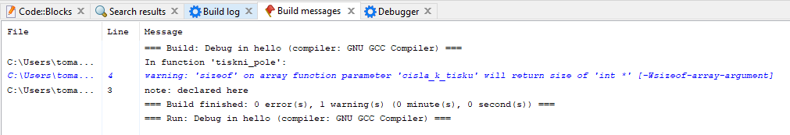

V našich programech bychom někdy chtěli pracovat s hodně proměnnými. Řekněme, že chceme mít deset čísel. Jeden z přístupů by byl definovat pro každé číslo proměnnou.


```c
#include <stdio.h>

int main()
{
    int cislo1 = 1;
    int cislo2 = 2;
    int cislo3 = 3;
    int cislo4 = 4;
    int cislo5 = 5;
    int cislo6 = 6;
    int cislo7 = 7;
    int cislo8 = 8;
    int cislo9 = 9;
    int cislo10 = 10;

    printf("%i\n", cislo1);
    printf("%i\n", cislo2);
    printf("%i\n", cislo3);
    printf("%i\n", cislo4);
    printf("%i\n", cislo5);
    printf("%i\n", cislo6);
    printf("%i\n", cislo7);
    printf("%i\n", cislo8);
    printf("%i\n", cislo9);
    printf("%i\n", cislo10);

    return 0;
}
```

Pokud bychom ale chtěli třeba 100 čísel, tak už by se program stal naprosto nepřehledným. Místo toho můžeme použít datový typ `pole`. Ten slouží jako taková **krabička, která v sobě může mít 0 až nekonečně (teoreticky) prvků**. Prvky v poli mají vždy stejný datový typ, který je definován v definici `pole` (viz dále).

`Pole` definujeme tak, že dáme hranaté závorky za název proměnné. Do těchto závorek dáme velikost `pole` (počet prvků, které můžeme do `pole` uložit). `Pole` typu `int` o 3 prvcích bychom definovali

```c
int pole[3];
```

Naše `pole` má teď tři prvky, ale jejich hodnota je zatím neznámá. Můžeme si to představit tak, že jsme si vytvořili krabičku, která má 3 přihrádky. Každá přihrádka má svoje číselné označení (říkáme `index`). Přihrádky číslujeme od 0 a každá další má o hodnota 1 více. Tzv. první má označení 0, druhé má 1, třetí má 2 atd.

`Pole` zatím vypadá takto

| Index  |  Hodnota  | 
|---|---|
| 0 | neznámá  |
| 1 | neznámá  |
| 2 | neznámá  | 

Máme tři přihrádky (protože jsme vytvořili `pole` o velikosti 3). Každá přihrádka má svůj `index` (označení). Do jednotlivých přihrádek můžeme vložit libovolné celé číslo (protože jsme vytvořili pole typu `int`).

Když budeme chtít nastavit hodnotu v `poli`, tak se používá zápis
```c
pole[1] = 20;
```

Kde `1` zde reprezentuje `index pole`. Po provedení toho příkazu se nastaví do přihrádky s označením 1 (říkáme `indexem` 1) hodnota 20.

| Index  |  Hodnota  | 
|---|---|
| 0 | neznámá  |
| 1 | 20  |
| 2 | neznámá  |

Když budeme chtít upravit hodnotu na `indexu` 2, tak uděláme

```c
pole[2] = -5;
```

A pak naše `pole` vypadá

| Index  |  Hodnota  | 
|---|---|
| 0 | neznámá  |
| 1 | 20  |
| 2 | -5  |

Hodnotu můžeme upravovat, kolikrát chceme. Tzv. můžeme přenastavit novou hodnotu na `index` 1.

```c
pole[1] = 7;
```

A pak naše pole vypadá

| Index  |  Hodnota  | 
|---|---|
| 0 | neznámá  |
| 1 | 7  |
| 2 | -5  |


Co znamená hodnota neznámá? `Při vytvoření pole jsou hodnoty nastavené na náhodnou hodnotu`. Na to je potřeba si dát pozor. Než začnu hodnoty z pole používat, tak je nutné je nastavit na nějakou hodnotu.

Jak se dají hodnoty z pole použít?
```c
#include <stdio.h>

int main()
{
    int pole[3];
    pole[1] = 20;
    int vysledek = pole[1];

    printf("Hodnota je %i\n", vysledek);

    return 0;
}
```
Vytiskne
```
Hodnota je 20
```

Předchozí program bychom mohli přepsat bez proměnné `vysledek` jako
```c
#include <stdio.h>

int main()
{
    int pole[3];
    pole[1] = 20;

    printf("Hodnota je %i\n", pole[1]);

    return 0;
}
```

Je potřeba si dát pozor na to, že pokud uložím hodnotu do proměnné z pole a pak změním hodnotu v poli, tak se změna neprojeví
```c
#include <stdio.h>

int main()
{
    int pole[3];
    pole[1] = 20;
    int vysledek = pole[1];
    pole[1] = 33;

    printf("Hodnota je %i\n", vysledek);

    return 0;
}
```
Tento program vytiskne 
```
Hodnota je 20
```
I když naše pole na konci programu vypadá takto
| Index  |  Hodnota  | 
|---|---|
| 0 | neznámá  |
| 1 | 33  |
| 2 | neznámá  |

Důležité je, že v době uložení hodnoty do proměnné `vysledek` byla v poli uložena hodnota 20.

Jako `index` do `pole` lze použít i proměnnou. Např.
```c
#include <stdio.h>

int main()
{
    int index = 1;
    int pole[3];
    pole[index] = 20;

    printf("Hodnota je %i\n", pole[index]);

    return 0;
}
```

Pozor však na to, abyste nesahali mimo velikost `pole`. Pokud má `pole` 3 prvky a my zkusíme použít čtvrtý prvek

```c
#include <stdio.h>

int main()
{
    int pole[3];
    pole[30] = 20;

    printf("Hodnota je %i\n", pole[30]);

    return 0;
}
```

Tak je dost pravděpodobné, že vše bude fungovat v pořádku. To je rozdíl oproti jazykům s vyšší úrovní abstrakce (např. Java, C# atd.). Tam by program způsobil vždy chybu. Jazyk C však dovolí v omezené míře programu šahat i tam, kde nemá co dělat. 

Jedná se však o `nedefinované chování`. Může se stát, že někdy dostaneme error při spuštění. Také se může stát, že upravíme hodnotu jiné proměnné, než by se čekalo (více v kapitole XXX). Zatím je potřeba si zapamatovat, že můžeme používat jenom takovou velikost `pole`, kterou jsme danému `poli` nastavili.

## Nastavení hodnot pole
Pro nastavení více hodnot můžeme použít zápis
```c
int pole[3];
pole[0] = 0;
pole[1] = 10;
pole[2] = 20;
```

Existuje však i kratší zápis

```c
int pole[3] = { 0, 10, 20 };
```

V tomto případě ani nemusíme definovat, že `pole` má tři prvky, protože se to dokáže samo odvodit z počtu hodnot, které do `pole` nastavujeme (říkáme, že inicializujeme `pole`). Tzv.

```c
int pole[] = { 0, 10, 20 };
```

Jak zjistit počet prvků v poli? Pomůže nám k tomu funkce (klíčové slovo) `sizeof`.

```c
#include <stdio.h>

int main()
{
    int pole[] = { 0, 10, 20 };
    int velikost = sizeof(pole);

    printf("Velikost je %i\n", velikost);
    
    return 0;
}
```

Vytiskne se
```
Velikost je 12
```

Nedefinovali jsme však `pole` o velikosti 3? Jaktože se nám vytisklo 12? Je to kvůli tomu, že `sizeof` nám vrátí kolik bajtů zabírá `pole` v paměti počítače.

Když pustíme program
```c
#include <stdio.h>

int main()
{
    int pole[] = { 0, 10, 20 };
    int velikost_pole = sizeof(pole);
    int velikost_int = sizeof(int);

    printf("Velikost pole je %i\n", velikost_pole);
    printf("Velikost int je %i\n", velikost_int);

    return 0;
}
```

Tak dostáváme výstup

```
Velikost pole je 12
Velikost int je 4
```

> Tady vidíme, že `sizeof` můžeme volat s argumentem proměnné, ale i s datovým typem. Je to taková specialita `sizeof`. Zatím to berme jako výjimku.


Na výpisu vidíme, že velikost datového typu `int` je 4 byty (může se lišit podle počítače, více v kapitole XXX). Každá přihrádka má tedy 4 byty a dohromady všechny mají 12. Kolik je teda počet prvků v `poli`? Vydělíme celkový počet pole velikostí jednoho prvku `pole`.

```c
#include <stdio.h>

int main()
{
    int pole[] = { 0, 10, 20 };
    int pocet_prvku = sizeof(pole) / sizeof(int);

    printf("Pocet prvku pole je %i\n", pocet_prvku);

    return 0;
}
```
Dostáváme již správný výsledek
```
Pocet prvku pole je 3
```


## Pole a cykly
`Pole` a cykly jsou skvělá kombinace a často se používají společně. Například jak bychom mohli vytisknout všechny hodnoty v `poli`? Jeden ze způsobů by byl

```c
#include <stdio.h>

int main()
{
    int pole[3];
    pole[0] = 0;
    pole[1] = 10;
    pole[2] = 20;

    printf("Hodnota je %i\n", pole[0]);
    printf("Hodnota je %i\n", pole[1]);
    printf("Hodnota je %i\n", pole[2]);

    return 0;
}
```

Pro větší `pole` ale vidíme, že by to byl problém. Tuto situaci lze vyřešit pomocí cyklu. Můžeme si ukázat řešení např. pro cyklus `for`.

```c
#include <stdio.h>

int main()
{
    int pole[3];
    pole[0] = 0;
    pole[1] = 10;
    pole[2] = 20;

    for (int i = 0; i < 3; i = i + 1) {
        printf("Hodnota je %i\n", pole[i]);
    }

    return 0;
}
```
Po spuštění dostáváme

```
Hodnota je 0
Hodnota je 10
Hodnota je 20
```

Ve `for` cyklu používáme proměnnou pojmenovanou `i`. Název `i` se v programování často používá právě v cyklech jako `index` do `pole`. Pokud bych měl vnořené cykly a potřeboval další proměnné, tak je typické použít název `j`, `k`, `l` atd.


## Pole a funkce
Práce s `polem` je v jazyce C má svoje úskalí. Mějme funkci `tiskni_pole`. Aby tato funkce přijímala `pole`, tak za název parametru přidáme hranaté závorky. Při volání této funkce ji předáme jako název `pole`. Mějme program

```c
#include <stdio.h>

void tiskni_pole(int cisla_k_tisku[]) {
}

int main()
{
    int pole[] = { 0, 10, 20 };
    int velikost_pole = sizeof(pole)/sizeof(int);
    printf("Velikost pole mimo funkci %i\n", velikost_pole);
    tiskni_pole(pole);

    return 0;
}
```

Nyní chceme vytisknout ve funkci velikost `pole` ve funkci pro ověření, že je vše v pořádku

```c
#include <stdio.h>

void tiskni_pole(int cisla_k_tisku[]) {
    int velikost_pole = sizeof(cisla_k_tisku)/sizeof(int);
    printf("Velikost pole ve funkci %i\n", velikost_pole);
}

int main()
{
    int pole[] = { 0, 10, 20 };
    int velikost_pole = sizeof(pole)/sizeof(int);
    printf("Velikost pole mimo funkci %i\n", velikost_pole);
    tiskni_pole(pole);

    return 0;
}
```

Dostáváme
```
Velikost pole mimo funkci 3
Velikost pole ve funkci 2
```
To je ale špatně! Jak je to možné? Napoví nám chyby v Build messages



```
'sizeof' on array function parameter 'cisla_k_tisku' will return size of 'int *'
```

Pokud předáme `pole` do funkce, tak `pole` `degraduje` na `ukazatel` typu `int *`. O ukazatelích více v kapitole XXX. Zatím si to můžeme pro zjednodušení představit tak, že se z `pole` stal jiný datový typ.

Když bychom spustili program, ve kterém jsme změnili ve funkci `main` druhý řádek a místo `pole` jsme dali datový typ `int*`

```c
#include <stdio.h>

void tiskni_pole(int cisla_k_tisku[]) {
    int velikost_pole = sizeof(cisla_k_tisku)/sizeof(int);
    printf("Velikost pole ve funkci %i\n", velikost_pole);
}

int main()
{
    int pole[] = { 0, 10, 20 };
    int velikost_pole = sizeof(int*)/sizeof(int);
    printf("Velikost pole mimo funkci %i\n", velikost_pole);
    tiskni_pole(pole);

    return 0;
}
```
Tak dostáváme

```
Velikost pole mimo funkci 2
Velikost pole ve funkci 2
```

To nám ale neříká, kolik je prvků v poli. Pokud potřebujeme dostat velikost `pole` do naší funkce, tak ji musíme poslat jako druhý parametr. Naše funkce by tedy měla vypadat jako

```c
#include <stdio.h>

void tiskni_pole(int cisla_k_tisku[], int velikost_pole) {
}

int main()
{
    int pole[] = { 0, 10, 20 };
    int velikost_pole = sizeof(pole)/sizeof(int);
    tiskni_pole(pole, velikost_pole);

    return 0;
}
```

Nyní už můžeme vytisknout všechny prvky v `poli`

```c
#include <stdio.h>

void tiskni_pole(int cisla_k_tisku[], int velikost_pole) {
    for (int i = 0; i < velikost_pole; i = i + 1) {
        printf("Na indexu %i je hodnota %i\n", i, cisla_k_tisku[i]);
    }
}

int main()
{
    int pole[] = { 0, 10, 20 };
    int velikost_pole = sizeof(pole)/sizeof(int);
    tiskni_pole(pole, velikost_pole);

    return 0;
}
```

Je potřeba na to myslet, když budete někdy pracovat s polem ve funkcích.

Pokud bychom chtěli načíst 5 čísel z uživatelského vstupu, tak můžeme náš program zjednodušit na
```c
#include <stdio.h>

void tiskni_pole(int cisla_k_tisku[], int velikost_pole) {
    for (int i = 0; i < velikost_pole; i = i + 1) {
        printf("Na indexu %i je hodnota %i\n", i, cisla_k_tisku[i]);
    }
}

int main()
{
    int pole[5];

    for (int i = 0; i < 5; i = i + 1) {
        int vstup = 0;
        printf("Zadejte cislo:\n");
        scanf("%i", &vstup);
        pole[i] = vstup;
    }

    tiskni_pole(pole, 5);

    return 0;
}
```

## Předání pole odkazem
XXX

## Úkoly na procvičení
### Úkol 1
Napište program, který načte 5 kladných čísel a po načtení vytiskne to největší z nich.


<details>
  <summary>Klikni pro zobrazení možného řešení</summary>

```c
#include <stdio.h>

void tiskni_nejvetsi(int cisla_k_tisku[], int velikost_pole) {
    // Zde predpokladame, ze pole ma aspon jeden prvek
    // Lepsi by bylo to osetrit na zacatku pro situace, kdy pole bude mit 0 prvku
    int max = cisla_k_tisku[0];  
    for (int i = 0; i < velikost_pole; i = i + 1) {
        if (cisla_k_tisku[i] > max) {
            max = cisla_k_tisku[i];
        }
    }
    
    printf("Maximum je %i\n", max);
}

int main()
{
    int pole[5];

    for (int i = 0; i < 5; i = i + 1) {
        int vstup = 0;
        printf("Zadejte cislo:\n");
        scanf("%i", &vstup);
        pole[i] = vstup;
    }

    tiskni_nejvetsi(pole, 5);

    return 0;
}
```
</details>

### Úkol 2
Naprogramujte tělo funkce `tiskni_delitelne_tremi`, která dostane na vstupu (parametry) pole a vytiskne čísla, které jsou v poli dělitelná třemi (beze zbytku).

Například
Pole: [1, 2, 3, 4, 5, 6]
Vytiskne se: 3 a 6


Kostra programu

```c
#include <stdio.h>

void tiskni_delitelne_tremi(int pole[], int velikost_pole) {

}

int main()
{
    int pole[6] = { 1, 2, 3, 4, 5, 6 };

    tiskni_delitelne_tremi(pole_a, 6);

    return 0;
}
```

<details>
  <summary>Klikni pro zobrazení možného řešení</summary>

```c
#include <stdio.h>

void tiskni_delitelne_tremi(int pole[], int velikost_pole) {
    for (int i = 0; i < velikost_pole; i = i + 1) {
        if (pole[i] % 3 == 0) {
            printf("Cislo %i\n", pole[i]);
        }
    }
}

int main()
{
    int pole[6] = { 1, 2, 3, 4, 5, 6 };

    tiskni_delitelne_tremi(pole, 6);

    return 0;
}
```
</details>


### Úkol 3
Naprogramujte tělo funkce `tiskni_duplikaty`, která dostane na vstupu (parametry) dvě pole a vytiskne čísla, které se objevují v obou polích.

Například
PoleA: [1, 2, 3]
PoleB: [2, 3, 4, 5]
Vytiskne se: 2 a 3 (obě číslou jsou v poli A i B)

Pro 
PoleA: [15, -22, 303, 0]
PoleB: [20, 303, 14, 15, 99, 0, 420, 9999999]
Vytiskne se: 15, 303 a 0

Předpokládejme, že se žádný prvek neobjevuje v jednom poli dvakrát. Nemůže se tedy stát, že poleA obsahuje dvakrát číslo 3.


Kostra programu

```c
#include <stdio.h>

void tiskni_duplikaty(int pole_a[], int velikost_pole_a, int pole_b[], int velikost_pole_b) {

}

int main()
{
    int pole_a[8] = { 1, 2, 3, 4, 5, 6, 7, 8 };
    int pole_b[2] = { 4, 105, -5, 7 };

    tiskni_duplikaty(pole_a, 8, pole_b, 2);

    return 0;
}
```

<details>
  <summary>Klikni pro zobrazení možného řešení</summary>

```c
#include <stdio.h>

void tiskni_duplikaty(int pole_a[], int velikost_pole_a, int pole_b[], int velikost_pole_b) {
    for (int i = 0; i < velikost_pole_a; i = i + 1) {
        for (int j = 0; j < velikost_pole_b; j = j + 1) {
            if (pole_a[i] == pole_b[j]) {
                printf("Duplicita je %i\n", pole_a[i]);
            }
        }
    }
}

int main()
{
    int pole_a[8] = { 1, 2, 3, 4, 5, 6, 7, 8 };
    int pole_b[2] = { 4, 7 };

    tiskni_duplikaty(pole_a, 8, pole_b, 2);

    return 0;
}
```
</details>

## Fun fact
V programování existuje označení pro různé úrovně programátorů.
* **JUNIOR** programátor (začátečník) - má zadání a je rád, že to vůbec nějak napíše a nějak to funguje
* **MEDIOR** programátor (středně pokročilý) - ví jak zadání naprogramovat a jenom přemýšlí, jak to napsat lépe
* **SENIOR** programátor (pokročilý) - přemýšlí, jestli daný kód je vůbec potřeba napsat a zda by se problém nedal vyřešit jinak