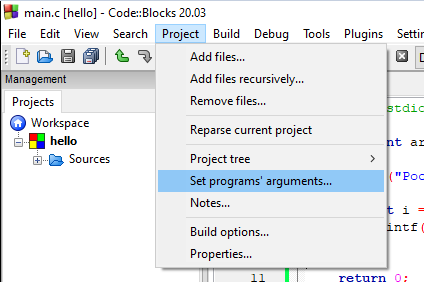

Pokud chceme předávat nějaká data našim programům, tak máme několik způsobů. Jeden z nich byl uživatelský vstup (viz kapitola XXX). Dalším způsobem jsou `argumenty programu`.

Pomocí terminálu můžeme předat našim programům nějaká. To uživatelům umožňuje upravovat chování programu i potom, co jsme my udělali binární soubor a poslali jsme jim výsledný `.exe` soubor. 

Abychom mohli pracovat v našem programu s argumenty programu, tak musíme rozšířit parametry `main` funkce. Můžeme použít variantu `int main(int argc, char* argv[])` nebo také `int main(int argc, char** argv)`. Já preferuji první variantu.

Co jednotlivé parametry znamenají?

* **argc** (argument count) - počet argumentů programu (celé číslo)
* **argv** (argument vector) - samotné argumenty programu (pole řetězců)


```c
#include <stdio.h>

int main(int argc, char* argv[])
{
    printf("Pocet argumentu: %i\n", argc);

    for(int i = 0; i < argc; i = i +1) {
        printf("%s\n", argv[i]);
    }

    return 0;
}
```

Když program pustíme

```
Pocet argumentu: 1
C:\Users\tomas\codeblocks\hello\bin\Debug\hello.exe
```

Vidíme, že první argument je cesta k binárnímu souboru, který se spouští. Jak předáme další argumenty?

Jeden ze způsobů je, že si otevřeme aplikaci PowerShell terminál (automaticky ve Windows) a půjdeme do složky, kde máme binární soubor.

```ps1
PS C:\Users\tomas> cd "C:\Users\tomas\codeblocks\hello\bin\Debug\"
PS C:\Users\tomas\codeblocks\hello\bin\Debug> .\hello.exe prvni druhy treti
Pocet argumentu: 4
C:\Users\tomas\codeblocks\hello\bin\Debug\hello.exe
prvni
druhy
treti
PS C:\Users\tomas\codeblocks\hello\bin\Debug> .\hello.exe "argument s mezerou"
Pocet argumentu: 2
C:\Users\tomas\codeblocks\hello\bin\Debug\hello.exe
argument s mezerou
```


V CodeBlocks můžeme nastavit v horní liště `Project -> Set program's arguments`



A následně nastavíme argumenty do `Program arguments`.


Pokud program nyní spustíme, tak dostáváme.

```
Pocet argumentu: 3
C:\Users\tomas\codeblocks\hello\bin\Debug\hello.exe
test1
test2
```


K čemu jsou dobré? XXX


## Úkoly na procvičení
### Úkol 1
Napište program, který načte 5 kladných čísel a po načtení vytiskne to největší z nich.


<details>
  <summary>Klikni pro zobrazení možného řešení</summary>

```c
#include <stdio.h>

void tiskni_nejvetsi(int cisla_k_tisku[], int velikost_pole) {
    // Zde predpokladame, ze pole ma aspon jeden prvek
    // Lepsi by bylo to osetrit na zacatku pro situace, kdy pole bude mit 0 prvku
    int max = cisla_k_tisku[0];  
    for (int i = 0; i < velikost_pole; i = i + 1) {
        if (cisla_k_tisku[i] > max) {
            max = cisla_k_tisku[i];
        }
    }
    
    printf("Maximum je %i\n", max);
}

int main()
{
    int pole[5];

    for (int i = 0; i < 5; i = i + 1) {
        int vstup = 0;
        printf("Zadejte cislo:\n");
        scanf("%i", &vstup);
        pole[i] = vstup;
    }

    tiskni_nejvetsi(pole, 5);

    return 0;
}
```
</details>

## Fun fact
Pokud máme v programu chybu, tak se běžně používá označení, že máme v programu "bug" (anglicky brouk). Tohle označení vzniklo ve 40. letech při vytváření sálového počítače Harvard Mark II.
Tento počítač začal selhávat. Operátoři počítače zjistili, že chyba byla způsobena skutečným broukem (molem), který byl uvězněn uvnitř počítače.
