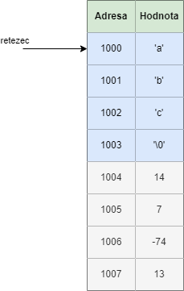
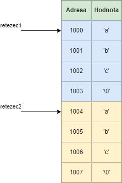

S řetězci jsme se již seznámili okrajově v předchozích kapitolách. Předtím jsme si zadefinovali řetězec jako
```c
char * retezec = "abc";
```
V paměti to vypadá následovně



Všimněme si, že poslední znak je `\0`. To je speciální escape sekvence, která **reprezentuje konec řetězce a doplní se automaticky** v případě, že řetězec definujeme jako `"abc"`. Kdyby tam tento znak nebyl, tak nevíme, kdy řetězec v paměti končí. Proto zabírá **každý řetězec v paměti o jeden byte místa navíc** (jeden byte navíc zabere právě tento ukončovací znak `\0`).

Co kdybychom se pokusili změnit první znak? Zkusme spustit následující program

```c
#include <stdio.h>

int main() {
    char * retezec = "abc";
    *retezec = 'q';

    printf("Retezec je %s\n", retezec);

    return 0;
}
```

Dostáváme chybu. Proč? Pokud řetězec zadefinujeme jako tzv. `řetězcový literál`. Tzv. způsobem `char * x = "abc";`, tak se řetězec `abc` uloží na speciální místo v paměti, které je **jenom ke čtení** a nedá se upravovat.

Tuto situaci můžeme vyřešit tím, že řetězec vytvoříme jako pole.

```c
#include <stdio.h>

int main() {
    char retezec[] = { 'a', 'b', 'c', '\0' };
    retezec[0] = 'q';

    printf("Retezec je %s\n", retezec);

    return 0;
}
```

A již se nám tiskne `Retezec je qbc`. Při definici pole je potřeba dát si pozor na to, že **musíme ukončovací znak definovat ručně**.

Paměť (v případě definice pomocí pole) by vypadala stejně jako v případě řetězcového literálu


Ale díky tomu, že se pole uloží do paměti, kterou můžeme modifikovat, tak nám náš program funguje správně.

Co by se stalo, kdybychom nedefinovali v poli poslední znak `\0`? Jak vidíme na obrázku, tak na adrese 1004 a dál je nějaká náhodná paměť. Při tisku by se tedy pokračovalo v tisku všech znaků dokud by se nenarazilo na `\0`, který by byl náhodně v paměti.

Následující program

```c
#include <stdio.h>

int main() {
    char retezec[] = { 'a', 'b', 'c' };
    retezec[0] = 'q';

    printf("Retezec je %s\n", retezec);

    return 0;
}
```
Mně konkrétně vytisknul
```
Retezec je qbcá‼║
```
Ve vašem případě by ale mohl vytisknout něco jiného nebo by program mohl úplně spadnout. Záleželo by, co máte zrovna v paměti. **Jedná se o nedefinované chování**.


## Porovnání dvou řetězců
Pokud bychom chtěli porovnat dva řetězce, tak by nás mohlo napadnout udělat

```c
#include <stdio.h>

int main() {
    char rezetec1[] = {'a', 'b', 'c', '\0' };
    char rezetec2[] = {'a', 'b', 'c', '\0' };

    if (rezetec1 == rezetec2) {
        printf("Pravda\n");
    } else {
        printf("Nepravda\n");
    }

    return 0;
}
```

Ale bohužel se nám vytiskne `Nepravda`. Proč? Protože tímto způsobem porovnáváme adresu řetězců. V paměti to vypadá následovně



Co program vykoná, když udělame `rezetec1 == rezetec2`, tak je porovnání, zda adresa 1000 se rovná adrese 1004, což není pravda. Proto je podmínka nepravdivá. Pro porovnání hodnot řetězců (ne jejich adres) můžeme použít funkci `strcmp` (string compare) z knihovny `string.h`.

```c
#include <stdio.h>
#include <string.h>

int main() {
    char rezetec1[] = {'a', 'b', 'c', '\0' };
    char rezetec2[] = {'a', 'b', 'c', '\0' };

    if (strcmp(rezetec1, rezetec2) == 0) {
        printf("Pravda\n");
    } else {
        printf("Nepravda\n");
    }

    return 0;
}

```
Nyní se nám tiskne `Pravda`. Funkce `strcmp` porovnává dva řetězce znak po znaku a vrátí hodnotu 0, pokud jsou oba řetězce stejné. 


## Úkoly na procvičení
### Úkol 1
XXXXXXXXXX

<details>
  <summary>Klikni pro zobrazení možného řešení</summary>

```c
#include <stdio.h>

int main()
{
    char vstup;
    printf("Zadejte znak:\n");
    scanf("%c", &vstup);
    
    printf("Zadali jste znak %c\n", vstup);

    return 0;
}
```
</details>


## Fun fact
Pokud programujete na Windows, tak se hodí znát užitečné zkratky, které vám můžou zefektivnit práci s textem (vaším zdrojovým kódem).

* **Ctrl + a** - označit všechen text
* **Shift + sipka doleva/doprava** - rychlejší posun doleva/doprava (neposunujete se po jednom znaku, ale přeskakujete celá slova)
* **Shift + tab** - opak **tab** (tzv. tab dělá posun doprava, shift + tab dělá posun doleva)
