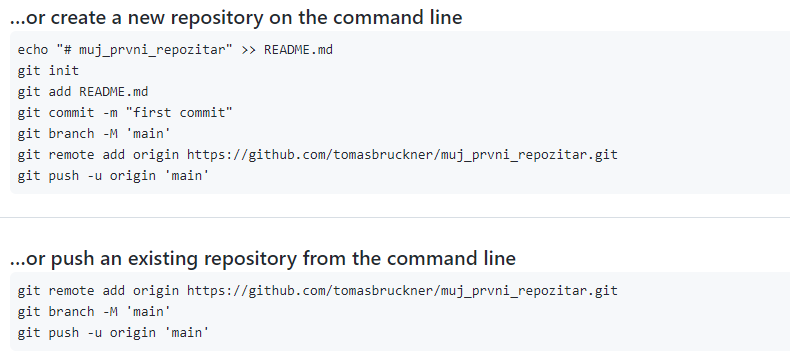

# Git

Git je nástroj na verzování souborů. To se hodí když píšeme nějaký program. Tak první den uděláme kus programu. Druhý den v tom pokračujeme, ale program z námi neznámých důvodů přestane fungovat. Chtěli bychom se vrátit ke včerejší verzi, ale to už je problém.

Git je nejběžnější verzovací nástroj v programátorském světě. Pokud se z vás stanou profesionální programátoři, tak se s Gitem určitě potkáte. Git je skvělý nástroj a proto se s ním v této kapitole seznámíme.

## Poskytovatelé Gitu
Git si nainstalujeme jako aplikaci do našeho počítače. To nám umožní pracovat s Gitem, ale nastává problém, když bychom chtěli s někým jiným na projektu spolupracovat. K tomu nám slouží cloudoví poskytovatelé, kteří podporují Git. Ti nám umožní naše zdrojové kódy nahrát na servery daného poskytovatele, kde jsou pak dostupné i jiným lidem (buď veřejně všem nebo privátně jenom těm lidem, kterým projekt nasdílíme).

Mezi tři největší poskytovatelé patří
* [Github](https://github.com/) - největší hráč na trhu. V roce 2018 byl koupen Microsoftem. V roce 2022 měl přes 83 milionů uživatelů a 200 milionů projektů.
* [Gitlab](https://gitlab.com/) - velmi populární i díky tomu, že má veřejné dostupné zdrojové kódy. Uživatelé si ho můžou zdarma rozjet na vlastním serveru.
* [Bitbucket](https://bitbucket.org/product) - Jednu dobu velmi populární, ale dnes již zastaral oproti konkurenci.

V této kapitole budeme procovat s Githubem.

## Instalace Git na počítač
Na stránce [Git for Windows](https://gitforwindows.org/) si stáhněte a nainstalujte Git. Pokud máte jiný operační systém než Windows, tak na internetu určitě najdete spoustu návodů.

## První repozitář
Na stránce [Githubu](https://github.com/) si udělejte účet (asi není potřeba tady detailně popisovat návod, jak se zaregistrovat).

Jakmile máte účet, tak na hlavní stránce (https://github.com/) můžete kliknout na New vlevo nahoře

Otevře se nám formulář na vytvoření nového repozitáře (anglicky repository). Repozitář si můžete představit jako projekt. Je to tam, kde budeme ukládat naše soubory. Pro větší projekty můžeme někdy potřeba více repozitářů, ale pro naše účely si vystačíme s jedním repozitářem na jeden projekt. Ve formuláři zadáme jméno, jaké nám přijde nejvíce popisující náš projekt.

Je potřeba se rozhodnout, jestli bude repozitář veřejný (public). Pak ho uvidí kdokoliv na internetu. Nebo soukromý (private), pak ho uvidíme jenom my a lidi, kterým ho nasdílíme. Toto nastavení jde později změnit. Zatím nechme private. Není potřeba vytvářet README ani nic dalšího, takže klikneme na Create repository.

Tím jsme vytvořili náš první repozitář. Github nám rovnou říká, co máme dělat dál

Ať ještě nemáme vytvořený projekt nebo už máme nějakou složku, kterou chceme přidat do Gitu.

## Práce s Gitem
O gitu je napsaná velmi dobrá knížka zdarma [zde](https://git-scm.com/book/en/v2). Nalevo si můžete zvolit i překlad v češtině. Já zde uvedu jenom velmi zkrácenou verzi, ale pokud vás Git zajímá, tak neváhejte použít tuto knížku.

## Fun fact
Git vytvořil Linus Torvalds, který je autor jádra Linuxu. Vytvořil ho právě pro vývoj Linuxu, protože jiné verzovací nástroje v té době měly spoustu nedostatků.