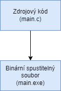
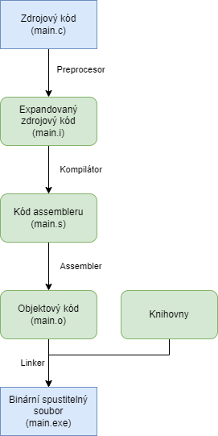

Důležitou součástí programování je i kompilace, nebo-li proces transformace vašeho zdrojového kódu na spustitelný binární soubor (říkáme binárku). V zjednodušeném diagramu to vypadá tak, že se vezme váš zdrojový kód (např. `hello.c`) a udělá se z něj spustitelný soubor (`hello.exe`).




Cílem kompilace (taky někdy říkáme `překladu`) zdrojového kódu je kód nový. V našem případě je výsledkem kompilace `strojový kód` (v angličtině `machine code`) uložený jako binární exe soubor. Více informací o strojovém kódu například [zde](https://en.wikipedia.org/wiki/Machine_code).

Pro kompilaci používáme kompilátor, což je aplikace, která dokáže z našeho zdrojového kódu udělat kód strojový. Konkrétně pro naše účely se používá aplikace (kompilátor) GCC. Ta je nainstalovaná spolu s CodeBlocks ve složce `C:\Program Files\CodeBlocks\MinGW\bin\gcc`.

GCC je velmi chytrý nástroj, který dokáže dělat i různé optimalizace nad naším zdrojovým kódem. Pokud třeba zjistí, že nějaká část našeho programu se nikdy neprovede, tak ji smaže z výsledného strojového kódu. Problematika kompilátoru je velmi obsáhlá a v tomto kurzu si probereme jenom naprosté základy pro lepší pochopení celého procesu vytváření aplikace.


Když se na proces kompilace podíváme podrobněji, tak zjistíme, že je zde několik mezikroků.





## Preprocesor fáze

Jedná se o první fázi kompilace. Nahrazuje makra (viz kapitola XXX) za konstanty. Mějme program

```c
#include <stdio.h>

#define PI 3.14

int main()
{
    double vysledek = 2*PI*1;
    printf("Vysledek je %lf\n", vysledek);

    return 0;
}
```

Výstup z fáze preprocesoru pak vypadá zjednodušeně takto

```c
int main()
{
    double vysledek = 2*3.14*1;
    printf("Vysledek je %lf\n", vysledek);

    return 0;
}
```

Zmizel nám include i define. Kompletně celý výstup si můžeme zobrazit tak, že si otevřeme ve Windows aplikaci PowerShell terminál a jdeme do složky, kde máme projekt. V mém případě je to
```
C:\Users\tomas\codeblocks\hello
```

V této složce pustíme preprocesor na náš soubor

```ps1
 & "C:\Program Files\CodeBlocks\MinGW\bin\gcc" main.c -E > main.i
 ```

Tímto jsme si vytvořili soubor main.i a když si ho otevřeme v libovolném textovém editoru (Notepad, VS Code, Notepad++ a nebo libovolný jiný). Tak vidíme celkový výstup preprocesor fáze. Na konci by měl být váš zdrojový kód s nahrazenými makry.

## Kompilátor fáze
Druhá fáze překladu, která vezme výstup preprocesoru a transformuje ho na kód strojových instrukcí (do jazyku asembleru).


V terminálu spustíme následující příkaz
```ps1
 & "C:\Program Files\CodeBlocks\MinGW\bin\gcc" main.c -S
 ```
Již není potřeba přesměrovat výstup. Automaticky se vytvoří `main.s`.

Výstup bude vypadat nějak takto

```asm
	.file	"main.c"
	.text
	.def	__main;	.scl	2;	.type	32;	.endef
	.section .rdata,"dr"
.LC1:
	.ascii "Vysledek je %lf\12\0"
	.text
	.globl	main
	.def	main;	.scl	2;	.type	32;	.endef
	.seh_proc	main
main:
	pushq	%rbp
	.seh_pushreg	%rbp
	movq	%rsp, %rbp
	.seh_setframe	%rbp, 0
	subq	$48, %rsp
	.seh_stackalloc	48
	.seh_endprologue
	call	__main
	movsd	.LC0(%rip), %xmm0
	movsd	%xmm0, -8(%rbp)
	movsd	-8(%rbp), %xmm1
	movsd	-8(%rbp), %xmm0
	movq	%xmm0, %rdx
	leaq	.LC1(%rip), %rcx
	call	printf
	movl	$0, %eax
	addq	$48, %rsp
	popq	%rbp
	ret
	.seh_endproc
	.section .rdata,"dr"
	.align 8
.LC0:
	.long	1374389535
	.long	1075388088
	.ident	"GCC: (x86_64-posix-seh-rev0, Built by MinGW-W64 project) 8.1.0"
	.def	printf;	.scl	2;	.type	32;	.endef
```

Jazyk strojových instrukcí je samostatný nízkoúrovňový programovací jazyk, který zde nebudeme rozebírat do detailu. Pokud vás asembler více zajímá, tak více informací najdete například [zde](https://en.wikipedia.org/wiki/Assembly_language).


## Assembler fáze
Třetí fáze překladu (kompilace) je transformace z jazyka asembleru do objektového kódu. Pokud jste si program spustili přes CodeBlocks, tak objektový soubor můžete najít ve složce projektu v podsložce `obj\Debug`. V mém případě je tedy objektový soubor uložený na

```
C:\Users\tomas\codeblocks\hello\obj\Debug\main.o
```

Pokud si soubor otevřeme, tak už nedostáváme moc čitelný výstup. Je to proto, že tento soubor už je binární. Není tedy určen ke čtením lidem, ale je určen pro čtení počítačům.

Pokud bychom chtěli vytvořit objektový soubor ručně, tak můžeme spustit přes PowerShell

```ps1
& "C:\Program Files\CodeBlocks\MinGW\bin\gcc" main.c -c
```

Což nám v aktuální složce vytvoří `main.o`.

## Linker fáze
Poslední fáze je vytvoření spustitelného souboru pomocí linkeru. Ten vezme naše objektové soubory a použité knihovny a udělá z toho jeden finální soubor.

Pokud jsme program spustili v CodeBlocks, tak se nám tento soubor vytvořil automaticky ve složce projektu v podsložce `bin\Debug`. V mém případě je soubor uložený na 

```
C:\Users\tomas\codeblocks\hello\bin\Debug\hello.exe
```

Pokud půjdu do této složky v PowerShellu terminálu, tak si soubor můžu spustit následovně

```ps1
.\hello.exe
```

Pokud jste si projekt pojmenovali jinak, tak musíte použít tento jiný název. Po spuštění by se vám mělo vytisknout v terminálu

```
Vysledek je 6.280000
```

Pokud byste si chtěli exe soubor vytvořit ručně, tak běžte do složky, kde máte váš zdrojový kód (main.c). A spusťte
```ps1
& "C:\Program Files\CodeBlocks\MinGW\bin\gcc" main.c
```

To vám vytvoří soubor `a.exe`. Ten můžete spustit obdobně

```ps1
.\a.exe
```
A opět se vypíše
```
Vysledek je 6.280000
```

V této kapitole jsme si ukázali, co se děje s vaším zdrojovým kódem, než se z něj stane spustitelný binární soubor.
