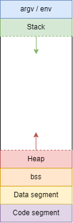

O paměti jsme si v předchozích kapitolách už několikrát povídali. Nyní se podíváme, jak zhruba paměť vypadá jako celek a z jakých částí se skládá.

Zjednodušenný diagram paměti vašeho programu vypadá následovně





**argv / env** sekce slouží k uložení argumentů programu a proměnných prostředí (environment variables). Proměnné prostředí jsme v tom kurzu nerozebíraly.

**Stack** (česky zásobník) slouží k ukládání především lokálních proměnných funkcí. Velikost zásobníků se rozšiřuje nebo zmenšuje podle toho, v jaké funkci se zrovna nacházíme nebo jak moc zanoření ve volání funkcí jsme (viz kapitola rekurze XXX).

**Heap** (česky halda) slouží k ukládání především dynamické paměti alokované pomocí funkcí `malloc`/`calloc`/`realloc` (případně další). Podobně jako `Stack` se paměť haldy rozšiřuje podle toho, jak alokujeme/dealokujeme dynamickou paměť v našem programu.

**bss** sekci se také říká neinicializovaná data. Při spuštění programu se tato sekce vynuluje. Slouží k uložení **globálních** a **statických** proměnných, které nejsou inicializované ve zdrojovém kódu nebo jsou nastavené na nulu.

Příklady
```c
int globalni_promenna;
int globalni_nulova_promenna = 0;
static int staticka_promenna;
static int staticka_nulova_promenna = 0;
```

**Data segment** (česky datová sekce) nebo také inicializovaná data. Rozděluje se na následující podsekce

* **sekce ke čtení**
* **sekce ke čtení a k zápisu**

Sekce ke čtení je slouží k uložení řetěcových literálů typu `char * s = "abc"`. Řetězec `"abc"` se uloží do paměti ke čtení.

Sekce ke čtení a zápisu slouží k uložení globálních a statických proměnných, které jsou inicializované na nenulovou hodnotu

Příklady
```c
int globalni_promenna = 10;
static int staticka_nulova_promenna = 10;
```

O paměti je dobré mít základní přehled. Nejdůležitější je pochopit rozdíly mezi pamětí `stack` a `heap`. Je dobré vědět, že paměť alokovaná na haldě zůstává alokovaná i po skončení funkce a je mnohem pomalejší (viz kapitola XXX).

## Odkazy
[Zpátky na přehled](./index.md)

[Předchozí kapitola: Kompilace](./expert-kompilace.md)

[Následující kapitola: Závěrem](./zaver.md)

[GitHub diskuze k této kapitole](https://github.com/tomasbruckner/c_lectures/discussions/50)

