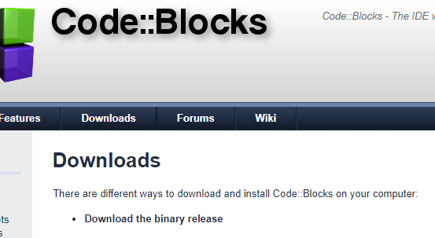

# Instalujeme CodeBlocks

next -> I agree -> Next -> Install -> Next -> Finish

Pokud se po otevření objeví okno Compilers auto-detection, tak vyberte GNU GCC Compiler

No, leave everything as it is 

Settings -> Compiler

Compiler flags
Have gcc follow the 2017 ISO C language standard [-std=c17]
Produce debugging symbols [-g]
Enable all common compiler warnings (overrides many other settings) [-Wall]
Enable extra compiler warnings [-Wextra]
Treat as errors the warnings demanded by strict ISO C and ISO C++ [-pedantic-errors]

OK

Settings -> Editor

Encoding settings

Use encoding when opening files: UTF-8
