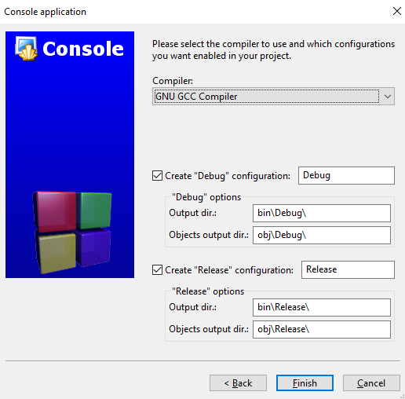
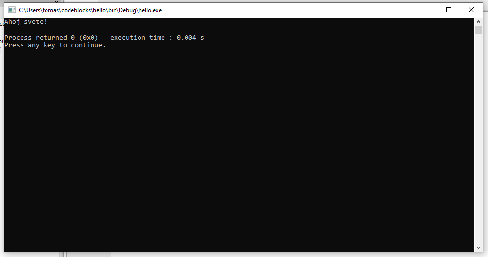
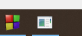

# První program - Ahoj světe!

Začněme s naším prvním programem. Tento kus kódu je velmi známý a nazývá se **Hello world!** (česky Ahoj světe!). Celý zdrojový kód programu je:

```c
#include <stdio.h>
#include <stdlib.h>

int main()
{
    printf("Hello world!\n");
    return 0;
}
```

Co tento program dělá? Vytiskne na obrazovku Hello world! a ukončí se. Nyní bychom si měli zkusit tento program vytvořit a úspěšně spustit. Tím ověříme, že vše funguje správně.

Jak na to v CodeBlocks? 

1. Klikneme na "Create a new project" uprostřed obrazovky


2. Vybereme "Console application" a klikneme GO


3. Dále klikneme na NEXT (a můžeme zaškrtnout Skip thhis page next time)


4. Vybereme C


5. Vyplníme Project title libovolným názvem. Já jsem si vybral "hello". Vybereme složku, kam se má projekt uložit. Já jsem si vybral cestu "C:\Users\tomas\codeblocks\". Klikneme NEXT.

 
6. Necháme vše zaškrtnuto a klikneme FINISH.


7. Měli bychom vidět náš první program. Pokud ne, tak si ve stromové struktuře nalevo rozklikneme hello -> Sources -> main.c (dvojklik na main.c)


8. Nyní nezbývá než kliknout na ozubené kolečko se zelenou šipkou v horní liště. Tím se náš program spustí. Pozor, nechceme klikat ani na samostatné ozubené kolečko ani na samostatnou zelenou šipku, ale na tlačítko, které má oba tyto znaky 

9. Pokud vše proběhlo v pořádku, tak vidíme


10. Nyní můžeme kliknout na libovolnou klávesu a tím terminálové okno zmizí.

> Pozor, je vždy potřeba terminálové okno vypnout. Někdy se stane, že se programátor jenom překlikne zpátky do CodeBlocks. To způsobuje problém v tom, že pokud bych teď udělal v programu změny a chtěl ho znovu spustit, tak tlačítko pro spuštění programu (ozubené kolečko se zelenou šipkou) bude zašedlé a nepůjde spustit. Vyřešíte to tak, že se překliknete ve Windows zpátky do terminálového okna (ve spodní liště Windows) a ukončíte svůj program (kliknete libovolnou klávesu nebo na křížek v pravém horním rohu). Ve spodní liště to vypadá nějak takto



## Anatomie programu Ahoj světe
S trochou štěstí nám vše funguje. Teď je potřeba si rozebrat jednotlivé části programu, co která znamená.

### Tisk textu
```c
printf("Hello world!\n");
```
Pro vypsání textu na obrazovku se používá funkce **printf**. Volání funkce (více viz kapitola XXX) obsahuje vždy několik částí. Název funkce, závorky, parametr a středník.


Závorky a středník jsou povinné. Název funkce může být různý. Vždy záleží jakou funkci chceme volat (každá funkce má jinou funkci). Dokonce si můžeme i vytvářet své vlastní funkce (viz kapitola XXX).

Velmi důležitý je parametr funkce. Ten se může lišit pro různé funkce (některé funkce ani nemají žádný parametr). Naše funkce *printf* přijímá parametr typu **string** (v češtině *řetězec*). Ten vždy začíná a konči dvojitými uvozovkami **"**. Můžeme si to představit jako libovolný text.

Pokud bychom chtěli vytisknout něco jiného. Pokud bychom upravili volání funkce na

```c
printf("Ahoj svete!\n");
```
Tak po spuštění se nám zobrazí nový text.

> Pozor na práci s diakritikou. Ta je trošku komplexnější a zatím ji nebudeme používat. V dalších kapitolách si vysvětlíme práci s diakritikou.


Velmi podezřele může působit **\n**. Co to znamená a proč se v programu nachází? Jedná se o něco, čemu se říká **Escape sekvence**. O nich více v kapitole XXX. Pro náš případ je nutné si jenom zapamatovat, že pokud vytisknu **\n**, tak se mi nevytiskne **\n**, ale nahradí se to za nový řádek (tzv. jako kdybych zmáčknul na klávesnici klávesu Enter).

Tuto escape sekvenci můžu dát kdekoliv do textu. Pokud bych spustil program
```c
printf("Hello\nworld!\n");
```
tak se mi vytiskne
```
Hello
world!

```

Do svého programu můžu dát kolik chci escape sekvencí. Můžu jich dát i více za sebou. Např.

```c
printf("Hello\n\n\nworld!\n");
```
vytiskne
```
Hello


world!

```
Proč? Mezi Hello a world jsem dat třikrát escape sekvencí pro nový řádek. Tzv. se vytiskne výstup jako kdybych po Hello zmáčknul třikrát Enter klávesu.


Co kdybych ale chtěl vytisknout opravdu znaky **\n**? K tomu slouží jiná escape sekvence **\\\\**. Pokud dám do kódu dvě zpětná lomítka za sebou a pak n, tak se dvě lomítka nahradí za vytisknutí jednoho lomítka.

Např. ukázka:
```c
printf("Hello world!\\n");
```
vytiskne
```
Hello world!\n
```


### include knihoven
```c
#include <stdio.h>
#include <stdlib.h>
```

Tento kus kódu nám umožňuje používat kusy kódu (funkce) jiných programátorů, abychom si ušetřili práci. Bylo by obtížné si programovat všechno od začátku. Například chceme spočítat odmocninu nebo sinus, ale kdybychom si to měli programovat kompletně sami, tak bychom asi ani nevěděli jak. Naštěstí nemusíme, protože někdo před námi už tyto funkce naprogramoval za nás a my je můžeme použít. Stačí si přidat do našeho programu odpovídající knihovnu.

Stejně tak funkce **printf** je jedna z funkcí, které někdo naprogramoval před námi. Abychom ji mohli použít, tak nám stačí přidat knihovnu **stdio** (zde se funkce printf nachází) do našeho programu přidáním na začátek programu řádku 
```c
#include <stdio.h>
```


Co by se stalo, kdybychom oba řádku s #include smazali? Můžeme si to vyzkoušet. Náš program pak bude vypadat takto

```c
int main()
{
    printf("Hello world!\n");
    return 0;
}
```

Po stisknutí ozubeného kolečka se zelenou šipkou vidíme, že se program nespustil a editoru se nám označil červeně 3. řádek


Zde je důležité si všimnout i spodní části aplikace. Zde je záložka "Build messages" kde vidíme informace, proč došlo k chybě.


Umět se naučit číst chybové hlášky je naprosto vitální v cestě stát se dobrým programátorem. Zde vidíme
`implicit declaration of function 'printf' [-Wimplicit-function-declaration]`. To znamená, že funkce `printf` není definovaná. To většinou znamená, že nemám přidanou přes #include správnou knihovnu nebo jsme nedefinovali nějakou funkci.

Dále se dozvídáme i řešení `include '<stdio.h>' or provide a declaration of 'printf'`. Pokud tedy přidáme daný include.

```c
#include <stdio.h>

int main()
{
    printf("Hello world!\n");
    return 0;
}
```

Pokud nyní program znovu spustíme, tak by vše mělo fungovat. Zde se můžete ptát, kam zmizel include knihovny `stdlib.h`. Ten pro náš program neni potřeba. CodeBlocks ho tam však přidává, protože knihovna `stdlib` obsahuje spoustu běžně potřebných funkcí.

Jde nějak zjistit, jaké funkce jsou obsaženy v těchto knihovnách? Pro *stdio* knihovna má dokumentaci [zde](https://www.tutorialspoint.com/c_standard_library/stdio_h.htm). Knihovna stdlib má dokumentaci např. [zde](https://www.tutorialspoint.com/c_standard_library/stdlib_h.htm).

K programování patří i věci jako mít přehled o tom, jaké existují knihovny a jaké funkce obsahují. Tím si lze ulehčit spoustu práce a "neobjevovat kolo". Další vlastnost dobrého programátora je naučit se číst dokumentace knihoven. Ze začátku může dokumentace působit hrozivě a nebude vám spoustu věcí jasná, ale postupem času se budete v čtení dokumentace čím dál více zlepšovat.

Počet volání funkcí v programu není nijak omezen. Můžeme tedy dát i několik volání pod sebe, např.
```c
#include <stdio.h>

int main()
{
    printf("Hello world!\n");
    printf("Ahoj svete!\n");
    printf("Ucime se C 2022.\n");
    return 0;
}
```

Pokud takový program spustíme, tak se zobrazí

```
Hello world!
Ahoj svete!
Ucime se C 2022.
```

### main funkce
```c
int main()
```

Další funkce, se kterou se v našem malém programu setkáváme, je funkce nazvaná **main**. S funkcí *printf* jsme se setkali s konceptem volání funkce. Další koncept týkající se funkcí je definování vlastních funkcí. V tomto případě nepoužíváme funkce definované v nějaké knihovně (jako např. *stdio*), ale vytvoříme si vlastní funkci.

Funkce **main** má v jazyce C speciální význam. Je to počáteční bod, kde začíná každý náš program. Takovou funkci najdete v každém programu jazyka C.


V této kapitole si nebudeme rozebírat co jednotlivé části znamenají. Zatím berme jako fakt, že definujeme `int main` a budeme se pohybovat jenom v těle funkce.


### Návratová hodnota
```c
return 0;
```

Poslední řádek těla funkce je `return 0;`. Opět podrobně rozebereme později. Je nutné si dát pozor, že se musí jednat o poslední řádek. Pro náš případ to zjednodušíme tak, že tento příkaz ukončuje náš program. Mějme příklad

```c
printf("1\n");
printf("2\n");
return 0;
printf("3\n");
```

Pokud toto tělo funkce doplnímne do funkce main, pak dostáváme
```c
#include <stdio.h>

int main()
{
    printf("1\n");
    printf("2\n");
    return 0;
    printf("3\n");
}
```

Po spuštění se vytiskne
```
1
2

```
Pokud bychom dali `return 0;` nakonec, tzv.
```c
#include <stdio.h>

int main()
{
    printf("1\n");
    printf("2\n");
    printf("3\n");
    return 0;
}
```
pak dostáváme
```
1
2
3

```

Jak jsme si řekli, `return 0;` ukončuje náš program (zatím pouze zjednodušení).

### Složené závorky
```c
{
  ...
}
```
Povinné složené závorky. Bylo vysvětleno v sekci funkce main.


## Fun fact
*Hello world* je klasický program pro demonstrování syntaxe programovacího jazyku. Často se používá při výuce programování libovolného programovacího jazyku. Poprvé se veřejně objevil v roce 1978 v knize v nazvané **The C Programming Language** od Briana Kernighana a Dennise Ritchieho. Dennis Ritchie je mimo jiné také autorem samotného jazyka C.

Ještě dříve se však objevil v interním memorandu firmy Bell Labs už v roce 1974 (autorem byl Brian Kernighan).

