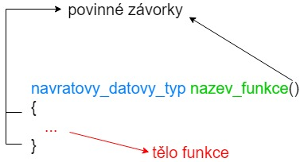

# Definujeme vlastní funkce
V našem kurzu jsme se setkali s funkcemi *printf* (funkce knihovny stdio) a *main* (povinná funkce, která musí být v každém programu). Nyní si vyzkoušíme definovat vlastní funkce.

Funkce si rozdělíme na několik typů
1. Funkce bez parametrů
1. Funkce s parametrama (pevným počtem)
1. Funkce s variabilním množství parametrů

Třetí typ pro nás zatím není důležitý. Probereme si ho více v kapitole XXX.

## Funkce bez parametrů

Abychom funkci mohli použít, je potřeba ji nejdříve definovat. Obecný formát definice je následovný



Jednotlivé sekce jsou

* návratový datový typ - funkce může vrátit nějakou hodnotu. Proto musíme vždy definovat datový typ hodnoty (obdobně jako při definici proměnné), kterou funkce vrátí. Pokud funkce nic nevrací, tak jí definujeme návratový datový typ **void** (vysvětlíme si později na příkladu).
* název funkce - každá funkce musí mít unikátní identifikátor (název). Pro identifikátory funkcí platí stejná pravidla jako pro identifikátory proměnných (pouze velká a malá písmena bez diakritiky, čísla atd. viz kapitola XXX).
* tělo funkce - obsahuje libovolný počet příkazů (pro zjednodušení řádku kódu). Zde se definuje, co má funkce dělat. Tělo funkce může být i prázdné, ale to by znamenalo, že funkce nic nedělá.


Pojďme si definovat naši novou funkci. Rozhodli jsme si, že je to funkce, která nebude vracet žádnou hodnotu. Pojmenujeme si ji **nase_nova_funkce**. Definujeme ji tedy jako

```c
void nase_nova_funkce()
{
}
```

Celý program by pak vypadal jako

```c
#include <stdio.h>

void nase_nova_funkce()
{
}

int main()
{
    return 0;
}
```
Pokud program nyní spustíme, tak se nám nic nevypíše. Je to proto, že v našem programu nemáme žádný příkaz *printf*. Definujme si tedy tělo funkce *nase_nova_funkce*.

```c
#include <stdio.h>

void nase_nova_funkce()
{
    printf("Hello world!\n");
}

int main()
{
    return 0;
}
```

Když nyní program spustíme, tak se nám opět nic nevypíše. Proč? Protože program se vykonává postupně od začátku funkce main. Tzv. začne se zpracovávat funkce main, ta má v sobě jeden příkaz `return 0;`, což náš program ukončí. Naše funkce se tedy nikdy nespustí. Abychom funkci spustili, musíme ji zavolat. Zavolání funkce probíhá tak, že do místa, kde chceme funkci zavolat, tak dáme název dané funkce, závorky a středník. Náš kód tedy upravíme.
```c
#include <stdio.h>

void nase_nova_funkce()
{
    printf("Hello world!\n");
}

int main()
{
    nase_nova_funkce();
    return 0;
}
```
A po spuštění se nám vytiskne `Hello world!`. Funkce v programu můžeme volat i několikrát. Jak bychom udělali, kdybychom chtěli `Hello world!` vytisknout 4x za sebou? Máme několik možností. Buď můžeme udělat to, že zavoláme naši funkci v main 4x.

```c
#include <stdio.h>

void nase_nova_funkce()
{
    printf("Hello world!\n");
}

int main()
{
    nase_nova_funkce();
    nase_nova_funkce();
    nase_nova_funkce();
    nase_nova_funkce();
    return 0;
}
```
nebo můžeme dát 4x printf do naší nové funkce.

```c
#include <stdio.h>

void nase_nova_funkce()
{
    printf("Hello world!\n");
    printf("Hello world!\n");
    printf("Hello world!\n");
    printf("Hello world!\n");
}

int main()
{
    nase_nova_funkce();
    return 0;
}
```

Dáme 2x printf do naší funkce a zavoláme ji dvakrát

```c
#include <stdio.h>

void nase_nova_funkce()
{
    printf("Hello world!\n");
    printf("Hello world!\n");
}

int main()
{
    nase_nova_funkce();
    nase_nova_funkce();
    return 0;
}
```

Nebo můžeme i zavolat printf ve funkci main

```c
#include <stdio.h>

void nase_nova_funkce()
{
    printf("Hello world!\n");
    printf("Hello world!\n");
}

int main()
{
    printf("Hello world!\n");
    nase_nova_funkce();
    printf("Hello world!\n");
    return 0;
}
```

Určitě byste vymysleli i více různých variant. V programování obecně platí, že vždy existuje hodně způsobů jak vyřešit daný problém. Některé jsou lepší, některé horší a hodně z nich je zhruba stejných.


## Vlastní funkce s parametry

## Jak použít 