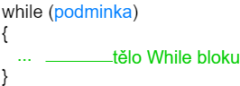
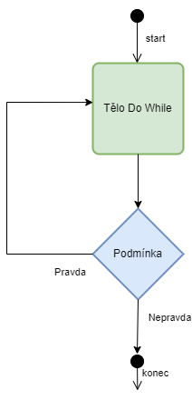
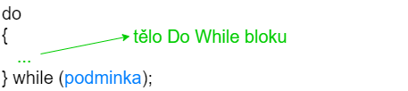

# Cykly
Cykly nám pomáhají opakovat určitou část kódu do té doby, dokud je splněna stanovená podmínka. Cyklů máme více typů. Nelze říct, že jeden je lepší nebo horší. Vždy jde kód napsat v libovolném typu cyklů.
## Cyklus While
První cyklus, který si ukážeme, je cyklus **while**. Jeho diagram je následující


Nejdříve se zkontroluje podmínka. Pokud je pravdivá, tak se provedé blok kódu while a podmínka se zkontroluje znovu. Pokud je opět pravdivá, tak se blok kódu provede znovu. Jakmile podmínka není pravdivá, tak se blok přeskočí.



Mějme kód


```c
#include <stdio.h>

int main()
{
    int x = 0;
    while (x < 3) {
        printf("%i\n", x);
        x = x + 1;
    }

    return 0;
}
```

Co daný kód vytiskne?

```
0
1
2
```

Co program vykoná krok za krokem
1. Definuje se proměnná x a nastaví se na hodnotu 0
1. Zkontroluje se podmínka zda x (0) je menší než 3 - ano je, podmínka je pravdivá
1. Vytiskne se 0 a nový řádek
1. do x se uloží hodnota 0 + 1, tzv. na hodnota 1
1. Zkontroluje se podmínka zda x (1) je menší než 3 - ano je, podmínka je pravdivá
1. Vytiskne se 1 a nový řádek
1. do x se uloží hodnota 1 + 1, tzv. na hodnota 2
1. Zkontroluje se podmínka zda x (2) je menší než 3 - ano je, podmínka je pravdivá
1. Vytiskne se 2 a nový řádek
1. do x se uloží hodnota 2 + 1, tzv. na hodnota 3
1. Zkontroluje se podmínka zda x (3) je menší než 3 - není, podmínka je nepravdivá
1. Provede se return 0 a program končí


## Cyklus For

Další cyklus je For.


```c
#include <stdio.h>

int main()
{
    for (int x = 0; x < 3; x = x + 1) {
        printf("%i\n", x);
    }

    return 0;
}
```
Co program vykoná krok za krokem
1. Definuje se proměnná x a nastaví se na hodnotu 0
1. Zkontroluje se podmínka zda x (0) je menší než 3 - ano je, podmínka je pravdivá
1. Vytiskne se 0 a nový řádek
1. do x se uloží hodnota 0 + 1, tzv. na hodnota 1
1. Zkontroluje se podmínka zda x (1) je menší než 3 - ano je, podmínka je pravdivá
1. Vytiskne se 1 a nový řádek
1. do x se uloží hodnota 1 + 1, tzv. na hodnota 2
1. Zkontroluje se podmínka zda x (2) je menší než 3 - ano je, podmínka je pravdivá
1. Vytiskne se 2 a nový řádek
1. do x se uloží hodnota 2 + 1, tzv. na hodnota 3
1. Zkontroluje se podmínka zda x (3) je menší než 3 - není, podmínka je nepravdivá
1. Provede se return 0 a program končí

Můžete si všimnout, že program vykonává to stejné jako v cyklus While. Cokoliv co napíšete pomocí while cyklu lze předělat na for cyklus i naopak. Můžete používat ten, který se vám líbí více.

## Cyklus Do While

Poslední cyklus, který si dnes probereme. Je velmi podobný cyklu while



Hlavní (a jediný) rozdíl je v tom, že tělo cyklu proběhne vždy aspoň jedenkrát. Podmínka se vyhodnocuje až na konci cyklu.



Mějme program, který má vždy podmínku nepravdivou.
```c
#include <stdio.h>

int main()
{
    do {
        printf("Ahoj\n");
    } while (0);

    return 0;
}
```
Co program vykoná krok za krokem
1. Vytiskne se `Ahoj`
1. Zkontroluje se podmínka zda 0 je pravda - není, podmínka je nepravdivá
1. Provede se return 0 a program končí

Pokud potřebujete, aby cyklus proběhnul aspoň jednou (také říkáme udělal jednu iteraci), tak cyklus Do while je skvělá volba.

## Zanoření cyklů
Cykly můžeme libovolně zanořovat. Můžeme mít cyklus v cyklu
```c
#include <stdio.h>

int main()
{
    int x = 0;
    while (x < 2) {
        int y = 0;
        while (y < 2) {
            printf("X je %i, Y je %i\n", x, y);
            y = y + 1;
        }
        x = x + 1;
    }

    return 0;
}

```
Nám dává výsledek

```
X je 0, Y je 0
X je 0, Y je 1
X je 1, Y je 0
X je 1, Y je 1
```

Co program vykoná krok za krokem
1. Vytvoří se proměnná x a nastaví se na 0
1. Zkontroluje se podmínka zda x (0) je menší než 2 - ano je, podmínka je pravdivá
1. Vytvoří se proměnná y a nastaví se na 0.
1. Zkontroluje se podmínka zda y (0) je menší než 2 - ano je, podmínka je pravdivá
1. Vytiskne se `X je 0, Y je 0`
1. Zvýší se hodnota y o 1 (na 1)
1. Zkontroluje se podmínka zda y (1) je menší než 2 - ano je, podmínka je pravdivá
1. Vytiskne se `X je 0, Y je 1`
1. Zvýší se hodnota y o 1 (na 2)
1. Zkontroluje se podmínka zda y (2) je menší než 2 - není, podmínka je nepravdivá
1. Zvýší se x o 1 (na 1)
1. Zkontroluje se podmínka zda x (1) je menší než 2 - ano je, podmínka je pravdivá
1. Vytvoří se proměnná y a nastaví se na 0.
1. Zkontroluje se podmínka zda y (0) je menší než 2 - ano je, podmínka je pravdivá
1. Vytiskne se `X je 1, Y je 0`
1. Zvýší se hodnota y o 1 (na 1)
1. Zkontroluje se podmínka zda y (1) je menší než 2 - ano je, podmínka je pravdivá
1. Vytiskne se `X je 1, Y je 1`
1. Zvýší se hodnota y o 1 (na 2)
1. Zkontroluje se podmínka zda y (2) je menší než 2 - není, podmínka je nepravdivá
1. Zvýší se x o 1 (na 2)
1. Zkontroluje se podmínka zda x (2) je menší než 2 - není, podmínka je nepravdivá
1. Provede se `return 0` a program končí

Všimněme si bodu 13. Deklarovat proměnnou uvnitř cyklu není problém. Je to kvůli tomu, že proměnné mají tzv. blokový scope. Více si o tom povíme v kapitole XXX. Zatím nám stačí vědět, že je něco takového možné.


Cykly také můžeme kombinovat s IF strukturou (cyklus uvnitř IF nebo IF uvnitř cyklu). Např.
```c
#include <stdio.h>

int main()
{
    int x = 0;
    while (x < 2) {
      if (x == 1) {
        printf("Ahoj\n");
      }

        x = x + 1;
    }

    return 0;
}
```


## Zacyklení
Při psaní cyklů je potřeba si dát pozor na to, aby neběžel cyklus do nekonečna. Pokud se tak stane, tak říkáme, že došlo k zacyklení programu. Ukázka může být např.

```c
#include <stdio.h>

int main()
{
    while (1) {
        printf("Ahoj\n");
    }

    return 0;
}
```

Pokud tento program spustíme, tak bude psát do nekonečna `Ahoj`. Jediný způsob jak tuto situaci vyřešit je program násilně ukončit (také se používá fráze zabít program).

Jaké jsou nejčastější případy, kdy se program zacyklí? Např. zapomeneme měnit proměnnou v podmínce

```c
#include <stdio.h>

int main()
{
    int x = 0;
    while (x < 2) {
        printf("Ahoj\n");
    }

    return 0;
}
```


Co program vykoná krok za krokem
1. Vytvoří se proměnná x a nastaví se na 0
1. Zkontroluje se podmínka zda x (0) je menší než 2 - ano je, podmínka je pravdivá
1. Vytiskne se `Ahoj`.
1. Zkontroluje se podmínka zda x (0) je menší než 2 - ano je, podmínka je pravdivá
1. Vytiskne se `Ahoj`.
1. Zkontroluje se podmínka zda x (0) je menší než 2 - ano je, podmínka je pravdivá
1. Vytiskne se `Ahoj`.
1. Zkontroluje se podmínka zda x (0) je menší než 2 - ano je, podmínka je pravdivá
1. Vytiskne se `Ahoj`.
1. Zkontroluje se podmínka zda x (0) je menší než 2 - ano je, podmínka je pravdivá
1. Vytiskne se `Ahoj`.
1. Zkontroluje se podmínka zda x (0) je menší než 2 - ano je, podmínka je pravdivá
1. Vytiskne se `Ahoj`.
1. ...

Jak vidíme, tak x se nikdy nezmění, podmínka bude vždy pravdivá.

Další častý případ je, že měníme proměnnou jinak, než bychom měli

```c
#include <stdio.h>

int main()
{
    int x = 0;
    while (x < 2) {
        printf("Ahoj\n");
        x = x - 1;
    }

    return 0;
}
```


Co program vykoná krok za krokem
1. Vytvoří se proměnná x a nastaví se na 0
1. Zkontroluje se podmínka zda x (0) je menší než 2 - ano je, podmínka je pravdivá
1. Vytiskne se `Ahoj`.
1. Hodnota x se sníží o 1 (na -1)
1. Zkontroluje se podmínka zda x (-1) je menší než 2 - ano je, podmínka je pravdivá
1. Vytiskne se `Ahoj`.
1. Hodnota x se sníží o 1 (na -2)
1. Zkontroluje se podmínka zda x (-2) je menší než 2 - ano je, podmínka je pravdivá
1. Vytiskne se `Ahoj`.
1. Hodnota x se sníží o 1 (na -3)
1. Zkontroluje se podmínka zda x (-3) je menší než 2 - ano je, podmínka je pravdivá
1. ...

Teoreticky by tento program bežel donekonečna. Kvůli limitům datových typů však jednou takový program doběhne, i když to bude za hodně dlouho. Více v kapitole XXX.


Na zacyklení je potřeba si dávát pozor. Nic si z toho ale nedělejte, pokud se vám to stane. Dříve nebo později to určitě přijde.