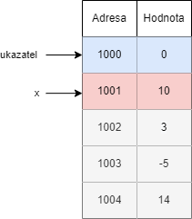

V některých případech neznáme dopředu velikost pole. Mějme například program, který načítá čísla od uživatele, dokud uživatel nenapíše číslo 0. Pak program vypíše všechny hodnoty a ukončí se.

Ať vytvoříme libovolně velké statické pole (s pevně danou velikostí), tak vždy může uživatel zadat minimálně o jedno číslo navíc.

Mějme variantu se statickým polem

```c
#include <stdio.h>

#define VELIKOST_POLE 3

void vytiskni_pole(int pole[], int velikost) {
    for (int i = 0; i < velikost; i = i + 1) {
        printf("%i\n", pole[i]);
    }
}

int main() {
    int pole[VELIKOST_POLE];
    int pocet = 0;
    int hodnota = 0;

    while (1) {
        scanf("%i", &hodnota);
        if (hodnota == 0) {
            break;
        }

        pole[pocet] = hodnota;
        pocet += 1;
        if (pocet >= VELIKOST_POLE) {
            printf("Nelze nacist dalsi\n");
            break;
        }
    }

    vytiskni_pole(pole, pocet);

    return 0;
}
```

V jazyku C však můžeme pracovat i s dynamickou pamětí. Tzv. můžeme vytvářet libovolně velká pole. Slouží nám na to funkce `malloc` (memory allocation) z knihovny `stdlib.h`. Má jeden parametr a to počet bytů, které chceme alokovat (přiřadit) ukazateli. Funkce `malloc` může selhat. V takovém případě vrátí funkce `NULL` (ve vašich programech se asi nikdy nestane pokud neuděláte nějaké nekonečné zacyklení).

```c
#include <stdio.h>
#include <stdlib.h>

void vytiskni_pole(int pole[], int velikost) {
    for (int i = 0; i < velikost; i = i + 1) {
        printf("%i\n", pole[i]);
    }
}

int main() {
    int * ukazatel = malloc(4 * sizeof(int));

    if (ukazatel == NULL) {
        printf("Doslo k chybe\n");
        return 1;
    }

    ukazatel[0] = 1;
    ukazatel[1] = 2;
    ukazatel[2] = 3;
    ukazatel[3] = 4;

    vytiskni_pole(ukazatel, 4);

    free(ukazatel);
    ukazatel = NULL;

    return 0;
}
```

Všimněmě si, že po skončení práce s pamětí, kterou jsme si alokovali pomocí funkce `malloc`, tak musíme zavolat funkci `free`. Ta dělá to, že uvolní paměť a může ji pak používat někdo jiný. Pokud bychom paměť neuvolnili a program by běžel dlouho (dny, měsíce, roky), tak by náš program mohl postupně zabírat více a více paměti, kterou neuvolňuje, a tím postupně zabrat všechny prostředky (všechnu paměť) počítače. Tomu se anglicky říká `memory leak`. **Proto je důležité nepotřebnou dynamickou paměť vždy uvolnit**. Nemusíte se však bát, že by paměť zůstala alokovaná i po skončení programu. Paměť se totiž vždy uvolní automaticky, když program skončí.

Další dobrá zásada je, že když skončíte práci s ukazatelem, tak mu nastavíte hodnotu `NULL`. Tím dáváte najevo, že již s touto pamětí nebudete pracovat. Pokud byste to neudělali a následně pracovali s proměnnou `ukazatel`, tak pracujete s nedefinovaným chováním. Lepší je pracovat s `NULL`, která vám okamžitě hodí chybu. Proto po uvolnění paměti pomocí funkce `free` nastavujeme proměnnou `ukazatel` na `NULL`.

> Je potřeba dávat pozor na to, že `malloc` vám přiřadí náhodou paměť, která v sobě obsahuje náhodné hodnoty. Pokud byste potřebovali mít nastavené hodnoty v paměti na nulu, tak můžete použít funkci `calloc` viz dokumentace například [zde](https://devdocs.io/c/memory/calloc).


Pomocí funkce `malloc` dokážeme generovat libovolně velkou paměť (teoreticky neomezenou, prakticky jsme vždy limitováni pamětí počítače). To nám ale neřeší náš případ, protože my na začátku programu nevíme, jak velkou paměť potřebujeme. K řešení nám pomůže funkce `realloc` (reallocation). Ta dostane parametrem paměť, která byla vytvořená pomocí `malloc`/`calloc`/`realloc` funkce (a nebyla zatím na ní zavolaná funkce `free`). Tuto paměť pak následně zvětší/zmenší dle potřeby.

Ukažme si funkci `realloc` na následujícím programu
```c
int main() {
    int * ukazatel = malloc(4 * sizeof(int));

    if (ukazatel == NULL) {
        printf("Doslo k chybe\n");
        return 1;
    }

    int * novy_ukazatel = realloc(ukazatel, 10 * sizeof(int));
    if (novy_ukazatel == NULL) {
        printf("Doslo k chybe\n");
        free(ukazatel);
        return 1;
    }

    ukazatel = novy_ukazatel;
    novy_ukazatel = NULL;

    // provedu neco s ukazatelem

    free(ukazatel);
    ukazatel = NULL;

    return 0;
}
```

Nejdříve jsme proměnné `ukazatel` přidělili pomocí funkce `malloc` paměť pro 4 hodnoty datového typu `int`. Následně jsme tuto paměť zvětšili na 10.

Jak tím vyřešit náš původní program, abychom mohli načítat čísla donekonečna?

```c
#include <stdio.h>
#include <stdlib.h>

#define VELIKOST_ALOKACE 3

void vytiskni_pole(int pole[], int velikost) {
    for (int i = 0; i < velikost; i = i + 1) {
        printf("%i\n", pole[i]);
    }
}

int main() {
    int * ukazatel = malloc(VELIKOST_ALOKACE * sizeof(int));
    if (ukazatel == NULL) {
        printf("Doslo k chybe alokaci\n");
        return 1;
    }

    int pocet = 0;
    int hodnota = 0;
    int velikost_pole = VELIKOST_ALOKACE;
    while (1) {
        scanf("%i", &hodnota);
        if (hodnota == 0) {
            break;
        }

        ukazatel[pocet] = hodnota;
        pocet += 1;
        if (pocet >= velikost_pole) {
            velikost_pole += VELIKOST_ALOKACE;
            int * novy_ukazatel = realloc(ukazatel, velikost_pole * sizeof(int));
            if (novy_ukazatel == NULL) {
                printf("Doslo k chybe pri realokaci\n");
                free(ukazatel);
                return 1;
            }
        }
    }

    vytiskni_pole(ukazatel, pocet);
    free(ukazatel);
    ukazatel = NULL;

    return 0;
}
```

Velikost alokace (3) používáme jenom pro demonstrační účely. V reálném programu můžete použít mnohem větší konstanty (stovky, tisíce, desetitisíce). Dle vašich potřeb.


## Halda
Obecně je potřeba myslet na to, že práce s dynamickou pamětí je mnohem pomalejší a náročnější než práce se statickou pamětí. Při práci s dynamickou pamětí (funkce `malloc`, `realloc`, `calloc`, `free`) se paměť přiřazuje do sekce paměti, které říkáme Halda (anglicky Heap). S jiným druhem paměti jsme se setkali již v předchozí kapitole XXX, kde jsme zjistili, že řetězcový literál se ukládá také do jiné části paměti, která je jenom ke čtení.

Halda má jednu výraznou vlastnost oproti paměti, se kterou jsme se setkali do této doby. A to je, že adresa je nadále dostupná i po skončení funkce, ve kterém byla paměť vytvořena.

Jak to funguje normálně?

```c
#include <stdio.h>

int* vrat_ukazatel() {
    int x = 10;

    return &x;
}

void tiskni() {
    int y = 30;
}

int main() {
    int * ukazatel = NULL;
    ukazatel = vrat_ukazatel();
    tiskni();
    printf("%i\n", *ukazatel);

    return 0;
}
```

Tento program nám hodí chybu. Proč? Na začátku funkce `main` po vytvoření proměnné ukazatel vypadá paměť následovně


Na začátku funkce `vrat_ukazatel` vypadá paměť následovně



Po vrácení se do funkce `main` a uložení hodnoty do proměnné ukazatele vypadá paměť následovně


Vidíme, že ukazatel ukazuje do paměti, která už není aktivní a dostupná. Když se nyní zavolá funkce `tiskni`, tak se daná paměť přepíše


A tím bychom ukazovali na úplně něco jiného, než jsme původně chtěli. Tohle nám jazyk C nepovolí, takže když se pokusíme ukazatel použít pomocí `printf("%i\n", *ukazatel);`, tak dostáváme chybu a program končí.


Tato situace se dá řešit dynamickou pamětí (haldou).

```c
#include <stdio.h>
#include <stdlib.h>

int* vrat_ukazatel() {
    int * x = malloc(sizeof(int));

    if (x == NULL) {
        return NULL;
    }

    *x = 10;

    return x;
}

int main() {
    int * ukazatel = vrat_ukazatel();
    if (ukazatel == NULL) {
        return 1;
    }

    printf("%i\n", *ukazatel);

    free(ukazatel);

    return 0;
}
```

Ve funkci `vrat_ukazatel` alokujeme paměť na haldě, kde bude do té doby, než program skončí nebo někdo nezavolá funkci `free`. Do té doby s ní můžeme bezpečně pracovat a program ji nemůže přidělit někam jinam.
