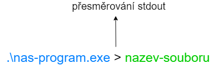
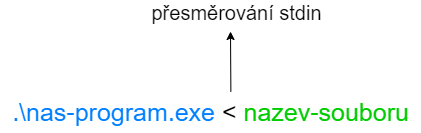
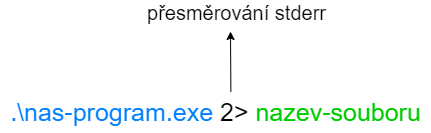

V jazyku C máme několik základních tzv. streamů.

1. **standardní výstup** (stdout)
1. **standardní vstup** (stdin)
1. **standardní chybový výstup** (stderr)


## Standardní výstup - stdout
Se standardním vstup a výstupem jsme se již setkali. Při volání funkce `printf` posíláme výstup právě do tzv. standardního výstupu.

Při práci se standardním vstupem se nám může hodit tzv. **přesměrování** (anglicky redirect) výstupu.

Mějme program

```c
#include <stdio.h>

int main()
{
    printf("Ahoj svete!\n");

    return 0;
}
```

Pokud program spustíme v PowerShell terminálu (viz kapitola XXX), tak se nám výstup vytiskne přímo do PowerShell terminálu. Někdy bychom ale chtěli, aby se nám výstup uložil do souboru. To lze udělat právě pomocí přesměrování.

Pokud chceme přesměrovat standardní výstup, tak použijeme operátor `>`.



Kdybychom zavolali náš program jako


```ps1
PS C:\Users\tomas> cd "C:\Users\tomas\codeblocks\hello\bin\Debug\"
PS C:\Users\tomas\codeblocks\hello\bin\Debug> .\hello.exe > test.txt
```

Tak se nám ve složce `C:\Users\tomas\codeblocks\hello\bin\Debug\` vytvoří soubor `test.txt`, který bude obsahovat
```
Ahoj svete!
```


Existuje i alternativní forma pro standardní výstup pomocí `1>`


Ta funguje stejně jako předchozí přesměrování

```ps1
PS C:\Users\tomas> cd "C:\Users\tomas\codeblocks\hello\bin\Debug\"
PS C:\Users\tomas\codeblocks\hello\bin\Debug> .\hello.exe 1> test.txt
```

## Standardní vstup - stdin
Se standardním vstup jsme se již setkali. Když čteme uživatelský vstup pomocí funkce `scanf` (viz kapitola [Práce s uživatelskám vstupem](./zaklady-vstup.md)), tak čteme právě standardní vstup.

Původně jsme pracovali se standardním vstupem tak, že jsme něco napsali na klávesnici a zmáčknuli enter. Pokud pouštíme program pořád dokola se stejným standardním vstupem, tak po nějaké době je otravné zadávat pořád dokola ten stejný vstup. Tento problém se dá vyřešit právě přesměrováním standardního vstupu.



Funguje to tak, že si uložíme do souboru vstup, který bychom normálně psali ručně.

Mějme program

```c
#include <stdio.h>

int main()
{
    int prvniCislo = 0;
    int druheCislo = 0;
    printf("Zadejte prvni cislo:\n");
    scanf("%i", &prvniCislo);

    printf("Zadejte druhe cislo:\n");
    scanf("%i", &druheCislo);

    int soucet = prvniCislo + druheCislo;
    printf("Soucet je: %i\n", soucet);

    return 0;
}
```

Když ho nyní spustíme, tak musíme zadat nejprve první číslo a následně druhé číslo. My si ale můžeme vytvořit soubor s názvem například `vstup.txt` ve složce, kde máme binární soubor. V mém případě by to byl soubor s cestou `C:\Users\tomas\codeblocks\hello\bin\Debug\vstup.txt`. Do tohoto souboru uložíme

```
100
25
```

Nyní když spustíme náš program z PowerShell terminálu

```ps1
PS C:\Users\tomas> cd "C:\Users\tomas\codeblocks\hello\bin\Debug\"
PS C:\Users\tomas\codeblocks\hello\bin\Debug> .\hello.exe < vstup.txt
```

Tak bohužel dostáváme chybu `The '<' operator is reserved for future use.`. Je to kvůli tomu, že tohle přesměrování se ještě Microsoft nerozhodnul, že bude PowerShell podporovat. Pokud jste na Linuxu, tak s tím problém mít nebudete. Alternativa ve Windows je použít místo PowerShell terminálu starou aplikaci `cmd.exe` (program příkazový řádek, anglicky command prompt), která to podporuje.

Naštěstí jde pustit `cmd.exe` přímo z PowerShell terminálu, takže můžete udělat přesměrování standardního vstupu pomocí

```ps1
PS C:\Users\tomas\codeblocks\hello\bin\Debug> cmd.exe /c ".\hello.exe < .\vstup.txt"
```

Nyní by se nám mělo vytisknout

```
Zadejte prvni cislo:
Zadejte druhe cislo:
Soucet je: 125
```

Nyní už nemusíme žádná čísla ručně zadávat.


## Standardní chybový výstup - stderr
Nový stream, se kterým jsme se ještě nesetkali, tak je standardní chybový výstup. Jak můžeme něco vytisknout na standardní chybový výstup? Slouží nám k tomu funkce `fprintf`. S tou jsme se již setkali v kapitole [Práce se soubory](./zaklady-soubory.md). Tato funkce dokáže přijímat jako první parametr nejenom soubor, ale i hodnoty `stdout` a `stderr`.

```c
#include <stdio.h>

int main()
{
    fprintf(stdout, "Ahoj svete stdout!\n");
    fprintf(stderr, "Ahoj svete stderr!\n");

    return 0;
}
```

Když program pustíme, tak dostáváme

```
Ahoj svete stdout!
Ahoj svete stderr!
```

Jaký je tedy rozdíl? Když zkusíme přesměrování

```ps1
PS C:\Users\tomas> cd "C:\Users\tomas\codeblocks\hello\bin\Debug\"
PS C:\Users\tomas\codeblocks\hello\bin\Debug> .\hello.exe > test.txt
```

Tak se nám pořád do terminálu tiskne

```
Ahoj svete stderr!
```

Je to proto, že operátor `>` přesměruje pouze standardní vstup, nikoliv standardní chybový výstup. Standardní chybový výstup můžeme přesměrovat pomocí operátoru `2>`



Když přesměrujeme chybový výstup
```ps1
PS C:\Users\tomas\codeblocks\hello\bin\Debug> .\hello.exe 2> test.txt
```
Tak dostáváme

```
Ahoj svete stdout!
```

Pokud bychom chtěli přesměrovat oba vstupy, tak můžeme použít

```ps1
PS C:\Users\tomas\codeblocks\hello\bin\Debug> .\hello.exe > text.txt 2> chyba.txt
```

K čemu je tedy standardní chybový výstup dobrý? Obecně do něj tiskneme chyby. Pokud máme nějaké dlouho běžící programy, tak často tisknout mnoho GB dat denně. Většina z nich jsou jenom informační tisky, že něco proběhlo úspěšně. Pokud bychom v takových výpisech měli i chyby, tak bychom je špatně dohlédavali v takovém množství dat.

Tento problém nám vyřeší právě standardní chybový vstup, který můžeme přesměrovat do svého vlastního souboru. Pak se můžeme dívat jenom do tohoto souboru a máme všechny chyby na jednom místě.

**Každý správný program by měl všechny chyby tisknout na standardní chybový výstup.**


## Odkazy
[Následující kapitola: Práce s uživatelskám vstupem pro pokročilé](./pokrocile-vstup.md)

[GitHub diskuze k této kapitole](https://github.com/tomasbruckner/c_lectures/discussions/31)

[Zpátky na přehled](./index.md)

[Předchozí kapitola: Struktury pro pokročilé](./pokrocile-struktury.md)
