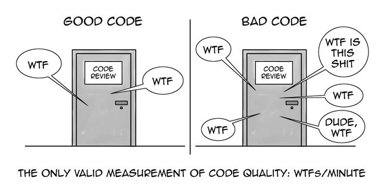

Čistý kód je označení, které se v programování používá, pro dobře napsaný kód. Dobře napsaný kód je ten, ve kterém se vyznají i jiní lidé, než ti, kteří daný kód napsali.




Jak psát dobrý a kvalitní kód? To není až tak jednoznačná věc. V některých komunitách se píše kód způsobem A a způsob B je kompletně špatně. Pak ale můžete zjistit, že v jiné komunitě to je naprosto naopak. Způsob A je naprosto špatně a musíte ho psát způsobem B. Každý má jiné preference, které většinou vychází z toho, s jakým způsobem psaní se člověk setkal v posledních x letech.

Existuje však několik pouček, které jsou univerzálně brány jako správné. Na některé vybrané poučky se v této kapitole podíváme. Obecně si kvalitu svého kódu můžete uvědomit tak, že po nějaké době přijdete ke svému starému kódu a pokusíte se pochopit, co se ve vašem programu děje. Čím více chápete, tím kvalitnější kód jste napsali.

Nyní se podívejme na několik základních pouček.


## Naformátovaný kód
Kód by měl být vždy dobře naformátovaný. Ukázka špatného kódu

```c
int   moje_funkce ( int cislo_k_tisku)  

{
        int z=32;
  int    q =   4;

                printf("abc\n"); return 0;


   }
```

Existuje více způsobů odsazení. Můžete používat taby/mezery. Můžete používat různé velikosti odsazení (2/4/8 mezer na jedno odsazení). Tohle není důležité a je jedno, co si vyberete.

Stejný program, ale lépe naformátovaný kód je
```c
int moje_funkce(int cislo_k_tisku)  
{
    int z = 32;
    int q = 4;
    printf("abc\n");

    return 0;
}
```

Takový kód se lépe čte a působí profesionálněji. Většina editorů pro psaní kódu umožňuje kód automaticky naformátovat tak, aby vypadal dobře.


## Princip DRY - Don't Repeat Yourself
Když máte dvě funkce, které dělají téměř to samé

```c
int funkce_return_1(int cislo_k_tisku)  
{
    int z = 32;
    int q = 4;
    int vysledek = cislo_k_tisk + z + q;
    printf("Tisk %i\n", vysledek);

    return 1;
}

int funkce_return_0(int cislo_k_tisku)  
{
    int z = 32;
    int q = 4;
    int vysledek = cislo_k_tisk + z + q;
    printf("Tisk %i\n", vysledek);

    return 0;
}
```

Tak může společný kód vyextrahovat do pomocné funkce


```c
void tisk(int cislo_k_tisku) {
    int z = 32;
    int q = 4;
    int vysledek = cislo_k_tisk + z + q;
    printf("Tisk %i\n", vysledek);
}

int funkce_return_1(int cislo_k_tisku)  
{
    tisk();

    return 1;
}

int funkce_return_0(int cislo_k_tisku)  
{
    tisk();

    return 0;
}
```
To nám zaručí, že když budeme v budoucnu chtít udělat změnu ve společném kódu, tak nám stačí upravit jenom jedno místo a nemůže se nám stát, že na jedno z míst zapomeneme.

> Tady je potřeba dát pozor na to, jestli spolu sdílený kód více funkcí logicky souvisí nebo ne. Pokud je to spíše náhoda, že více funkcí sdílí stejný kód, tak se nám může stát, že když uděláme změnu právě v tomto sdíleném kódu kvůli funkci 1, tak se změná projeví i ve funkci 2, což nemusí být dobře. To už je ale taková pokročilá technika. Zatím bychom se měli více soustředit na to, ať se nám kód zbytečně neduplikuje.

## Zakomentovaný kód
Další špatná praktika při psaní kódu je komentovat kód, a pak zakomentovaný kód nesmazat a sdílet ho s členy našeho týmu. Nechat v kódu zakomentovaný kód může v některých případech dávat smysl pro vlastní soukromé projekty, kde s nikým nespolupracujeme. Jakmile začnete pracovat na větším projektu, kde spolupracujete s více lidma, tak zakomentovaný kód přináší více problémů než užitku.

Mějme program
```c
void tisk(int cislo_k_tisku) {
    int z = 32;
    int q = 4;
    int vysledek = cislo_k_tisk + z + q;
    printf("Tisk %i\n", vysledek);
    // moje_funkce(q, z);
    // tiskni_prvocislo(vysledek);
}
```

Když takový kód napíšete, tak s trochou štěstí si za měsíc ještě budete pamatovat, proč jste danou část kódu zakomentovali. Jakmile takový kód uvidíte za rok, tak už to bude spíše nepravděpodobné, že si vzpomenete, proč se daný kus zakomentoval. A člověk, který ten kód uvidí poprvé (a nepsal ho), tak ten už vůbec nebude vědět, proč je daný kus zakomentovaný. Často se tedy stává, že se tento zakomentovaný kód nikdy nesmaže, protože už nikdo neví, jestli je potřeba nebo už není.

Správně by takový zakomentovaný kód vůbec neměl vzniknout a pokud nějaký kód nepotřebujete, tak ho rovnou smažte.

Někdo by mohl namítnout, že se může stát, že se k zakomentovanému kódu budeme potřebovat vrátit. Tento problém však řeší verzovací systémy např. Git. O něm více v kapitole XXX.

## Dobře pojmenované proměnné a funkce
Měli bychom se snažit pojmenovat názvy funkcí a jejich parametrů tak, aby programátor (který je bude používat) co nejlépe pochopil, co daná funkce dělá. Mělo by to být jasné jen z názvu, tzv. i bez toho, abychom museli studovat samotný obsah funkce (tělo funkce).

Mějme prototyp funkce

```c
void moje_funkce(int cislo);
```

Když se podíváme jenom na název funkce, tak vůbec nevíme, co funkce dělá. Stejně tak název proměnné není moc dobře pojmenovaný. My už z datového typu parametru víme, že se jedná o číslo.

Když se podíváme na implementaci funkce.

```c
void moje_funkce(int cislo)
{
    printf("Operace trvala %i sekund\n", cislo);
}
```

Až teď vidíme, co se opravdu ve funkci děje. Zkusíme funkci a parametry lépe pojmenovat
```c
void tisk_trvani_operace(int cas_v_sekundach);
```

Nyní bychom měli mít mnohem lepší představu o tom, co funkce dělá.


Podobně to je i s pojmenováním proměnných
```c
int x = 5;
int y = 7;
int z = 10;
int q = x * y * z;
```
Pokud bychom proměnné lépe pojmenovali
```c
int strana_a = 5;
int strana_b = 7;
int strana_c = 10;
int objem_kvadru = x * y * z;
```

Tak opět máme mnohem lepší představu, co jednotlivé proměnné znamenají.

## Preferujte pozitivní podmínky
Negativní podmínky se obecně hůře čtou a lidé v nich dělají častěji chyby. Vždy preferujte pozitivní porovnání nad negativním (pokud je to možné)

```c
if (x != 3) {
    printf("ruzne od tri\n");
} else {
    printf("tri\n");
}
```

Radši preferujte pozitivní

```c
if (x == 3) {
    printf("tri\n");
} else {
    printf("ruzne od tri\n");
}
```

## Magické konstanty
Magické konstanty je označení pro hodnoty, které nemají speciální pojmenování a používají se v kódu jako konstanty. Příkládem může být

```c
if (cas > 300) {
    printf("Chyba\n");
}
```
Opravíme to tak, že konstantu 300 pojmenujeme pro lepší čitelnost (viz kapitola makra XXX)

```c
#define MAXIMALNI_POCET_SEKUND 300

if (cas > MAXIMALNI_POCET_SEKUND) {
    printf("Chyba\n");
}
```

Obecně není potřeba pojmenovávat konstanty 0, 1 a -1, protože u nich je jejich význam většinou zřejmý.


## Jazyk
Je silně nedoporučováno používat více jazyků ve vašem zdrojovém kódě. Například by bylo špatně, kdyby část kódu/komentářů byla napsaná anglicky a část česky.

Také silně doporučuji ve vašich kódech používat angličtinu místo češtiny. Angličtina je jazyk programátorů. Ať půjdete pracovat do libovolné firmy, tak vždy budete pracovat v angličtině. Čím dříve se s angličtinou naučíte pracovat, tím lépe pro vaši kariéru.


## Příliš dlouhé funkce
Na co si dát pozor je, že byste všechno neměnili mít v jedné funkci. Maximální délka funkce se hodně liší podle toho, koho se zeptáte. Může to být například maximálně 30 řádků. Někdo říká 7 řádků. Obecně pokud má vaše funkce přes 100, tak už určitě víte, že je moc dlouhá.

Pokud máte moc dlouhou funkci, tak to většinou znamená, že se snažíte dělat příliš moc věcí v jedné funkci. Příliš dlouhou funkci byste měli rozbít na několik menších funkcí.

Tím se zvyšuje přehlednost v kódu a vaše funkce půjdou znovupoužít i v jiných částech aplikace.

## Fun fact
Čistý kód je pojmenován podle stejnojmenné knížky [Clean Code](https://www.goodreads.com/book/show/3735293-clean-code).

Ta je zaměřená především na programování v Javě, ale určitě patří do každé knihovničky dobrého programátora.

