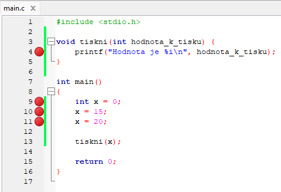

Debugger (česky ladička od slovo ladit) je funkce všech moderních editorů zdrojového kódu. Tato funkcionalita nám umožňuje procházet zdrojový kód krok po kroku a v každém kroku se podívat aktuální hodnoty proměnných a co přesně se v programu děje. `Debugger` je součástí také CodeBlocks.

Každý `debugger` musí obsahovat minimálně nasledující funkce

- Nastaveni/zrušení `breakpointu`
- Sleduj hodnotu
- Pokračuj k dalšímu `breakpointu`
- Jdi na další řádek
- Vstup do funkce
- Vystup z funkce

Zkontrolujme si, že máme CodeBlocks správně nastavený. V horní liště byste měli vidět ovládání `debuggeru`


Pokud to nevidíte, tak si ho zobrazte tím, že kliknete v navigační liště (nahoře) na:

View -> Toolbars -> Debugger


Nyní máme vše připraveno a můžeme začít. Mějme program

```c
#include <stdio.h>

void tiskni(int x) {
    printf("Hodnota je %i\n", x);
}

int main()
{
    int x = 0;
    x = 15;
    x = 20;

    tiskni(x);

    return 0;
}
```

## Nastaveni/zrušení breakpointu
`Breakpoint` nastavíme tak, že klikneme na řádek, kde chceme `breakpoint` nastavit. Přesněji řečeno klikneme napravo od čísla řádku. Tím nám vznikne u tohoto řádku červené kolečko.


Na obrázku vidíme `breakpoint` nastavený na řádek 11.

Pokud na červené kolečko klikneme znovu, tak zmizí. Tím jsme `breakpoint` odstranili.

Breakpointu můžeme mít v aplikaci libovolné množství.



## Sleduj hodnotu
Mějme `breakpoint` na řádku 4 a 11. Program teď spustíme, ale nikoliv přes zelenou šipku. Pustíme ho pomocí červené šipky v liště ovládání `debuggeru`. 

Pokud ji zmáčkneme, tak vidíme, že se nám program nějak podivně zastavil a u `breakpointu` je teď žlutá šipka


**Žlutá šipka nám ukazuje, kde se program aktuálně nachází.** Když teď klikneme na ikonku aplikace s oranžovým broučkem (jde to opravdu špatně poznat) a zaklikneme `Watches`, tak nám vyskočí nové okno, ve kterém vidíme aktuální hodnotu proměnné `x` (15).


Nyní máme několik možností.

### Možnost 1 - Pokračuj k dalšímu breakpointu
Pokud klikneme na červené šipku znovu, tak program bude pokračovat k dalšímu `breakpointu`.


Nyní vidíme, že se program nachází na `breakpointu` na řádku 4. Ve `Watches` vidíme, že `hodnota_k_tisku` má hodnotu 20.

Pokud zmáčkneme červenou šipku potřetí, tak program skončí (už další `breakpoint` v aplikaci nemáme).

### Možnost 2 - Jdi na další řádek
Pokud klikneme na třetí symbol zleva (Next line)


Tak se nám program přesune na řádek 13 (žlutá šipka) a hodnota hodnoty `x` ve `Watches` se změní na 20.


Nyní pokud zrušíme `breakpoint` na řádku 4 (budeme mít pak jenom jedno červené kolečko a to na řádku 11) a klikneme na tlačítko `Next line`, tak program pokračuje na řádek 15.

`Next line` funguje tak, že ve výchozím nastavení nevstoupí dovnitř funkce, ale přeskočí ji. Vstoupí do ni jenom v případě, že je zde `breakpoint`. To si můžeme vyzkoušet tak, že si vrátíme zpátky `breakpoint` na řádek 4.

> Zde pozor, že i když se nějaká funkce "přeskočí", tak program ji stejně vykoná. Není to tak, že by se přeskočené řádky nevykonaly. Vždy se vykonají, akorát se debugger zastaví až za danou přeskočenou funkcí. V našem případě se tedy vždy vytiskne "Hodnota je 20"!

Pokud bychom zmáčknuli `Next line` na řádku 15, tak program končí.

### Možnost 3 - vstup do funkce
Pokud klikneme na čtvrtý symbol zleva (Step into), tak se nám program přesune na řádek 13 (obdobně jako v možnosti 2).

Opět zrušme `breakpoint` na řádku 4. Nyní když klikneme na `Step into`, tak se funkce `tiskni` nepřeskočí, ale vstoupíme dovnitř této funkce a dostáváme se na řádek 4. To je hlavní rozdíl mezi `Next line` a `Step into`. První přeskakuje funkce (pokud tam není `breakpoint`) a druhé do funkce vždy vstoupí.

Nyní můžeme klikat `Step into` tak dlouho, než program neskončí.

### Možnost 4 - vystup z funkce
Pokud bychom klikli na pátý symbol (Step out), tak se program ukončí. `Step out` funguje tak, že "vystoupí" (dokončí) aktuálně prováděnou funkce.

Mějme program

```c
#include <stdio.h>

void tiskni(int hodnota_k_tisku) {
    printf("Hodnota je %i\n", hodnota_k_tisku);
    printf("Hodnota je %i\n", hodnota_k_tisku);
    printf("Hodnota je %i\n", hodnota_k_tisku);
}

int main()
{
    tiskni(10);

    tiskni(15);

    return 0;
}
```

Dejme si `breakpoint` na řádek 4 (pouze). Pokud Nyní program spustíme přes červenou šipku, tak se debugger zastavil na řádku 4 (žlutá šipka). Nyný když klikneme na `Step out`, tak se dostáváme na řádek 13. Je to proto, že jsme do funkce `tiskni` vstoupili na řádku 11 a pomocí `Step out` jsme z funkce vystoupili zpátky (odkud jsme funkci volali, tzv. do funkce `main`) a pokračujeme na další řádek (což je řádek 13).

Pokud nyní zmáčkneme `Step out`, tak se program ukončuje. Pokud bychom klikli na `Next line` nebo `Step into`, tak se opět dostáváme do funkce `tiskni`.


## Call stack
Mějme program

```c
#include <stdio.h>

void tiskni(int hodnota_k_tisku) {
    printf("Hodnota je %i\n", hodnota_k_tisku);
}

int main()
{
    int x = 0;
    x = 15;
    x = 20;

    tiskni(x);

    return 0;
}
```

Dejme `breakpoint` na řádek 4 a spusťme program přes červenou šipku. Nyní zapneme `Call stack` tam, kde jsme zapnuli `Watches`.

> Nedoporučuji zapínat `CPU Registers`. Může způsobit nefunkčnost celkového `Debuggeru`. Opravíte to tak, že `CPU Registers` zase vypnete.


Nyní bychom měli vidět


Díky tomu můžeme vidět, že jsme ve funkci `tiskni` s parametrem `hodnota_k_tisku=20`.

Na druhém řádku vidíme, že do funkce jsme se dostali z řádku 13 z funkce `main`.

To se může v některých situacích hodit.

## Shrnutí
`Debugger` je skvělá pomůcka, která dokážete velmi zjednodušit pochopení, proč program nefunguje nebo co se v programu děje. Silně doporučuji si `debugger` osvojit a naučit se s ním pracovat.


## Odkazy
[Následující kapitola: Aritmetické operace](./zaklady-aritmeticke-operace.md)

[GitHub diskuze k této kapitole](https://github.com/tomasbruckner/c_lectures/discussions/51)

[Zpátky na přehled](./index.md)

[Předchozí kapitola: Definujeme vlastní funkce](./zaklady-funkce.md)
