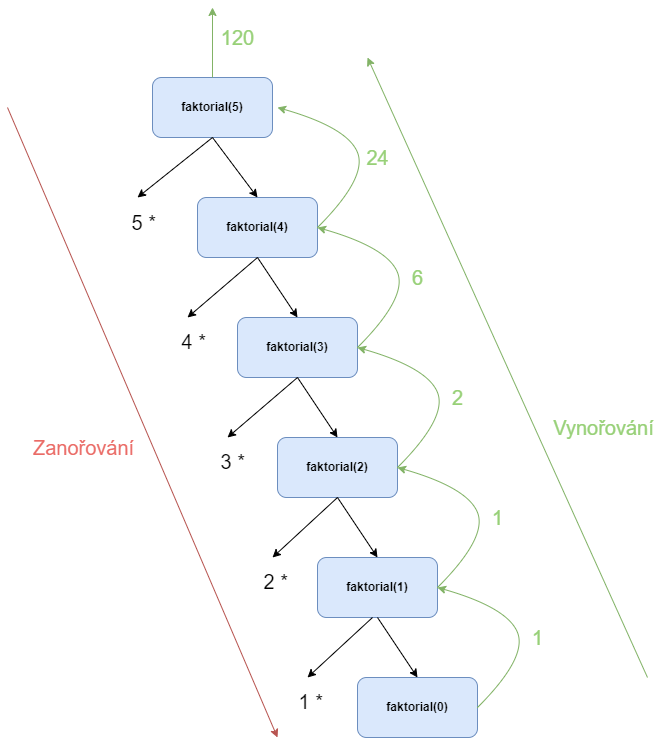

Rekurzivní funkce je pojmenování pro funkce, které volají samy sebe. Je dobré o nich vědět, protože můžou někdy výrazně zjednodušit řešení problému.

Ukázka rekurzivní funkce je

```c
void rekurze() {
    rekurze();
}
```

Kdybychom takovou funkci zavolali, tak se nedočkáme úspěšného konce. Můžeme si to demonstrovat na následujícím programu

```c
#include <stdio.h>

void rekurze() {
    rekurze();
}

int main()
{
    rekurze();

    return 0;
}
```

Takový program poběží teoreticky nekonečně dlouho. Ve skutečnosti ale programu dojde paměť v počítači a program se ukončí s chybou `stack overflow`. Proto je důležité u každé rekurzivní funkce mít podmínkou, kdy program skončí (ukončující podmínku).

Příkladem rekurzivní funkce může být výpočet faktoriálu. Pro zopakování faktoriálu např. [zde](https://www.matweb.cz/faktorial/).

Pro faktoriál platí
1. pokud n = 0, pak faktoriál se rovná 1
1. jinak platí, že n faktoriál se rovná n krát n - 1 faktoriál (n! = n*(n-1)!)


Pokud se výpočet faktoriálu pokusíme naprogramovat, tak si nejdříve můžeme udělat ukončující podmínku

```c
#include <stdio.h>

int faktorial(int n) {
    if (n == 0) {
        return 1;
    }

    return ...;
}

int main()
{
    int vysledek = faktorial(5);

    return 0;
}
```

To je náše podmínka, která nám zastaví nekonečnou rekurzi. V každé rekurzivní funkci musí být nějaká podmínka, která výpočet zastaví a již znova nezavolá danou funkci.

Nyní můžeme naprogramovat druhou část funkce. Pokud n není 0, tak se má vrátít `n * (n - 1)!`.

To můžeme naprogramovat následovně
```c
#include <stdio.h>

int faktorial(int n) {
    if (n == 0) {
        return 1;
    }

    return n * faktorial(n - 1);
}

int main()
{
    int vysledek = faktorial(5);
    printf("Vysledek %i\n", vysledek);

    return 0;
}
```

Jak výpočet probíhá?

| Volání  |  Návratová hodnota  | Výsledek  |
|---|---|---|
| faktorial(5) | return 5 * faktorial(4)  | 120 (5 * 24)  | 
| faktorial(4) | return 4 * faktorial(3)  | 24 (4 * 6) | 
| faktorial(3) | return 3 * faktorial(2)  | 6 (3 * 2) | 
| faktorial(2) | return 2 * faktorial(1)  | 2 (2 * 1) | 
| faktorial(1) | return 1 * faktorial(0)  | 1 (1 * 1) | 
| faktorial(0) | return 1  | 1  | 

Pokud si to odkrokujeme, tak dostáváme

1. Zavolá se funkce `faktorial(5)`
1. Zkontroluje se podmínka - je 5 rovno 0? Ne, IF se nevyhodnotí
1. zavolá se `5 * faktorial(4)`
1. Zkontroluje se podmínka - je 4 rovno 0? Ne, IF se nevyhodnotí
1. zavolá se `4 * faktorial(3)`
1. Zkontroluje se podmínka - je 3 rovno 0? Ne, IF se nevyhodnotí
1. zavolá se `3 * faktorial(2)`
1. Zkontroluje se podmínka - je 2 rovno 0? Ne, IF se nevyhodnotí
1. zavolá se `2 * faktorial(1)`
1. Zkontroluje se podmínka - je 1 rovno 0? Ne, IF se nevyhodnotí
1. zavolá se `1 * faktorial(0)`
1. Zkontroluje se podmínka - je 0 rovno 0? Ano, IF se vyhodnotí
1. Vrátí se hodnota 1 jako výsledek `faktorial(0)`
1. `1 * faktorial(0)` se nahradí za `1 * 1`
1. Vrátí se hodnota 1 jako výsledek `faktorial(1)`
1. `2 * faktorial(1)` se nahradí za `2 * 1`
1. Vrátí se hodnota 2 jako výsledek `faktorial(2)`
1. `3 * faktorial(2)` se nahradí za `3 * 2`
1. Vrátí se hodnota 6 jako výsledek `faktorial(3)`
1. `4 * faktorial(3)` se nahradí za `4 * 6`
1. Vrátí se hodnota 24 jako výsledek `faktorial(4)`
1. `5 * faktorial(4)` se nahradí za `5 * 24`
1. Vrátí se hodnota 120 jako výsledek `faktorial(5)`
1. Hodnota 120 se uloží do proměnné `vysledek` ve funkci `main`
1. Hodnota `vysledek` se vytiskne
1. Program se ukončí pomocí `return 0`


Obecný výpočet rekurzivní funkce probíhá vždy tak, že se nejdříve výpočet zanořuje směrem dolů (volá se rekurzivní funkce dále a dále). Výpočet se zanořuje tak dlouho, než narazí na ukončovací podmínku (v našem případě pro faktoriál `n == 0`). Jakmile se narazí na ukončovací podmínku, tak se výpočet začne zase vynořovat (volání rekurzivní funkce se nahrazují za hodnoty).

Na diagramu by to vypadalo následovně




## Vztah rekurze a iterace
Obecně se programy s rekurzí dají přepsat na programy bez rekurze se zachováním funkčnosti. Náš program na výpočet faktoriálu by šlo napsat bez použití rekurze následovně

```c
#include <stdio.h>

int faktorial(int n) {
    int vysledek = 1;

    while (n > 1) {
        vysledek = vysledek * n;
        n = n - 1;
    }

    return vysledek;
}

int main()
{
    int vysledek = faktorial(5);
    printf("Vysledek %i\n", vysledek);

    return 0;
}
```

Některé programy je však mnohem jednodušší napsat pomocí rekurze a bylo by mnohem náročnější je napsat bez rekurze.

Je nutné si dát pozor, že použití rekurze může mít negativní vliv na výkon programu. Velké rekurze si berou hodně zdrojů počítače a pro velké množství zanoření nemusí takový program ani nikdy doběhnout.


## Odkazy
[Následující kapitola: Čistý kód](./volitelne-cisty-kod.md)

[GitHub diskuze k této kapitole](https://github.com/tomasbruckner/c_lectures/discussions/37)

[Zpátky na přehled](./index.md)

[Předchozí kapitola: Struktura Switch](./volitelne-switch.md)
