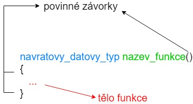
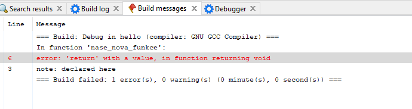
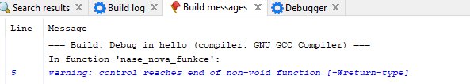
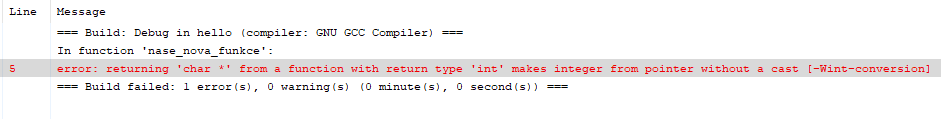
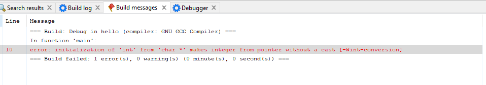
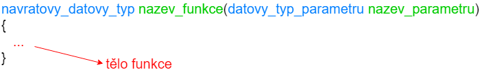
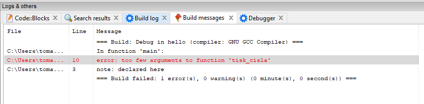
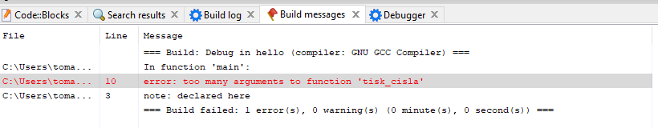

# Definujeme vlastní funkce
V našem kurzu jsme se setkali s funkcemi *printf* (funkce knihovny stdio) a *main* (povinná funkce, která musí být v každém programu). Nyní si vyzkoušíme definovat vlastní funkce.

Funkce si rozdělíme na několik typů
1. Funkce bez parametrů
1. Funkce s parametrama (pevným počtem)
1. Funkce s variabilním množství parametrů

Třetí typ pro nás zatím není důležitý. Probereme si ho více v kapitole XXX.

## Funkce bez parametrů

Abychom funkci mohli použít, je potřeba ji nejdříve definovat. Obecný formát definice je následovný



Jednotlivé sekce jsou

* návratový datový typ - funkce může vrátit nějakou hodnotu. Proto musíme vždy definovat datový typ hodnoty (obdobně jako při definici proměnné), kterou funkce vrátí. Pokud funkce nic nevrací, tak jí definujeme návratový datový typ **void** (vysvětlíme si později na příkladu).
* název funkce - každá funkce musí mít unikátní identifikátor (název). Pro identifikátory funkcí platí stejná pravidla jako pro identifikátory proměnných (pouze velká a malá písmena bez diakritiky, čísla atd. viz kapitola XXX).
* tělo funkce - obsahuje libovolný počet příkazů (pro zjednodušení řádku kódu). Zde se definuje, co má funkce dělat. Tělo funkce může být i prázdné, ale to by znamenalo, že funkce nic nedělá.


Pojďme si definovat naši novou funkci. Rozhodli jsme si, že je to funkce, která nebude vracet žádnou hodnotu. Pojmenujeme si ji **nase_nova_funkce**. Definujeme ji tedy jako

```c
void nase_nova_funkce()
{
}
```

Celý program by pak vypadal jako

```c
#include <stdio.h>

void nase_nova_funkce()
{
}

int main()
{
    return 0;
}
```
Pokud program nyní spustíme, tak se nám nic nevypíše. Je to proto, že v našem programu nemáme žádný příkaz *printf*. Definujme si tedy tělo funkce *nase_nova_funkce*.

```c
#include <stdio.h>

void nase_nova_funkce()
{
    printf("Hello world!\n");
}

int main()
{
    return 0;
}
```

Když nyní program spustíme, tak se nám opět nic nevypíše. Proč? Protože program se vykonává postupně od začátku funkce main. Tzv. začne se zpracovávat funkce main, ta má v sobě jeden příkaz `return 0;`, což náš program ukončí. Naše funkce se tedy nikdy nespustí. Abychom funkci spustili, musíme ji zavolat. Zavolání funkce probíhá tak, že do místa, kde chceme funkci zavolat, tak dáme název dané funkce, závorky a středník. Náš kód tedy upravíme.
```c
#include <stdio.h>

void nase_nova_funkce()
{
    printf("Hello world!\n");
}

int main()
{
    nase_nova_funkce();
    return 0;
}
```
A po spuštění se nám vytiskne `Hello world!`. Funkce v programu můžeme volat i několikrát. Jak bychom udělali, kdybychom chtěli `Hello world!` vytisknout 4x za sebou? Máme několik možností. Buď můžeme udělat to, že zavoláme naši funkci v main 4x.

```c
#include <stdio.h>

void nase_nova_funkce()
{
    printf("Hello world!\n");
}

int main()
{
    nase_nova_funkce();
    nase_nova_funkce();
    nase_nova_funkce();
    nase_nova_funkce();
    return 0;
}
```
nebo můžeme dát 4x printf do naší nové funkce.

```c
#include <stdio.h>

void nase_nova_funkce()
{
    printf("Hello world!\n");
    printf("Hello world!\n");
    printf("Hello world!\n");
    printf("Hello world!\n");
}

int main()
{
    nase_nova_funkce();
    return 0;
}
```

Dáme 2x printf do naší funkce a zavoláme ji dvakrát

```c
#include <stdio.h>

void nase_nova_funkce()
{
    printf("Hello world!\n");
    printf("Hello world!\n");
}

int main()
{
    nase_nova_funkce();
    nase_nova_funkce();
    return 0;
}
```

Nebo můžeme i zavolat printf ve funkci main

```c
#include <stdio.h>

void nase_nova_funkce()
{
    printf("Hello world!\n");
    printf("Hello world!\n");
}

int main()
{
    printf("Hello world!\n");
    nase_nova_funkce();
    printf("Hello world!\n");
    return 0;
}
```

Určitě byste vymysleli i více různých variant. V programování obecně platí, že vždy existuje hodně způsobů jak vyřešit daný problém. Některé jsou lepší, některé horší a hodně z nich je zhruba stejných.

Všimněme si, že v naší funkci neni žádný `return 0;`. Pokud bychom se ho tam pokusili přidat

```c
#include <stdio.h>

void nase_nova_funkce()
{
    printf("Hello world!\n");
    return 0;
}

int main()
{
    nase_nova_funkce();
    return 0;
}
```
Tak dostáváme chybu



Na řádku 6 je chyba, že se vrací hodnota, i když funkce má vracet void. Na řádku 3 je u funkce definováno, že je void. To je správné chování, protože void funkce nemůže vracet hodnotu.


Co kdybychom ale nějakou hodnotu chtěli vracet? Pak nám stačí definovat návratový datový typ naší funkce. Pokud bychom nyní nechali tělo funkce prázdné

```c
#include <stdio.h>

int nase_nova_funkce()
{
}

int main()
{
    nase_nova_funkce();
    return 0;
}
```

Tak dostáváme chybu 



Na řádku 5 jsme se dostali na konec funkce, která není void, ale chybí return. Opravíme to tedy

```c
#include <stdio.h>

int nase_nova_funkce()
{
    return 0;
}

int main()
{
    nase_nova_funkce();
    return 0;
}
```

Nyní už program proběhne v pořádku, ale nic se nevypíše. Co my však můžeme udělat je, že si uložíme výsledek funkce do proměnné a následně ho vytiskneme.


```c
#include <stdio.h>

int nase_nova_funkce()
{
    return 7;
}

int main()
{
    int x = 10;
    x = nase_nova_funkce();
    printf("Hodnota je: %i\n", x);
    
    return 0;
}
```

Pokud nyní program spustíme, tak se nám vytiskne
```
Hodnota je: 7
```

Stejně tak můžeme i přiřadit hodnotu do proměnné rovnou

```c
#include <stdio.h>

int nase_nova_funkce()
{
    return 7;
}

int main()
{
    int x = nase_nova_funkce();
    printf("Hodnota je: %i\n", x);
    
    return 0;
}
```

Pokud bychom však z funkce vrátili hodnotu o jiném datovém typu
```c
#include <stdio.h>

int nase_nova_funkce()
{
    return "test";
}

int main()
{
    int x = nase_nova_funkce();
    printf("Hodnota je: %i\n", x);

    return 0;
}

```

Dostáváme chybu


Na řádku 5 se vrací datový typ **char \*** místo **int**.

Pokud bych naši funkci opravil

```c
#include <stdio.h>

char * nase_nova_funkce()
{
    return "test";
}

int main()
{
    int x = nase_nova_funkce();
    printf("Hodnota je: %i\n", x);

    return 0;
}
```

Tak opět dostávám chybu


Na řádku 10 se snažím nastavit hodnotu **char \*** do proměnné typu **int**.

Musíme tedy opravit i datový typ proměnné x a rovnou opravíme i %i na %s.

```c
#include <stdio.h>

char * nase_nova_funkce()
{
    return "test";
}

int main()
{
    char * x = nase_nova_funkce();
    printf("Hodnota je: %s\n", x);

    return 0;
}
```
A již dostáváme správný výsledek.

Z funkce můžeme vracet i hodnotu proměnné
```c
#include <stdio.h>

int nase_nova_funkce()
{
    int x = 15;

    return x;
}

int main()
{
    int x = nase_nova_funkce();
    printf("Hodnota je: %i\n", x);

    return 0;
}
```

Všimněme si, že v obou funkcích máme proměnnou x. Neříkali jsme si ale, že názvy proměnných musí být unikátní a nelze definovat stejnou proměnnou dvakrát? To platí vždy pro tzv. **scope**, ve kterém se proměnná nachází. Více si o tom povíme v kapitole XXX. Pro zjednodušení to zatím můžeme brát tak, že v rámci jedné funkce musí být název proměnná unikátní, ale v rámci jiných funkcí se opakovat můžou.


## Vlastní funkce s parametry
Funkce můžou mít i jeden nebo i více parametrů. Nejdříve si definujme pro jednoduchost funkci s jedním parametrem.



Mějme funkci, která nic nevrací (návratový datový typ void) a zatím nemá parametr.

```c
#include <stdio.h>

void tisk_cisla()
{
    int cislo_k_tisku = 15;

    printf("Hodnota je: %i\n", cislo_k_tisku);
}

int main()
{
    tisk_cisla();
    tisk_cisla();
    return 0;
}
```

Když program spustíme, tak se vytiskne dvakrát `Hodnota je: 15`, ale co bychom dělali, kdybychom jednou chtěli vytisknout 15 a podruhé 10? Jedna z možností je udělat další funkci.

```c
#include <stdio.h>

void tisk_cisla15()
{
    int cislo_k_tisku = 15;

    printf("Hodnota je: %i\n", cislo_k_tisku);
}

void tisk_cisla10()
{
    int cislo_k_tisku = 10;

    printf("Hodnota je: %i\n", cislo_k_tisku);
}

int main()
{
    tisk_cisla15();
    tisk_cisla10();
    return 0;
}
```

Nyní dostáváme správný výsledek. Co když ale chceme vytisknout ještě číslo 7? Jedno z řešení je přidat další funkci 

```c
#include <stdio.h>

void tisk_cisla15()
{
    int cislo_k_tisku = 15;

    printf("Hodnota je: %i\n", cislo_k_tisku);
}

void tisk_cisla10()
{
    int cislo_k_tisku = 10;

    printf("Hodnota je: %i\n", cislo_k_tisku);
}

void tisk_cisla7()
{
    int cislo_k_tisku = 7;

    printf("Hodnota je: %i\n", cislo_k_tisku);
}

int main()
{
    tisk_cisla15();
    tisk_cisla10();
    tisk_cisla7();
    return 0;
}
```

Kdybychom pak chtěli vytisknout dalších 10 různých čísel, tak by se nám program hodně rozrostl.

Problém by šlo vyřešit tím, že úplně zrušíme naše funkce a v `main` funkci dáme tisk natvrdo
```c
#include <stdio.h>

void tisk_cisla15()
{
    int cislo_k_tisku = 15;

    printf("Hodnota je: %i\n", cislo_k_tisku);
}

void tisk_cisla10()
{
    int cislo_k_tisku = 10;

    printf("Hodnota je: %i\n", cislo_k_tisku);
}

void tisk_cisla7()
{
    int cislo_k_tisku = 7;

    printf("Hodnota je: %i\n", cislo_k_tisku);
}

int main()
{
    printf("Hodnota je: 15\n");
    printf("Hodnota je: 10\n");
    printf("Hodnota je: 7\n");
    return 0;
}
```

Máme ale další problém. Co kdybychom chtěli vytisknout místo `Hodnota je: x` tak mít všude malé `h`, tzv. `hodnota je: x`. Musíme opravit tři řádky, kde se daný text objevuje. V takto malém programu to problém není, ale čím větší je daný program, tím větší to začíná být problém. Často se pak stává, že se opraví jenom několik místo a část tisku by pak měla malé a část velké H.

To lze vyřešit tak, že si vytvoříme funkci s jedním parametrem.

```c
#include <stdio.h>

void tisk_cisla(int cislo_k_tisku)
{
    printf("Hodnota je: %i\n", cislo_k_tisku);
}

int main()
{
    tisk_cisla(10);
    return 0;
}
```

Když program spustíme, tak se nám vytiskne
```
Hodnota je: 10
```

Parametry se definují vždy v závorkách za jménem funkce. Každý parametr musí mít definovaný datový typ (v tomto případě `int`) a unikátní identifikátor (jméno) v rámci funkce.

Taky se mění to, jak funkci voláme. Místo `tisk_cisla();` musíme funkci zavolat s parametrem. Pokud máme v definici funkci, že přijímá parametr datového typu int, tak funkci musíme volat s číslem. Co se stane, když bychom funkci zavolali bez parametru?


```c
#include <stdio.h>

void tisk_cisla(int cislo_k_tisku)
{
    printf("Hodnota je: %i\n", cislo_k_tisku);
}

int main()
{
    tisk_cisla();
    return 0;
}
```



Na řádku 10 je příliš málo argumentů (parametrů).

Pokud bychom funkci zavolali s více argumenty než jedním (argumenty od sebe oddělujeme čárkou)


```c
#include <stdio.h>

void tisk_cisla(int cislo_k_tisku)
{
    printf("Hodnota je: %i\n", cislo_k_tisku);
}

int main()
{
    tisk_cisla(10, 35);
    return 0;
}
```

Dostáváme tuto chybu `too many arguments` na řádku 10.


Správná forma je tedy naše původní. Nyní můžeme funkci zavolat kolikrát chceme

```c
#include <stdio.h>

void tisk_cisla(int cislo_k_tisku)
{
    printf("Hodnota je: %i\n", cislo_k_tisku);
}

int main()
{
    tisk_cisla(10);
    tisk_cisla(15);
    tisk_cisla(-5);
    tisk_cisla(0);
    return 0;
}
```

A pokud bychom potřebovali upravit text ve funkci *printf*, tak to stačí upravit pouze na jednom místě.

> Na jaké funkce program rozdělit. Kolik funkcí mít v programu. Jestli udělat funkci nebo ještě neudělat, to jsou problémy, které často tíží programátory. Neexistuje na to jednoduchá poučka. O tom jak psát dobře funkce si povíme více v kapitole XXX.

Pokud bychom chtěli funkci s více než jedním parametrem, tak postupujeme velmi obdobně. V definici funkce přidáme čárku za definicí první parametru a opět zadefinujeme datový typ druhého parametru a jeho název.

Mějme funkci, která sečte dvě čísla a vytiskne výsledek.
```c
#include <stdio.h>

void tisk_souctu(int x, int y)
{
    int vysledek = x + y;

    printf("Vysledek je: %i\n", vysledek);
}

int main()
{
    tisk_souctu(10, 5);
    return 0;
}
```

Pokud bychom chtěli sečíst tři čísla, můžeme udělat funkci, která má tři parametry
```c
#include <stdio.h>

void tisk_souctu(int x, int y, int z)
{
    int vysledek = x + y + z;

    printf("Vysledek je: %i\n", vysledek);
}

int main()
{
    tisk_souctu(10, 5, -2);
    return 0;
}
```

Vždy můžeme vrátit hodnotu z funkce. Stačí nám přidat do naší funkce `return` a změnit návratový datový typ z `void` na `int`.

```c
#include <stdio.h>

int soucet(int x, int y, int z)
{
    int vysledek = x + y + z;

    return vysledek;
}

int main()
{
    int vysledek_souctu = soucet(10, 5, -2);
    printf("Vysledek je: %i\n", vysledek_souctu);

    return 0;
}
```

Funkci jsme rovnou přejmenovali z *tisk_souctu* na *soucet*, protože funkce již nic netiskne.


# Parametr vs argument funkce
Můžete se setkat s pojmem argument funkce a parametr funkce. Někdo to používá jako synonymum. Je zde ale drobný rozdíl.

Parametr se používá v případě, že se bavíme o definici funkce.

```c
void tisk_cisla(int cislo_k_tisku)
{
    printf("Hodnota je: %i\n", cislo_k_tisku);
}
```
Zde je `cislo_k_tisku` parametr funkce.

Argument používáme v případě volání funkce.
```c
tisk_cisla(10);
tisk_cisla(x);
```

Argument prvního volání funkce je `10` a u druhého volání funkce je argument proměnná `x`.

Není potřeba se tím moc trápit. Jedná se o nedůležitou znalost. Z mého pohledu je v pořádku oba pojmy jako synonymum.