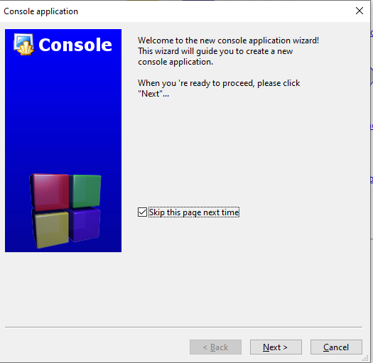
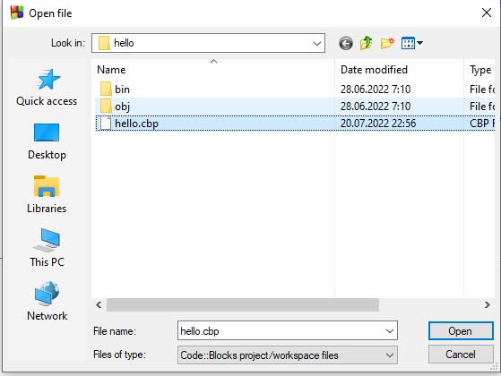

# První program - Ahoj světe!
Začněme s naším prvním programem. Následující zdrojový kód je velmi známý a nazývá se `Hello world!` (česky Ahoj světe!)

```c
#include <stdio.h>
#include <stdlib.h>

int main()
{
    printf("Hello world!\n");
    return 0;
}
```

Co tento program dělá? Vytiskne na obrazovku Hello world! a ukončí se. Zkusme si tento program vytvořit a úspěšně spustit v CodeBlocks. Tím ověříme, že se vše nainstalovalo správně.

Jak na to v CodeBlocks? 

1. Klikneme na "Create a new project" uprostřed obrazovky


2. Vybereme "Console application" a klikneme Go


3. Dále klikneme na Next (a můžeme zaškrtnout Skip thhis page next time)


4. Vybereme C


5. Vyplníme Project title libovolným názvem. Já jsem si vybral `hello`. Vybereme složku, kam se má projekt uložit. Já jsem si vybral cestu "C:\Users\tomas\codeblocks\". Doporučuji si vybrat složku někde ve složce vašeho uživatele (v mém případě C:\Users\tomas\\). Vyhnete se tím problémům s právami ve Windows. Klikneme Next.

 
6. Necháme vše zaškrtnuto a klikneme Finish.


7. Měli bychom vidět náš první program. Pokud ne, tak si ve stromové struktuře nalevo rozklikneme hello -> Sources -> main.c (dvojklik na main.c)


8. Nyní nezbývá než kliknout na ozubené kolečko se zelenou šipkou v horní liště. Tím se náš program spustí. Pozor, nechceme klikat ani na samostatné ozubené kolečko ani na samostatnou zelenou šipku, ale na tlačítko, které má oba tyto znaky 

9. Pokud vše proběhlo v pořádku, tak vidíme


10. Nyní můžeme kliknout na libovolnou klávesu a tím terminálové okno zmizí. Právě jsme si spustili náš první program!

> Pozor, je vždy potřeba terminálové okno vypnout. Někdy se stane, že se programátor jenom překlikne zpátky do CodeBlocks. To způsobuje problém v tom, že pokud bych teď udělal v programu změny a chtěl ho znovu spustit, tak tlačítko pro spuštění programu (ozubené kolečko se zelenou šipkou) bude zašedlé a nepůjde spustit. Vyřešíte to tak, že se překliknete ve Windows zpátky do terminálového okna (ve spodní liště Windows) a ukončíte svůj program (kliknete libovolnou klávesu nebo na křížek v pravém horním rohu). Ve spodní liště to vypadá nějak takto
. Další řešení je kliknout na červené tlačítko s křížkem (Abort), které je nyní aktivní 


## Anatomie programu Ahoj světe
S trochou štěstí nám vše funguje a nyní jsme oficiálně programátoři začátečníci! Teď je potřeba si rozebrat jednotlivé části programu, co která znamená.

### Tisk textu
Následující řádek
```c
printf("Hello world!\n");
```

slouží pro vypsání textu na obrazovku. K vypsání textu se používá funkce `printf`. Volání funkce (více viz kapitola XXX) obsahuje vždy několik částí. Název funkce, závorky, parametr a středník.


Závorky a středník jsou povinné. Název funkce může být různý. Vždy záleží jakou funkci chceme volat (každá funkce má jiné chování). Dokonce si můžeme i vytvářet své vlastní funkce (viz kapitola XXX).

Velmi důležitý je parametr funkce. Ten se může lišit pro různé funkce (některé funkce ani nemají žádný parametr). Naše funkce `printf` přijímá parametr typu `string` (v češtině *řetězec*). Ten vždy začíná a konči dvojitými uvozovkami `"`. Můžeme si to představit jako libovolný text.

Pokud bychom chtěli vytisknout něco jiného (například `Ahoj svete!`), tak bychom upravili volání funkce na

```c
```

Celý program by vypadal následovně
```c
#include <stdio.h>
#include <stdlib.h>

int main()
{
    printf("Ahoj svete!\n");
    return 0;
}
```

Po spuštění (ozubené kolečko se zelenou šipkou) se nám zobrazí nový text.

> Pozor na práci s diakritikou. Ta je trošku komplexnější a zatím ji nebudeme používat.


Velmi podezřele může působit `\n`. Co to znamená a proč se v programu nachází? Jedná se o něco, čemu se říká `Escape sekvence`. O nich více v kapitole XXX. Pro náše účely je nutné si zapamatovat, že pokud vytisknu `\n`, tak se mi nevytiskne `\n`, ale nahradí se to za nový řádek (tzv. jako kdybych zmáčknul na klávesnici klávesu Enter).

Tuto escape sekvenci můžu dát kdekoliv do textu. Pokud bych upravil parametr funkce `printf` na
```c
#include <stdio.h>
#include <stdlib.h>

int main()
{
    printf("Hello\nworld!\n");
    return 0;
}
```
tak se mi vytiskne
```
Hello
world!
```

Do svého programu můžu dát kolik chci escape sekvencí. Můžu jich dát i více za sebou. Např.

```c
printf("Hello\n\n\nworld!\n");
```
vytiskne
```
Hello


world!
```
Proč se to takto vytiskne? Mezi `Hello` a `world` jsem dat třikrát escape sekvencí pro nový řádek. Tzv. se vytiskne výstup jako kdybych po Hello zmáčknul třikrát Enter klávesu.


Co kdybych ale chtěl vytisknout opravdu znaky `\n`? K tomu slouží jiná escape sekvence `\\\\`. Pokud dám do kódu dvě zpětná lomítka za sebou a pak n, tak se dvě lomítka nahradí za vytisknutí jednoho lomítka.

Např. ukázka:
```c
printf("Hello \\n world!\n");
```
vytiskne
```
Hello \n world!
```


### include knihoven
```c
#include <stdio.h>
#include <stdlib.h>
```

Tento kus kódu nám umožňuje používat kusy kódu (funkce), které už za nás napsali jiní programátoři. Tím si můžeme ušetřit práci, protože použijeme už něco hotového místo toho, abychom si to museli udělat sami.

Pro všechny by bylo velmi obtížné, kdyby si každý musel vše naprogramovat od začátku. Například chceme spočítat odmocninu nebo sinus, ale kdybychom si to měli programovat kompletně sami, tak bychom asi ani nevěděli, jak to udělat. Naštěstí nemusíme, protože někdo před námi už tyto funkce naprogramoval za nás a my je můžeme použít. Stačí si přidat do našeho programu odpovídající knihovnu, která obsahuje danou funkci.

Stejně tak funkce `printf` je jedna z funkcí, kterou někdo naprogramoval před námi. Abychom ji mohli použít, tak nám stačí přidat knihovnu `stdio` (v knihovně `stdio` se funkce `printf` nachází) do našeho programu přidáním na začátek programu řádku 
```c
#include <stdio.h>
```


Co by se stalo, kdybychom oba řádku s #include smazali? Můžeme si to vyzkoušet. Náš program pak bude vypadat takto

```c
int main()
{
    printf("Hello world!\n");
    return 0;
}
```

Po stisknutí ozubeného kolečka se zelenou šipkou vidíme, že se program nespustil a editoru nám označil červeně 3. řádek. Tím nám editor dává najevo, že na tomto řádku se nachází chyba.


Zde je důležité si všimnout i spodní části editoru CodeBlocks. Zde je záložka `Build messages` kde vidíme informace, proč došlo k chybě.


Umět se naučit číst chybové hlášky je naprosto zásadní v cestě stát se dobrým programátorem. Zde vidíme
`implicit declaration of function 'printf' [-Wimplicit-function-declaration]`. To znamená, že funkce `printf` není definovaná. To ve většině případů znamená, že nemáme přidanou správnou knihovnu pomocí `#include` nebo jsme nedefinovali nějakou vlastní funkci.

Dále se dozvídáme i řešení `include '<stdio.h>' or provide a declaration of 'printf'`. Přidáme tedy daný include.

```c
#include <stdio.h>

int main()
{
    printf("Hello world!\n");
    return 0;
}
```

Pokud nyní program znovu spustíme, tak by vše mělo fungovat. Zde se můžete ptát, kam zmizel include knihovny `stdlib.h`. Ten pro náš program neni potřeba. CodeBlocks ho nám do programu automaticky přidal, protože knihovna `stdlib` obsahuje spoustu běžně potřebných funkcí a CodeBlocks neví, jaké všechny knihovny budeme v našem programu potřebovat. Proto tam přidal dvě nejpoužívanější (stdio a stdlib).

Jde nějak zjistit, jaké funkce jsou obsaženy v těchto knihovnách? Pro `stdio` knihovnu můžeme najít dokumentaci [zde](https://www.tutorialspoint.com/c_standard_library/stdio_h.htm). Knihovna stdlib má dokumentaci např. [zde](https://www.tutorialspoint.com/c_standard_library/stdlib_h.htm).

Pokud chcete být dobrý programátor, tak je důležité mít přehled o tom, jaké knihovny existují a jaké funkce obsahují. Tím si lze ulehčit spoustu práce a "neobjevovat kolo". Další vlastnost dobrého programátora je vůbec se naučit číst dokumentaci knihoven. Ze začátku může dokumentace působit hrozivě a nebude vám spoustu věcí jasná, ale postupem času se budete v čtení dokumentace čím dál více zlepšovat a budete chápat, co se vám snaží dokumentace říct.

Počet volání funkcí v programu není nijak omezen. Můžeme tedy dát i několik volání pod sebe, např.
```c
#include <stdio.h>

int main()
{
    printf("Hello world!\n");
    printf("Ahoj svete!\n");
    printf("Ucime se C 2022.\n");
    return 0;
}
```

Pokud takový program spustíme, tak se zobrazí

```
Hello world!
Ahoj svete!
Ucime se C 2022.
```

### main funkce
Následující řádek
```c
int main()
```

je další funkce, se kterou se v našem malém programu setkáváme. Má název `main`. S funkcí `printf` jsme se setkali s konceptem tzv. **volání funkce**. Další koncept týkající se funkcí je tzv. **definování vlastních funkcí**. V tomto případě nepoužíváme funkce definované v nějaké knihovně (jako např. `stdio`), ale vytvoříme si vlastní funkci. Říkáme tedy, že jsme si definovali vlastní funkci `main`.

Funkce `main` má v jazyce C speciální význam. Je to počáteční bod, kde začíná každý náš program. Takovou funkci najdete v každém programu jazyka C.

Schéma definování vlastní funkce


V této kapitole si nebudeme rozebírat, co jednotlivé části znamenají. Zatím berme jako fakt, že definujeme `int main` a budeme se pohybovat jenom v těle funkce. Více si to robezereme v kapitole XXX.


### Návratová hodnota
Tento řádek zdrojového kódu (programu)
```c
return 0;
```

je poslední řádek těla funkce. Opět ho rozebereme podrobněji až později. Pro náš případ to zjednodušíme tak, že tento příkaz ukončuje náš program (ukončuje funkci, v které se právě program nachází). Mějme příklad

```c
printf("1\n");
printf("2\n");
return 0;
printf("3\n");
```

Pokud toto tělo funkce doplnímne do funkce main, pak dostáváme
```c
#include <stdio.h>

int main()
{
    printf("1\n");
    printf("2\n");
    return 0;
    printf("3\n");
}
```

Po spuštění se vytiskne
```
1
2

```
Pokud bychom dali `return 0;` nakonec, tzv.
```c
#include <stdio.h>

int main()
{
    printf("1\n");
    printf("2\n");
    printf("3\n");
    return 0;
}
```
pak dostáváme
```
1
2
3

```

Jak jsme si řekli, `return 0;` ukončuje náš program (zatím pouze zjednodušení). Proto se v prvním případě nevytiskne trojka.

> Zde je důležité si všimnout, že program se vykonává sekvenčně řádek po řádku od začátku funkce main až po return. V posledním příkladě se nejdříve vytiskne 1, pak 2, pak 3 a nakonec se program ukončí pomocí `return 0`. Nikdy se nemůže stát, že by se nejdříve vytiskla 3 a pak 2 a pak 1. Vykonávání programu je vždy stejné.

### Složené závorky
```c
{
  ...
}
```
Povinné složené závorky. Označují začátek a konec funkce.


## Jak znovu otevřít projekt
Pokud jste CodeBlocks zavřeli, tak když ho znovu otevřete, tak již nevidíte svůj program/projekt. Znovu ho otevřete tak, že kliknete na `Open an existing project` uprostřed obrazovky


Tam vyberete složku, kde jste ukládali váš projekt a vyberete soubor s koncovkou `cbp` (code blocks project)




A kliknete na `Open`. Tím se vám projekt opět otevře.


## Úkoly na procvičení
### Úkol 1
Napište program, který vytiskne `Muj prvni program`.

<details>
  <summary>Klikni pro zobrazení možného řešení</summary>

```c
#include <stdio.h>

int main()
{
    printf("Muj prvni program\n");
    return 0;
}
```
</details>

### Úkol 2
Napište program, který vytiskne
```
A
B
C
D
```
Pomocí jednoho `printf`.

<details>
  <summary>Klikni pro zobrazení možného řešení</summary>

```c
#include <stdio.h>

int main()
{
    printf("A\nB\nC\nD\n");
    return 0;
}
```
</details>

### Úkol 3
Napište program, který vytiskne
```
A
B
C
D
```
Pomocí `šesti` `printf`.

<details>
  <summary>Klikni pro zobrazení možného řešení</summary>

```c
#include <stdio.h>

int main()
{
    printf("A\n");
    printf("B");
    printf("\n");
    printf("C\n");
    printf("D\n");
    printf("");
    return 0;
}
```
</details>

## Fun fact
*Hello world* je klasický program pro demonstrování syntaxe programovacího jazyku. Často se používá při výuce programování libovolného programovacího jazyku. Poprvé se veřejně objevil v roce 1978 v knize v nazvané `The C Programming Language` od Briana Kernighana a Dennise Ritchieho. Dennis Ritchie je mimo jiné také autorem samotného jazyka C.

Ještě dříve se však objevil v interním memorandu firmy Bell Labs už v roce 1974 (autorem byl Brian Kernighan).

