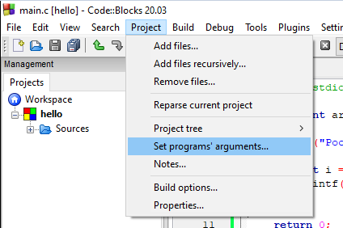

Našim programům můžeme předávat argumenty z terminálu. To uživatelům umožňuje upravovat chování programu i potom, co jsme my udělali binární soubor a poslali jsme jim výsledný .exe soubor. 

Abychom mohli pracovat v našem programu s argumenty programu, tak musíme rozšířit parametry `main` funkce. Můžeme použít variantu `int main(int argc, char* argv[])` nebo také `int main(int argc, char** argv)`. Já preferuji první variantu.

Co jednotlivé parametry znamenají?

* argc (argument count) - počet argumentů programu (celé číslo)
* argv (argument vector) - samotné argumenty programu (pole řetězců)


```c
#include <stdio.h>

int main(int argc, char* argv[])
{
    printf("Pocet argumentu: %i\n", argc);

    for(int i = 0; i < argc; i = i +1) {
        printf("%s\n", argv[i]);
    }

    return 0;
}
```

Když program pustíme

```
Pocet argumentu: 1
C:\Users\tomas\codeblocks\hello\bin\Debug\hello.exe
```

Vidíme, že první argument je cesta k binárnímu souboru, který se spouští. Jak předáme další argumenty?

Jeden ze způsobů je, že si otevřeme PowerShell a půjdeme do složky, kde máme binární soubor.

```ps1
PS C:\Users\tomas> cd "C:\Users\tomas\codeblocks\hello\bin\Debug\"
PS C:\Users\tomas\codeblocks\hello\bin\Debug> .\hello.exe prvni druhy treti
Pocet argumentu: 4
C:\Users\tomas\codeblocks\hello\bin\Debug\hello.exe
prvni
druhy
treti
PS C:\Users\tomas\codeblocks\hello\bin\Debug> .\hello.exe "argument s mezerou"
Pocet argumentu: 2
C:\Users\tomas\codeblocks\hello\bin\Debug\hello.exe
argument s mezerou
```


V CodeBlocks můžeme nastavit v horní liště `Project -> Set program's arguments`



A následně nastavíme argumenty do `Program arguments`.


Pokud program nyní spustíme, tak dostáváme.

```
Pocet argumentu: 3
C:\Users\tomas\codeblocks\hello\bin\Debug\hello.exe
test1
test2
```
