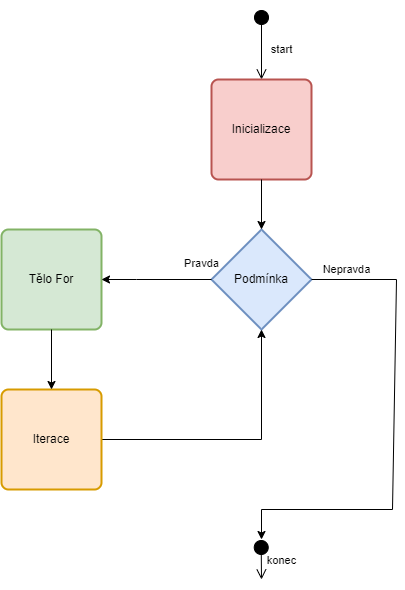
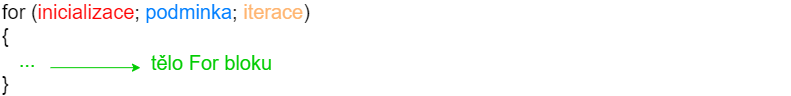

V této kapitole si více rozebereme některé cykly. Tuto sekci beru pro lidi, kteří už zvládají základy a chcou jít ve svých znalostech hlouběji.

## For cyklus podrobně
Ukažme si diagram For cyklu.



Kde kód má tuto strukturu




Jednoduchý program obsahuje

```c
#include <stdio.h>

int main()
{
    for (int x = 0; x < 3; x = x + 1) {
        printf("%i\n", x);
    }

    return 0;
}
```

V této kapitole si ukážeme, že jednotlivé sekce můžou být volitelné. Například lze definovat volitelnou inicializační sekci


```c
#include <stdio.h>

int main()
{
    int x = 0;

    for (; x < 3; x = x + 1) {
        printf("%i\n", x);
    }

    return 0;
}
```

A program funguje pořád stejně.

Také lze mít volitelnou iterační sekci. Pak je ale potřeba přesunout zvyšování dovnitř do těla cyklu, jinak by se proměnná x nikdy nezměnila.


```c
#include <stdio.h>

int main()
{
    int x = 0;

    for (; x < 3;) {
        printf("%i\n", x);
         x = x + 1;
    }

    return 0;
}
```

Je také možné vynechat část podmínky.


```c
#include <stdio.h>

int main()
{
    int x = 0;

    for (;;) {
        printf("%i\n", x);
         x = x + 1;
    }

    return 0;
}
```

To ale způsobí, že podmínka bude vždycky pravdivá. Je to stejné, jako kdybychom dali do podmínky nenulové číslo
```c
#include <stdio.h>

int main()
{
    int x = 0;

    for (;1;) {
        printf("%i\n", x);
         x = x + 1;
    }

    return 0;
}
```

Cyklus poběží donekonečna. Pro zrušení cyklu bychom museli použít klíčové slovo `break`.

```c
#include <stdio.h>

int main()
{
    int x = 0;

    for (;;) {
        printf("%i\n", x);
        x = x + 1;
        if (x > 10) {
            break;
        }
    }

    return 0;
}
```

Obdobně můžeme mít volitelnou libovolnou část for cyklu. Například jenom podmínku

```c
#include <stdio.h>

int main()
{
    for (int x = 0;;x = x + 1) {
        printf("%i\n", x);
        if (x > 10) {
            break;
        }
    }

    return 0;
}
```

## Break v zanořených cyklech

Mějme program

```c
#include <stdio.h>

int main()
{
    while (1) {
        while (1) {
            printf("Ahoj\n");
            break;
        }
    }

    return 0;
}
```

Kolikrát se `Ahoj` vytiskne? Správná odpověď je nekonečně krát. Proč? Protože `break` ukončí vždy aktuální cyklus. Ale pak se znova opakuje vnější cyklus, který znova spustí vnitřní cyklus.

Jak by se dalo ukončit oba cykly (říkáme vyskočit z obou cyklů). Lze k tomu použít tzv. návěstí (anglicky label) a klíčové slovo `goto`.

`goto` funguje tak, že přeskočí na specifikovaný label.

Definujme si label `konec` a použijme `goto` k ukončení zanořených cyklů.

```c
#include <stdio.h>

int main()
{
    while (1) {
        while (1) {
            printf("Ahoj\n");
            goto konec;
        }
    }

    konec:
    return 0;
}
```

Nyní se `Ahoj` vytiskne pouze jednou, protože goto pak přeskočí na příkaz `return 0;` a tím se program ukončí.

Pomocí `goto` se dá vytvořit i cyklus

```c
#include <stdio.h>

int main()
{
    int x = 0;

    iterace:
    if (x < 5) {
        printf("x je %i\n", x);
        x = x + 1;
        goto iterace;
    }

    return 0;
}
```

Program vytiskne
```
x je 0
x je 1
x je 2
x je 3
x je 4
```


Používání `goto` je obecně považováno za špatný programovací návyk (existují výjimky např. při vývoji jádra Linuxu). Vytváří v programu chaos a ve větších programech je pak těžké se zorientovat, co se v programu děje.


Každý program s `goto` jde přepsat bez `goto`. Pro skončení dvou zanořených cyklů lze například použít pomocnou proměnnou (různých řešení existuje spoustu)

```c
#include <stdio.h>

int main()
{
    int konec = 0;
    while (1) {
        while (1) {
            printf("Ahoj\n");
            konec = 1;
            break;
        }

        if (konec) {
            break;
        }
    }

    return 0;
}
```
