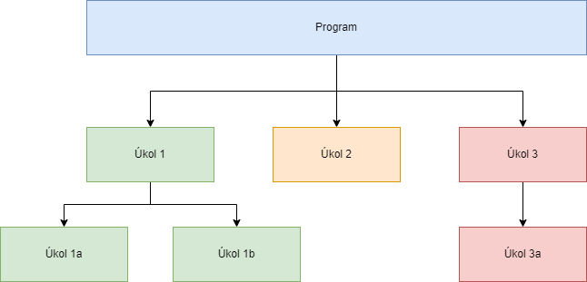

Když máme za úkol naprogramovat složitější program, tak se často stává, že člověk je úplně ochrnut velikostí programu a obrovským množstvím neznámých.

Díky dekompozici se nám  podaří rozdělit jeden velký problém, který nedokážeme vyřešit, na více menších problémů, které už dokážeme vyřešit.

Dekompozici si můžeme nejdříve demonstrovat na příkladu ze života. Mějme úkol, že chceme uvařit instantní nudle Oyakata příchuť Japanese Classic za 42,90 kč.


Jak bychom postupovali. Uvaření jídla bychom mohli rozdělit do několika menších činností, které dohromady vytvoří to jídlo. Tyto činnosti jsou například

- uvařit horkou vodu
- otevřít obal od nudlí
- vytáhnout z obalu omáčku
- zalít nudle horkou vodou
- zadělat nudle s horkou vodou víčkem
- počkat 3 minuty
- vylít vodu
- otevřít víčko
- otevřít obal s omáčkou
- dát omáčku do uvařených nudlí
- promíchat


Tím, že jsme si to rozdělil, tak si můžu vybrat tu nejjednodušší činnost a zkusit ji udělat. Například počkat 3 minuty. Zkusím udělat to, že mám čekat 3 minuty. To jsem zvládnul a mám první činnost za sebou. Pak si vyberu další činnost, co si myslím, že bych mohl zvládnout a tu zkusím udělat.

Pak už mi zbývají jenom činnosti, které třeba neumím celé zvládnout. Například bych chtěl zalít horkou vodou nudle. Já ale neumím vytvořit horkou vodu, tak si tuto činnost rozbiju na dvě menší části. Na zalití vody libovolnou vodou a zalití horkou vodou. Tím opět rozbíjím větší problém na několik menších.

Pak už třeba umím počkat 3 minuty a zalít nudle vodou, tak to zkusím udělat dohromady. A už mám první větší část hotovou.

Snažíme se postupně rozdělovat větší problémy na menší. Na diagramu si to můžeme zobrazit následovně




## Jak to aplikovat v programování
Mějme za úkol naprogramovat program, který přečte ze souboru obsah souboru a spočítá počet výskytů A. Pokud jich je sudý počet, tak vytiskne dvojnásobný počet A v textu. Pokud jich je lichý počet, tak se načte standardní vstup a spočítá se počet B a vytiskne se jejich počet. Pokud ale je v textu dvakrát po sobě mezera, tak se program ukončí a vypíše "Nevalidni vstup". Pokud je první znak libovolného vstupu (prvního nebo druhého) C, tak se navíc vždy vytiskne počet znaků C.

Musíme se nyní zamyslet, na jaké menší podprogramy bychom program mohli rozdělit. První dvě můžou být.

* Načítání ze souboru
* Počítání A v textu


Zatím třeba chceme řešit druhý problém (počítání A). Ignorujeme tedy to, že se má text načítat ze souboru. Program na počítání A může vypadat

```c
#include <stdio.h>

void vytiskni_pocet_a(const char* text_k_analyze) {
    int pocet_a = 0;

    for(int i = 0; text_k_analyze[i] != '\0'; i++) {
        if (text_k_analyze[i] == 'a' || text_k_analyze[i] == 'A') {
            pocet_a++;
        }
    }

    printf("Pocet a %i\n", pocet_a);
}

int main() {
    char * text = "abfwefcncawfwefg";
    vytiskni_pocet_a(text);

    return 0;
}
```

První problém máme vyřešený. Další malá podčást programu je kontrola, kolik počet A máme. Můžeme tedy zatím udělat jen kontrolu.

```c
#include <stdio.h>

int main() {
    int pocet_a = 5;

    if (pocet_a % 2 == 0) {
        printf("pocet je sudy\n");
    } else {
        printf("pocet je lichy\n");
    }

    return 0;
}
```

Nyní to můžeme dát dohromady

```c
#include <stdio.h>

int vrat_pocet_a(const char* text_k_analyze) {
    int pocet_a = 0;

    for(int i = 0; text_k_analyze[i] != '\0'; i++) {
        if (text_k_analyze[i] == 'a' || text_k_analyze[i] == 'A') {
            pocet_a++;
        }
    }

    return pocet_a;
}

int main() {
    int pocet_a = vrat_pocet_a("abfwefcncawfwefg");

    if (pocet_a % 2 == 0) {
        printf("pocet je sudy\n");
    } else {
        printf("pocet je lichy\n");
    }

    return 0;
}
```

Nyní chceme vyřešit případ, kdy jsou dvě mezery. Uděláme si zase malý program

```c
#include <stdio.h>

#define CHYBA_DVOJITA_MEZERA -1

int je_chyba_mezer(const char* text_k_analyze) {
    char predchozi_znak = '\0';

    for(int i = 0; text_k_analyze[i] != '\0'; i++) {
        if (text_k_analyze[i] == ' ' && predchozi_znak == ' ') {
            return CHYBA_DVOJITA_MEZERA;
        }

        predchozi_znak = text_k_analyze[i];
    }

    return 0;
}

int main() {
    if (je_chyba_mezer("abf  wefcn  cawfwefg") == CHYBA_DVOJITA_MEZERA) {
        printf("dvojita mezera\n");
    } else {
        printf("vse v poradku\n");
    }

    return 0;
}
```

Zase můžeme zakombinovat do našeho programu


```c
#include <stdio.h>

#define CHYBA_DVOJITA_MEZERA -1

int vrat_pocet_a(const char* text_k_analyze) {
    char predchozi_znak = '\0';
    int pocet_a = 0;

    for(int i = 0; text_k_analyze[i] != '\0'; i++) {
        if (text_k_analyze[i] == 'a' || text_k_analyze[i] == 'A') {
            pocet_a++;
        }

        if (text_k_analyze[i] == ' ' && predchozi_znak == ' ') {
            return CHYBA_DVOJITA_MEZERA;
        }

        predchozi_znak = text_k_analyze[i];
    }

    return pocet_a;
}

int main() {
    int pocet_a = vrat_pocet_a("abfwefcncawfwefg");

    if (pocet_a == CHYBA_DVOJITA_MEZERA) {
        printf("Nevalidni vstup\n");
        return 1;
    }

    if (pocet_a % 2 == 0) {
        printf("pocet je sudy\n");
    } else {
        printf("pocet je lichy\n");
    }

    return 0;
}
```

Nyní bychom chtěli počítat ještě znaky C. Ale z funkce můžeme vracet jenom jednu hodnotu? Jak to udělat? Můžeme použít strukturu.


```c
#include <stdio.h>

typedef struct { int pocet_a; int pocet_c; } text_analyza;

text_analyza vrat_analyzu_textu(const char* text_k_analyze) {
    text_analyza analyza = { .pocet_a = 0, .pocet_c = 0 };

    for(int i = 0; text_k_analyze[i] != '\0'; i++) {
        if (text_k_analyze[i] == 'a' || text_k_analyze[i] == 'A') {
            analyza.pocet_a++;
        }
        
        if (text_k_analyze[i] == 'c' || text_k_analyze[i] == 'c') {
            analyza.pocet_c++;
        }
    }

    return analyza;
}

int main() {
    text_analyza analyza = vrat_analyzu_textu("abfwefcncawfwefg");

    printf("Pocet a %i\n", analyza.pocet_a);
    printf("Pocet c %i\n", analyza.pocet_c);

    return 0;
}
```

Nyní můžeme udělat program, který zjistí, zda je první znak C.

```c
#include <stdio.h>

void zjist_prvni_c(const char* text_k_analyze) {
    int je_prvni_znak_c = text_k_analyze[0] == 'c';

    if (je_prvni_znak_c) {
        printf("prvni c\n");
    } else {
        printf("ne\n");
    }
}

int main() {
    zjist_prvni_c("cabfwefcncawfwefg");

    return 0;
}
```

To můžeme doplnit do předchozího programu
```c
#include <stdio.h>

typedef struct { int pocet_a; int pocet_c; int prvni_c; } text_analyza;

text_analyza vrat_analyzu_textu(const char* text_k_analyze) {
    text_analyza analyza = { .pocet_a = 0, .pocet_c = 0, .prvni_c = 0 };
    analyza.prvni_c = text_k_analyze[0] == 'c';

    for(int i = 0; text_k_analyze[i] != '\0'; i++) {
        if (text_k_analyze[i] == 'a' || text_k_analyze[i] == 'A') {
            analyza.pocet_a++;
        }

        if (text_k_analyze[i] == 'c' || text_k_analyze[i] == 'c') {
            analyza.pocet_c++;
        }
    }

    return analyza;
}

int main() {
    text_analyza analyza = vrat_analyzu_textu("cabfwefcncawfwefg");

    printf("Pocet a %i\n", analyza.pocet_a);

    if (analyza.prvni_c) {
        printf("Pocet c %i\n", analyza.pocet_c);
    }

    return 0;
}
```

To můžeme doplnit i do kontroly mezer a upravit to do naší struktury.

```c
#include <stdio.h>

#define CHYBA_DVOJITA_MEZERA -1

typedef struct { int pocet_a; int pocet_c; int prvni_c; int chyba_v_mezerach; } text_analyza;

text_analyza vrat_analyzu_textu(const char* text_k_analyze) {
    text_analyza analyza = { .pocet_a = 0, .pocet_c = 0, .prvni_c = 0, .chyba_v_mezerach = 0 };
    analyza.prvni_c = text_k_analyze[0] == 'c';
    char predchozi_znak = '\0';

    for(int i = 0; text_k_analyze[i] != '\0'; i++) {
        if (text_k_analyze[i] == 'a' || text_k_analyze[i] == 'A') {
            analyza.pocet_a++;
        }

        if (text_k_analyze[i] == 'c' || text_k_analyze[i] == 'c') {
            analyza.pocet_c++;
        }

        if (text_k_analyze[i] == ' ' && predchozi_znak == ' ') {
            analyza.chyba_v_mezerach = CHYBA_DVOJITA_MEZERA;
            return analyza;
        }

        predchozi_znak = text_k_analyze[i];
    }

    return analyza;
}

int main() {
    text_analyza analyza = vrat_analyzu_textu("c  abfwefcncawfwefg");

    if (analyza.chyba_v_mezerach) {
        printf("Nevalidni vstup\n");
        return 1;
    }

    printf("Pocet a %i\n", analyza.pocet_a);

    if (analyza.prvni_c) {
        printf("Pocet c %i\n", analyza.pocet_c);
    }

    return 0;
}
```

Postupně vidíme princip dekompozice. Vybereme si malý problém. Ten se pokusíme naimplementovat v co nejjednodušším programu. Jakmile to zvládneme, tak ten malý podprogram doplníme do většího a postupujeme dál.

Celý program tady dokončovat nebudeme. Můžete si ho dokončit za domácí úkol.
