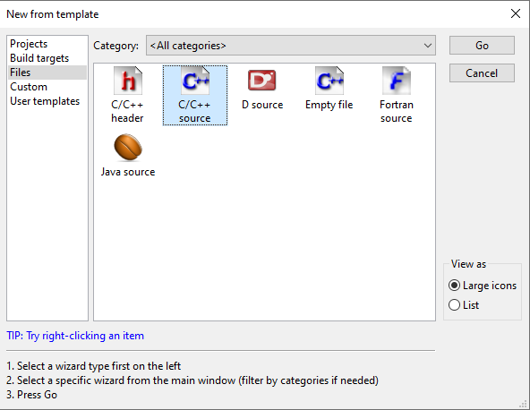
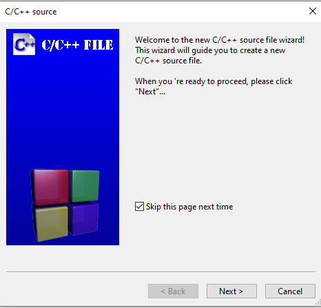
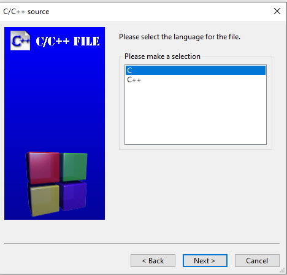
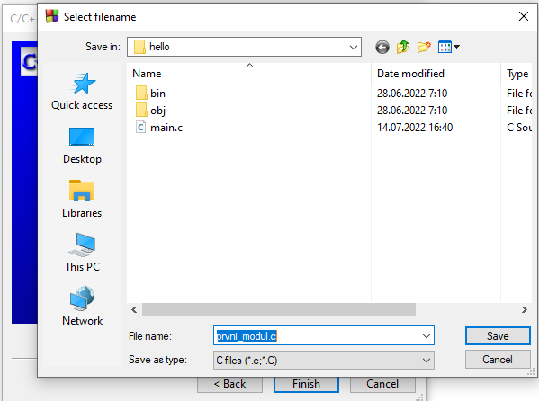
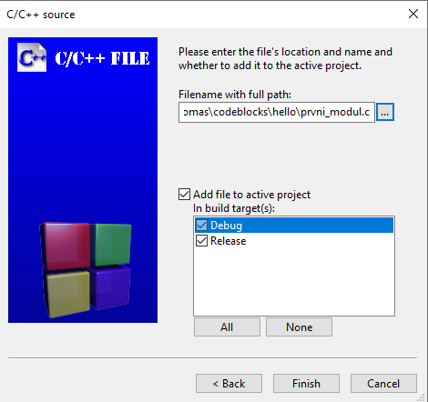
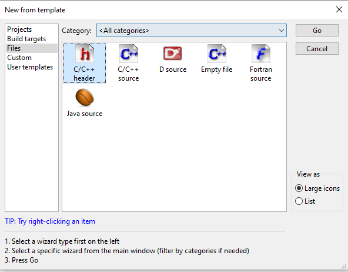
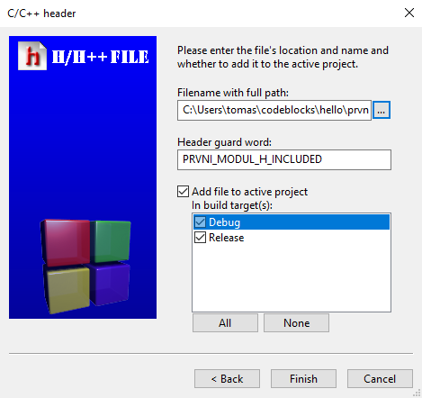
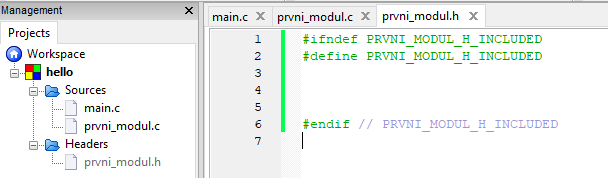

Ve větších programech chceme rozdělit program do více souborů. Pokud bychom měli všechno v jednom souboru, tak jakmile program naroste na tisíce nebo klidně desítky tisíc řádků kódu, tak už by se v něm nikdo nevyznal. K rozdělování na více souborů nám pomáhají moduly.

Každý jeden soubor je samostatný modul. Nebo přesněji ke každému modulu existují dva soubory

1. Hlavičkový soubor (header file), který obsahuje prototypy funkcí (a případně další věci) - soubor s příponou `.h`
2. Soubor obsahující samotnou implementaci - soubour s příponou `.c`


Vytvořme si náš první modul.

Klikneme vlevo nahoře na `New file` a pak vybereme `File...`


Vybereme `C/C++ source`



Můžeme dát `Next` a zakliknout `Skip this page next time`




Vybereme jazyk C a klikneme `Next`



U `Filename` klikneme napravo na tři tečky a nějak ho pojmenujeme. Například `prvni_modul.c` a klikneme na `Save`


A zaklikneme `Debug` i `Release`. Můžeme kliknout `Finish`


Objeví se nám obrazovka, zda chceme přidat soubor do projektu. Ano, chceme. Klikneme na `Yes`.


Úplně stejně postupujeme při přidání hlavičkového souboru. Akorát při výběru typu souboru dáme `C/C++ header`



A soubor pojmenujeme stejně jako předchozí soubor, akorát s koncovkou `.h`. V našem případě tedy `prvni_modul.h`. Vybereme opět `Debug` a `Release` a klikneme `Finish`




V levém menu se nám objeví novou modrá složka `Headers`. Když si náš hlavičkový soubor otevřeme, tak vidíme už předgenerovaný kód.





## Implementace
Do souboru `prvni_modul.c` souboru vložíme naši novou funkci, kterou otestujeme, zda modul funguje správně. Obsah souboru bude vypadat takto

```c
#include <stdio.h>

void tiskni_z_modulu(int cislo_k_tisku) {
    printf("Funkce z modulu ma cislo %i\n", cislo_k_tisku);
}
```


Do hlavičkového souboru `prvni_modul.h` dáme prototyp funkce z `prvni_modul.c`

```c
#ifndef PRVNI_MODUL_H_INCLUDED
#define PRVNI_MODUL_H_INCLUDED

void tiskni_z_modulu(int cislo_k_tisku);

#endif // PRVNI_MODUL_H_INCLUDED
```


Náš `main.c` soubor pak bude volání naší funkce, kterou jsme si vytvořili. Musíme také přidat `#include` našeho hlavičkového souboru
```c
#include "prvni_modul.h"

int main()
{
    tiskni_z_modulu(10);

    return 0;
}
```

Když nyní program pustíme, tak by mělo vše fungovat.
