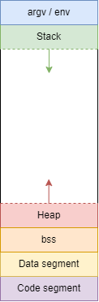

# Paměť
O paměti jsme si v předchozích kapitolách už několikrát povídali. Nyní se podíváme, jak zhruba vypadá paměť jako celek a z jakých částí se skládá.

Zjednodušenný diagram vypadá následovně





**argv / env** sekce slouží k uložení argumentů programu a proměnných prostředí (environment variables). Proměnné prostředí jsme v tom kurzu nerozebíraly.

**Stack** (česky zásobník) slouží k ukládání především lokálních proměnných funkcí. Velikost zásobníků se rozšiřuje nebo zmenšuje podle toho, v jaké funkci se zrovna nacházíme nebo jak moc zanoření jsme.

**Heap** (česky halda) slouží k ukládání především dynamické paměti alokované pomocí funkcí malloc/calloc/realloc (případně další). Podobně jako Stack, tak se využitá paměť haldy rozšiřuje podle toho, jak alokujeme dynamickou paměť v programu.

**bss** sekci se také říká neinicializovaná data. Při spuštění programu se tato sekce vynuluje. Slouží k uložení globálních a statických proměnných, které nejsou inicializované ve zdrojovém kódu nebo jsou nastavené na nulu.

Příklady
```c
int globalni_promenna;
int globalni_nulova_promenna = 0;
static int staticka_promenna;
static int staticka_nulova_promenna = 0;
```

**Data segment** (česky datová sekce) nebo také inicializovaná data. Rozděluje se na následující podsekce

* **sekce ke čtení**
* **sekce ke čtení a k zápisu**

Sekce ke čtení je slouží k řetěcům ve stylu `char * s = "abc"`. Řetězec `"abc"` se uloží do paměti ke čtení.

Sekce ke čtení a zápisu slouží k uložení globálních a statických proměnných, které jsou inicializované na nenulovou hodnotu

Příklady
```c
int globalni_promenna = 10;
static int staticka_nulova_promenna = 10;
```
