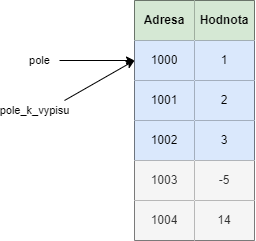

## Pole vs ukazatel
V předchozích kapitolách jsme si ukázali práci s polem a ukazateli. Ve skutečnosti pole a ukazatele mají k sobě velmi blízko.

Mějme pole

```c
int pole[] = { 1, 2, 3 };
```

My ho můžeme vzít a uložit ho do ukazatele.

```c
int pole[] = { 1, 2, 3 };
int * ukazatel = pole;
```

Mějmě program

```c
#include <stdio.h>

int main() {
    int pole[] = { 1, 2, 3 };
    int * ukazatel = pole;

    printf("Ukazatel je %i\n", *ukazatel);

    return 0;
}
```
Vytiskne se nám

```
Ukazatel je 1
```

Jak to vypadá v paměti?


Co však my můžeme dělat s ukazateli je i posunovat se na další adresu. Stačí nám k ukazateli přičíst jedničku

```c
#include <stdio.h>

int main() {
    int pole[] = { 1, 2, 3 };
    int * ukazatel = pole;

    printf("Prvni prvek je %i\n", *ukazatel);
    printf("Druhy prvek je %i\n", *(ukazatel + 1));
    printf("Treti prvek je %i\n", *(ukazatel + 2));

    return 0;
}
```
Program tiskne

```
Prvni prvek je 1
Druhy prvek je 2
Treti prvek je 3
```

Musíme si ale už ohlídat, že nešaháme někam, kam bychom neměli. Když uděláme `*(ukazatel + 3)`, tak už saháme mimo naše zadefinované pole. To je definované chování a může způsobit různé problémy. Proto bychom to neměli dělat.


Pokud jsme měli pole, co jsme předávali do funkce a zavolali nad ním `sizeof`.


```c
#include <stdio.h>

void tiskni_pole(int pole_k_vypisu[]) {
    int velikost = sizeof(pole_k_vypisu);
    printf("Prvni prvek je %i\n", velikost);
}

int main() {
    int pole[] = { 1, 2, 3 };
    tiskni_pole(pole);

    return 0;
}
```

A v Build messages vidíme upozornění, že sice voláme sizeof nad polem, ale vrátí se nám hodnota ukazatele na int.
```
'sizeof' on array function parameter 'pole' will return size of 'int *'
```

Je to proto, že když předáváme pole do funkce, tak ono se degraduje na ukazatel na toto pole. Nezkopíruje se tedy hodnota tohoto do nové proměnné. Mohli bychom čekat, že se na úrovni paměti stane následující


K tomu ale `nedochází`. Z pohledu paměti je velmi neefektivní kopírovat potenciálně obrovská pole. Co se děje místo toho je



Do funkce se pošle jenom ukazatel na existující adresu.

Proto tedy platí, že pokud modifikuji pole ve funkci, tak se změná projeví i v místě, odkud funkci voláme

```c
#include <stdio.h>

void modifikuj_pole(int pole[]) {
    pole[0] = 10;
}

int main() {
    int pole[] = { 1, 2, 3 };
    modifikuj_pole(pole);
    printf("Prvni prvek je %i\n", pole[0]);

    return 0;
}
```

Nám vytiskne `Prvni prvek je 10`.


## Přístupy do pole a ukazatele
Tak jak přistupujeme do pole pomocí hranatých závorek a nebo jak přistupujeme na ukazatel pomocí hvězdičky (dereference), tak to můžeme použít i naopak v poli i v ukazateli.

```c
#include <stdio.h>

int main() {
    int pole[] = { 1, 2, 3 };
    int * ukazatel = pole;

    printf("Ukazatel[1] je %i\n", ukazatel[1]);
    printf("*(pole + 1) je %i\n", *(pole + 1));

    return 0;
}
```

Dostáváme

```
Ukazatel[1] je 2
*(pole + 1) je 2
```