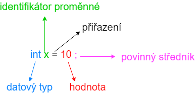
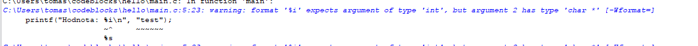
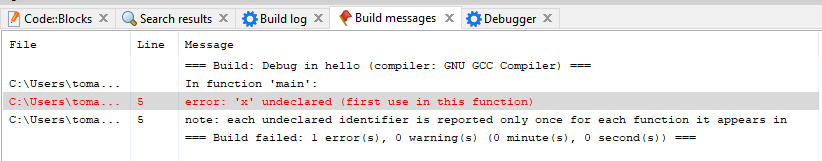
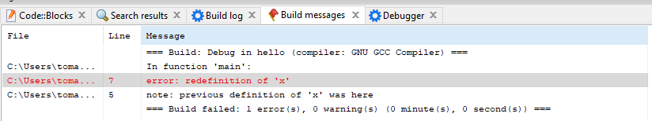

# Proměnné a datové typy
Pro psaní složitějších programů se neobejdeme bez použití tzv. proměnných. Proměnné jsou nějak pojmenované a obsahují nějakou hodnotu. Ukázka definování proměnné může být

```c
int x = 10;
```

Zde jsme vytvořili proměnnou s identifikátorem (názvem) `x` (můžeme použít libovolný název viz dále) a nastavili hodnotu dané proměnné na 10 (lze použít libovolné číslo viz níže). V programování říkáme, že jsme **definovali** proměnnou x.



Jednotlivé části definice proměnné jsou

1. **datový typ** - určuje, jakou hodnotu můžeme do proměnné uložit. Na našem příkladě vidíme datový typ: `int`. To je zkratka z anglického `integer`, což v češtině znamená celé číslo. Z toho si můžeme odvodit, že do proměnné x můžeme ukládat celá čísla. Nemůžeme zde tedy ukládat např. desetinná čísla nebo text, protože jsme si proměnnou `x` definovali jako datový typ `int`.
1. **identifikátor proměnné** - musí být unikátní. Identifikátory můžou obsahovat malá a velká písmena (bez diakritiky), čísla a podtržíka. První znak identifikátoru však nesmí být číslo (až druhý, třetí, čtvrtý atd.). Stejně tak identifikátor nemůže mít stejný název jako nějaké klíčové slovo (např. return, int atd.). Seznam klíčových slov pro jazyk C najdete např. [zde](https://devdocs.io/c/keyword)
    - Validní identifikátory:
        - **moje_promenna**
        - **_cool_variable**
        - **programovani123**
        - **\_12_cde_______9784_**
    - Nevalidní identifikátory:
        - **1abc** (obsahuje číslici na začátku)
        - **tom_34aš** (obsahuje diakritiku)
        - **tom_34aš** (obsahuje diakritiku)
        - **ha#sh** (obsahuje nevalidní znak #)
        - **hacker man** (obsahuje nevalidní znak mezeru)
        - **return** (return je klíčové slovo, nelze ho použít jako identifikátor)

> Dobrým zvykem v jazyce C je používat pro identifikátor skládající se z více slov oddělovač podtržítko. Tzv. pokud bych chtěl udělat proměnnou, co má název `moje super proměnná`, tak bych odstranil diakritiku a nahradil mezery za podtržítka. Výsledek by tedy byl `moje_super_promenna`. Je to více čitelné, než ji pojmenovat např. `mojesuperpromenna`.

3. **přiřazení** - pro zjednodušení zatím pracujme s tím, že je zde povinné. Existují však možnost, kde lze proměnnou definovat, ale nenastavit ji hodnotu. To ve většině případech nedává smysl. Vysvětlíme si v kapitole XXX.

1. **hodnota** - nastavení konkrétní hodnoty. Tím, že jsme si vybrali datový typ `int` (celé číslo), tak si můžeme vybrat téměř libovolnou hodnotu celého čísla (existují nejmenší a největší hodnoty pro jednotlivé datové typy, takže nelze použít úplně libovolnou hodnotu viz kapitola XXX). Mezi celá čísla patří jak kladná, tak záporná čísla včetně nuly. Mezi jednotlivými ciframi nesmí být mezera.
    - Validní hodnoty pro datový typ int:
        - **10**
        - **1337**
        - **-782**
        - **0**
        - **-0**
    - Nevalidní hodnoty pro datový typ int:
        - **10.5** (desetinné číslo)
        - **"Hello world!"** (jedná se o řetězec ne číslo)
        - **1 000 000** (obsahuje mezery)

> Všimněme si, že hodnota čísla není v uvozovkách jako tomu bylo v případě "Hello world!". To je správně, protože čísla se nikdy do uvozovek nedávají. Do uvozovek dáváme jenom text.


5. **středník** - je zde povinný. Středník v jazyce C ukončuje jeden **příkaz**.


Pojďme použít naši proměnnou v konkrétním programu.

```c
#include <stdio.h>

int main()
{
    int x = 121;
    printf("Hodnota promenne je: %i\n", x);
    return 0;
}
```

Pokud si náš program spustíme, tak se nám zobrazí
```
Hodnota promenne je: 121
```

V programu můžeme vidět nový koncept. V předchozí kapitole jsme měli volání funkce jako
```c
printf("Hello world!\n");
```
Nyní ale máme
```c
printf("Hodnota promenne je: %i\n", x);
```

Co je jinak? V prvním případě jsme volali funkci printf s jedním parametrem `"Hello world!\n"`. V druhém případě voláme funkci printf s dvěma parametrama. První parametr je řetězec `"Hodnota promenne je: %i\n"` a druhý parametr je proměnná `x`.

Podle čeho poznat, kolik má volání funkce parametrů? Každá hodnota je oddělena čárkou. Funkce může mít jeden parametr, dva parametry nebo i 10 parametrů. Některé funkce nemají žádný parametr. Funkce `printf` je speciální v tom, že má variabilní počet parametrů. Variabilní počet parametrů je obecně pokročilý koncept, který si více rozbereme v kapitole XXX. Zatím nám bude stačit pochopit, že printf může přijímat různý počet parametrů.

Další věc, která nám může přijít zvláštní je, že v řetězci máme `%i`, ale vytiskne se místo toho hodnota proměnné x. %i je zde zkratka pro *integer*. Lze použít %d místo %i, je to v tomto případě synonymum. Funkce printf má speciální chování, že hledá speciální znaky (v našem případě %i) a nahrazuje je za hodnoty, které funkci předáme v dalších parametrech. Obecně těmto znakům říkáme *modifikátor*.

Mějme program
```c
#include <stdio.h>

int main()
{
    int x = 121;
    printf("Prvni: %i\nDruha: %i\nTreti: %d\nCtvrta: %d\nPata: %i\n", x, -5, 10, x);
    return 0;
}
```

Po spuštění
```
Prvni: 121
Druha: -5
Treti: 10
Ctvrta: 121
```
První hodnota je naše proměnná x. Druhá hodnota je záporné číslo pět. Zde vidíme, že nezáleží, jestli předáme do funkce proměnnou nebo hodnotu "natvrdo". Třetí hodnota ukazuje, že můžeme použít i %d místo %i. Čtvrtá hodnota je opět x, tudíž se vytiskne opět 121. Tentokrát jsme opět použili %d. Není v tom rozdíl oproti %i.


Pojďmě zkusit použít řetězec
```c
#include <stdio.h>

int main()
{
    printf("Hodnota: %i\n", "test");
    return 0;
}
```
Po spuštění dostáváme
```
Hodnota: 4210688
```

To ale není to, co jsme chtěli! Když se podíváme do Build logu v CodeBlocks


CodeBlocks nám píše: `warning: format '%i' expects argument of type 'int', but argument 2 has type 'char *'` a dole je napsané `%s`. Tím se nám snaží říct, že %i máme použít hodnotu int, ale použili jsme hodnotu **char \*** (ten reprezentuje datový typ řetězec).

Zkusme tedy poslechnout dobrou radu a upravme program tak, že změníme %i na %s.
```c
#include <stdio.h>

int main()
{
    printf("Hodnota: %s\n", "test");
    return 0;
}
```

Nyní bychom měli dostat už chtěný výsledek. 
```
Hodnota: test
```


Je to proto, že %s je zkratka pro string (řetězec). Pokud chceme tedy tisknout řetězce, musíme použít s. Jaké další modifikátory funkce podporuje se dozvíte v dokumentaci např. [zde](https://devdocs.io/c/io/fprintf)


## Modifikace proměnné
Proměnná už v názvu nabádá, že ji lze měnit. Můžeme si to ilustrovat na následujícím programu
```c
#include <stdio.h>

int main()
{
    int x = 10;
    printf("Hodnota: %i\n", x);
    x = 15;
    printf("Hodnota: %i\n", x);
    x = 105;
    printf("Hodnota: %i\n", x);
    return 0;
}
```

Program nám vytiskne 
```
Hodnota: 10
Hodnota: 15
Hodnota: 105
```
Na co je potřeba dát pozor je, že proměnnou definujeme pouze jednou. Tzv. `int x` se může definovat v dané funkci pouze jednou. Jakmile je proměnná zadefinována, tak můžeme její hodnotu měnit (zde už datový typ int neuvádíme), tzv. `x = 15`.

Co by se stalo, kdybychom nezadefinovali proměnnou a chtěli do ní rovno přiřadit hodnotu? Tzv. program
```c
#include <stdio.h>

int main()
{
    x = 10;
    printf("Hodnota: %i\n", x);
    return 0;
}
```

V Build messages vidíme


Na řádku 5 je nedefinovaná (nebo také nedeklarovaná) proměnná. Úplně stejnou chybu dostaneme i pokud bychom proměnnou definovali, ale až po prvním použití, tzv. i tento program je špatně
```c
#include <stdio.h>

int main()
{
    x = 5;
    printf("Hodnota: %i\n", x);
    int x = 10;
    printf("Hodnota: %i\n", x);
    return 0;
}
```

Pokud bychom se pokusili proměnnou definovat dvakrát viz program 
```c
#include <stdio.h>

int main()
{
    int x = 5;
    printf("Hodnota: %i\n", x);
    int x = 10;
    printf("Hodnota: %i\n", x);
    return 0;
}
```

Dostáváme chybu


Zde se dozvídáme, že jsme se pokusili na řádku 7 redefinovat znova proměnnou x `error: redefinition of 'x'` a že tato proměnná je definována již na řádku 5 `previous definition of 'x' was here`.

Je tedy potřeba dávat pozor na to, že proměnnou ve funkci definujeme vždy nanejvýš jednou a pokud ji chceme používat, tak musí být definována před prvním použitím.


## Další datové typy
Pro celá čísla máme několik datových typů. Zatím se jimi nemusíme trápit. Bude více rozebráno v kapitole XXX.

Pro desetinná čísla používáme nejčastěji datový typ **double**.

Pro jeden znak máme datový typ **char**.

Pro řetězce máme datový typ **char \***. Ten je trošku komplikovanější. Bude vysvětleno v kapitole XXX. Pokud máte zkušenosti z jiných programovacích jazyků, tak tam se často používá pro řetězec datový typ **string**. Ten ale v C neexistuje. Stejně tak pro boolovskou hodnotu se v různých programovacích jazycích používá datový typ **bool** (někdy **boolean**). Ten opět nenajdeme v jazyku C (lze přidat přidáním knihovny stdbool.h).

Zatím si budeme stačit s těmito datovými typy. V pozdějších kapitolách se seznámíme s komplexnějšími.


## Úkoly na procvičení
### Úkol 1
Napište program, který vytiskne `Moje oblibene cislo je -7` s použitím jedné proměnné.

<details>
  <summary>Klikni pro zobrazení možného řešení</summary>

```c
#include <stdio.h>

int main()
{
    int x = -7;
    printf("Moje oblibene cislo je %i\n", x);
    return 0;
}
```
</details>

### Úkol 2
Doplňte do programu definice proměnných x, y a z tak, aby se vytisklo `Moje oblibene cislo je 42, protoze je nejlepsi`.

```c
#include <stdio.h>

int main()
{
    printf("%s%i%s", x, y, z);
    return 0;
}
```

<details>
  <summary>Klikni pro zobrazení možného řešení</summary>

```c
#include <stdio.h>

int main()
{
    char * x = "Moje oblibene cislo je ";
    int y = 42;
    char * z = ", protoze je nejlepsi\n";

    printf("%s%i%s", x, y, z);
    return 0;
}
```
</details>

### Úkol 3
Doplňte do programu 2x `printf("%i\n", x);` na libovolné místo, aby se vytisklo
```
0
5432
```

```c
#include <stdio.h>

int main()
{
    int x = -7;
    x = 13;
    x = 0;
    x = 1;
    x = 55;
    x = 5432;
    x = 1337;
    return 0;
}
```

<details>
  <summary>Klikni pro zobrazení možného řešení</summary>

```c
#include <stdio.h>

int main()
{
    int x = -7;
    x = 13;
    x = 0;
    printf("%i\n", x);
    x = 1;
    x = 55;
    x = 5432;
    printf("%i\n", x);
    x = 1337;
    return 0;
}
```
</details>


## Fun fact
V C je zvykem používat pro identifikátory formát moje_cool_proměnná, ale v různých jazycích jsou zvyky různé. Mezi tři nejpopulárnější zápisy patří

- **snake_case** - všechny znaky jsou malými písmeny a slova oddělujeme podtržítkem. Mělo by připomínat hada.
    - moje_cool_promenna
- **camelCase** - první slovo je celé malými písmeny. Každé další slovo má první znak velkým písmenem a ostatní malými. Mělo by připomínat velblouda.
    - mojeCoolPromenna
- **PascalCase** - první písmeno každého slova je velkými písmenem, všechno ostatní malými. Popularizováno programovacím jazykem Pascal.
    - MojeCoolPromenna

Mezi prográmatory se často vede bitva, kdo má rád který zápis. Obecně v tom není rozdíl a je to čistě subjektivní preference. Nejdůležítější je, aby v programu byla konzistence. Tzv. vybrat si jeden styl a ten pak používat v celém programu. Kód nepůsobí dobře, když je část identifikátoru psaná jako snake_case, část camelCase a část PascalCase
