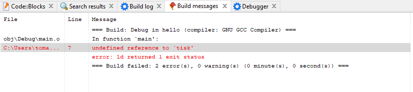

# Funkce - prototypy
Při psaní programu se nám může stát následující problém.

```c
#include <stdio.h>

int main()
{
    tisk();

    return 0;
}

void tisk() {
}
```

Když program spustíme, tak program končí s chybou


Na řádku 6 se snažíme volat funkci, která není definovaná. A na řádku 11 se snažíme definovat funkci znova.

To je způsobeno tím, že před prvním použitím funkce je potřeba funkci definovat. Problém se opraví tím, že přesuneme funkci před první funkci.

```c
#include <stdio.h>

void tisk() {
}

int main()
{
    tisk();

    return 0;
}
```

Existuje však i ještě jiné řešení. My můžeme definovat prototyp funkce. Prototyp funkce obsahuje návratový typ funkce, její název a parametr. Neobsahuje tedy tělo funkce. Navíc také končí středníkem. Příkladem je

```c
void tisk();
```

Tímhle dáváme programu najevo, že existuje taková funkce a bude definována až později. V našem programu by to pak bylo 

```c
#include <stdio.h>

void tisk();

int main()
{
    tisk();

    return 0;
}

void tisk() {
}
```

Tím se nám problém vyřešil. Je nutné však vždy doplnit definici funkce. Pokud bychom to neudělali

```c
#include <stdio.h>

void tisk();

int main()
{
    tisk();

    return 0;
}
```

Program končí s chybou



Na řádku 7 se používá funkce, ale není nikde definovaná.

## Volání dvou funkcí navzájem
Prototypy funkcí také řešení situaci, kdy se dvě funkce volají navzájem.

```c
#include <stdio.h>

void tisk_vetsi(int cislo_k_tisku) {
    if (cislo_k_tisku >= 0) {
        printf("Tisknu vetsi\n");
    } else {
        tisk_mensi(cislo_k_tisku);
    }
}

void tisk_mensi(int cislo_k_tisku) {
    if (cislo_k_tisku <= 0) {
        printf("Tisknu mensi\n");
    } else {
        tisk_vetsi(cislo_k_tisku);
    }
}

int main()
{
    tisk_vetsi(-5);

    return 0;
}
```

Situaci vyřešíme použitím prototypu

```c
#include <stdio.h>

void tisk_vetsi(int cislo_k_tisku);
void tisk_mensi(int cislo_k_tisku);

void tisk_vetsi(int cislo_k_tisku) {
    if (cislo_k_tisku >= 0) {
        printf("Tisknu vetsi\n");
    } else {
        tisk_mensi(cislo_k_tisku);
    }
}

void tisk_mensi(int cislo_k_tisku) {
    if (cislo_k_tisku <= 0) {
        printf("Tisknu mensi\n");
    } else {
        tisk_vetsi(cislo_k_tisku);
    }
}

int main()
{
    tisk_vetsi(-5);

    return 0;
}
```
