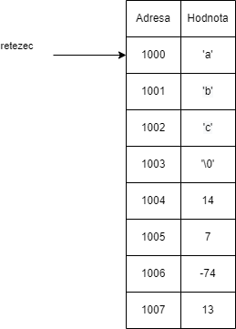
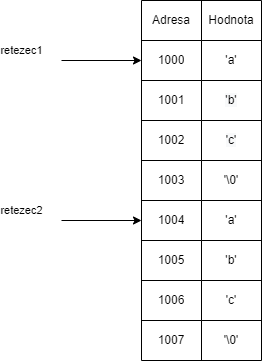

# Řetězce
S řetězci jsme se již seznámili okrajově v předchozích kapitolách. Předtím jsme si zadefinovali řetězec jako
```c
char * retezec = "abc";
```
V paměti to vypadá následovně



Všimněme si, že poslední znak je `\0`. To je speciální escape sekvence, která reprezentuje konec řetězce. Kdyby tam tento znak nebyl, tak nevíme, kdy řetězec v paměti končí. Proto zabírá každý řetězec v paměti o jeden byte místa (jeden byte navíc zabere ukončovací znak `\0`).

Co kdybychom se pokusili změnit první znak? Zkusme pustit následující program

```c
#include <stdio.h>

int main() {
    char * retezec = "abc";
    *retezec = 'q';

    printf("Retezec je %s\n", retezec);

    return 0;
}
```

Dostáváme chybu. Proč? Pokud řetězec zadefinujeme jako tzv. řetězcový literál. To je způsobem `char * x = "abc";`, tak se řetězec `abc` uloží na speciální místo v paměti, které je jenom ke čtení a nedá se upravovat.

Tuto situaci můžeme vyřešit tím, že řetězec uložíme jako pole.

```c
#include <stdio.h>

int main() {
    char retezec[] = { 'a', 'b', 'c', '\0' };
    retezec[0] = 'q';

    printf("Retezec je %s\n", retezec);

    return 0;
}
```
A již se nám tiskne `Retezec je qbc`. Při definici pole je potřeba dát si pozor na to, že musíme ukončovací znak definovat ručně. V paměti by to následovně vypadalo na začátku úplně stejně jako předchozí příklad


Ale díky tomu, že by se pole uložilo do paměti, kterou můžeme modifikovat, tak by nám následně nespadnul náš program.

Co by se stalo, kdybychom nedefinovali v poli `\0`? Jak vidíme na obrázku, tak na adrese 1004 a dál je nějaká náhodná paměť. Při tisku by se tedy pokračovalo v tisku všech znaků dokud by se nenarazilo na `\0`, který by byl náhodně v paměti. Program

```c
#include <stdio.h>

int main() {
    char retezec[] = { 'a', 'b', 'c' };
    retezec[0] = 'q';

    printf("Retezec je %s\n", retezec);

    return 0;
}
```
Mně konkrétně vytisknul
```
Retezec je qbcá‼║
```
Ve vašem případě by ale mohl vytisknout něco jiného nebo by program mohl úplně spadnout. Záleželo by, co máte zrovna v paměti a jedná se o nedefinované chování.


## Porovnání dvou řetězců
Pokud bychom chtěli porovnat dva řetězce, tak by nás mohlo udělat

```c
#include <stdio.h>

int main() {
    char rezetec1[] = {'a', 'b', 'c' };
    char rezetec2[] = {'a', 'b', 'c' };

    if (rezetec1 == rezetec2) {
        printf("Pravda\n");
    } else {
        printf("Nepravda\n");
    }

    return 0;
}
```

Ale vytiskne se nám `Nepravda`. Proč? Protože tímto způsobem porovnáváme adresu řetězců. V paměti to vypadá následovně



Co my děláme, tak je porovnání, zda 1000 se rovná 1004, což není. Proto nepravda. Pro porovnání můžeme použít funkci `strcmp` (string compare) z knihovny `string.h`.

```c
#include <stdio.h>
#include <string.h>

int main() {
    char rezetec1[] = {'a', 'b', 'c' };
    char rezetec2[] = {'a', 'b', 'c' };

    if (strcmp(rezetec1, rezetec2)) {
        printf("Pravda\n");
    } else {
        printf("Nepravda\n");
    }

    return 0;
}
```
Nyní se nám tiskne `Pravda`.


