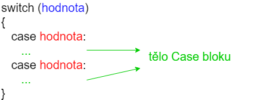

# Struktura Switch
Switch je velmi podobný několika IF struktuře. Mějme program

```c
#include <stdio.h>

int main()
{
    int x = 20;

    if (x == 10) {
        printf("Hodnota je 10\n");
    } else if (x == 20) {
        printf("Hodnota je 20\n");
    }

    return 0;
}
```

Můžeme ho přepsat pomocí Switch. Ten má diagram



V kódu bychom měli

```c
#include <stdio.h>

int main()
{
    int x = 20;

    switch (x) {
        case 10:
            printf("Hodnota je 10\n");
            break;
        case 20:
            printf("Hodnota je 20\n");
            break;
    }

    return 0;
}
```

Dostáváme stejný výsledek. Switch se skládá z hodnoty, kterou dáme do závorek za klíčové slovo switch (v našem případě x).
```c
switch (x)
```
A pak z jednotlivých case bloků (někdy také větví).
```c
case 10:
```

Jak se program zpracuje
1. Vytvoří se proměnná typu int s identifikátorem x a nastaví se jí hodnota 20
1. switch zkontroluje hodnotu proměnné x
1. Zkontroluje se, zda je hodnota x rovná 10 - není, pokračuje se na další case
1. Zkontroluje se, zda je hodnota x rovná 20 - ano, je
1. Vytiskne se `Hodnota je 20`
1. Ukončí se switch pomocí klíčového slova `break`
1. Program se ukončí pomocí `return 0`

## Default hodnota

Co kdybychom chtěli mít ve Switch i případ, který by odchytil libovolnou jinou hodnotu. Něco jako `else` v if případě. Tzv. Mějme
```c
#include <stdio.h>

int main()
{
    int x = 25;

    if (x == 10) {
        printf("Hodnota je 10\n");
    } else if (x == 20) {
        printf("Hodnota je 20\n");
    } else {
        printf("Hodnota je neznama\n");
    }

    return 0;
}
```
K tomu nám slouží klíčové slovo `default`.

```c
#include <stdio.h>

int main()
{
    int x = 25;

    switch (x) {
        case 10:
            printf("Hodnota je 10\n");
            break;
        case 20:
            printf("Hodnota je 20\n");
            break;
        default:
            printf("Hodnota je neznama\n");
            break;
    }

    return 0;
}
```

Při spuštění dostáváme
```
Hodnota je neznama
```

K čemu slouží klíčové slovo `break`? Ukončuje nám aktuální `case`. Můžeme se podívat, co se stane, když ho tam nedáme.
```c
#include <stdio.h>

int main()
{
    int x = 10;

    switch (x) {
        case 10:
            printf("Hodnota je 10\n");
        case 20:
            printf("Hodnota je 20\n");
            break;
        default:
            printf("Hodnota je neznama\n");
            break;
    }

    return 0;
}
```

Vytiskne se nám
```
Hodnota je 10
Hodnota je 20
```

Jak se program zpracuje
1. Vytvoří se proměnná typu int s identifikátorem x a nastaví se jí hodnota 10
1. switch zkontroluje hodnotu proměnné x
1. Zkontroluje se, zda je hodnota x rovná 10 - ano, je
1. Vytiskne se `Hodnota je 10`
1. `Case 20` se ignoruje
1. Vytiskne se `Hodnota je 20`
1. Ukončí se switch pomocí klíčového slova `break`
1. Program se ukončí pomocí `return 0`

Toho platí i pro default sekci

```c
#include <stdio.h>

int main()
{
    int x = 10;

    switch (x) {
        case 10:
            printf("Hodnota je 10\n");
        case 20:
            printf("Hodnota je 20\n");
        default:
            printf("Hodnota je neznama\n");
    }

    return 0;
}
```

Tiskne všechny větve.

```
Hodnota je 10
Hodnota je 20
Hodnota je neznama
```

Pokud bychom x nastavili na 20, tisklo by se 
```
Hodnota je 20
Hodnota je neznama
```

Toho se dá využít v případě, že chceme pro několik hodnot stejný kód
```c
#include <stdio.h>

int main()
{
    int x = 10;

    switch (x) {
        case 10:
        case 20:
            printf("Hodnota je 10 nebo 20\n");
            break;
        default:
            printf("Hodnota je neznama\n");
    }

    return 0;
}
```

Což bychom mohli napsat pomocí IF například takto
```c
#include <stdio.h>

int main()
{
    int x = 10;

    if (x == 10 || x == 20) {
        printf("Hodnota je 10 nebo 20\n");
    } else {
        printf("Hodnota je neznama\n");
    }

    return 0;
}
```


Kdy použít if a kdy switch? Switch nám dává jasně najevo, že kontrolujeme jeden výraz akorát na různé hodnoty. V případě if můžeme mít mnohem komplexnější podmínky.

Je to hodně o osobních preferencích. Někdo nepíše switch nikdy, někdo ho používá pokaždé, když může. Nelze říct, že jedno řešení je výrazně lepší než to druhé. Pokud se vám switch líbí, tak ho můžete používat.


