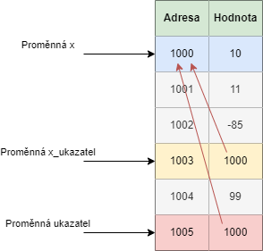

Každou proměnnou, kterou vytvoříte, tak je uložená někde v paměti počítače. Název proměnné není nic jiného, než námi pojmenované místo někde v paměti počítače.

Mějme program

```c
#include <stdio.h>

int main() {
    int x = 256;

    printf("Adresa je %p, hodnota je %i\n", &x, x);

    return 0;
}
```

Pro tisk adresy se používá `%p`. Pokud chceme získat adresu proměnné, použijeme operátor reference `&` (říkáme `reference na proměnnou x`). Program nám vytiskne (adresa se může lišit na vašem zařízení)

```
Adresa je 000000000061FE1C, hodnota je 256
```

## Datový typ ukazatel
V našich programech můžeme vytvářet datový typ ukazatel. Datový typ ukazatel má vždy doprovodný datový typ. K tomuto základnímu datovému typu přidáme hvězdičku. Například

* `int *` - ukazatel na datový typ int
* `char *` - ukazatel na datový typ char

Proměnná datového typu ukazatel v sobě obsahuje hodnotu adresu. Pokud máme například
```c
int * x_ukazatel;
```

Tak proměnná x_ukazatel slouží k uložení hodnoty adresy proměnné datového typu int. Jak do x_ukazatel uložit hodnotu? Když zkusíme

```c
int x = 256;
int * x_ukazatel = x;
```
Dostáváme chybu
```
initialization of 'int *' from 'int' makes pointer from integer without a cast
```
Tzv. snažíme se uložit hodnotu `int` do datového typu `int *`. Jak to opravit? Řekli jsme si, že adresu proměnné nám vrátí operátor `&`. Program tedy opravíme následovně

```c
int x = 256;
int * x_ukazatel = &x;
```


Mějme program

```c
#include <stdio.h>

int main() {
    int x = 256;
    int * x_ukazatel = &x;

    printf("Adresa x je %p, adresa x_ukazatel je %p\n", &x, x_ukazatel);

    return 0;
}
```
Nám vytiskne
```
Adresa x je 000000000061FE14, adresa x_ukazatel je 000000000061FE14
```
Adresa x a hodnota x_ukazatel jsou stejné.


## Dereference
Ukázali jsme si operátor `reference` (`&`). Existuje i opačný operátor nazvaný `dereference` (`*`). Pokud operátor reference vrátí adresu proměnné, co dělá operátor dereference? Vrátí hodnotu na dané adrese.
Mějme program

```c
#include <stdio.h>

int main() {
    int x = 256;
    int * x_ukazatel = &x;

    printf("Hodnota x je %i, hodnota x_ukazatel je %i\n", x, *x_ukazatel);

    return 0;
}
```
Dostáváme
```
Hodnota x je 256, hodnota x_ukazatel je 256
```

> Zde je potřeba si uvědomit rozdíl v použití hvězdičky `*`. Pokud hvězdičku napíšeme k datovému typu při definici proměnné (např. `int * x_ukazatel`), tak je význam **datový typ ukazatel na int**. Pokud hvězdičku napíšeme k proměnné (např. `*x_ukazatel`), tak je význam **dereference proměnné** (získání hodnoty na adrese).

Pokud bychom měli následující kód.

```c
int x = 10;
int * x_ukazatel = &x;
```
Tak se můžeme podívat, jak to vypadá v paměti a co by se nám vrátilo při referenci/dereferenci. Hodnoty adres v paměti jsou jenom ilustrační pro jednodušší pochopení principu.

| Proměnná | Hodnota | Adresa v paměti | Co vrátí reference (&) | Co vrátí dereference (*)
|---|---|---|---|---|
| x | 10 | 1000 | 1000 | nelze, hodnota v x není adresa (proto nejde dereferencovat) |
| x_ukazatel | 1000 | 1003 | 1003 | 10 (hodnotu na adrese 1000, tzv. hodnotu x) |


Kdybychom si měli situaci znázornit na diagramu, tak by vypadala následovně.


Co by se stalo, kdybychom změnili hodnotu x?

```c
int x = 10;
int * x_ukazatel = &x;
x = 11;
```

V paměti bychom pak měli


Proto nás ani nepřekvapí, když si vytiskneme hodnoty

```c
#include <stdio.h>

int main() {
    int x = 10;
    int * x_ukazatel = &x;
    x = 11;

    printf("Hodnota x je %i, hodnota x_ukazatel je %i\n", x, *x_ukazatel);

    return 0;
}
```

A dostáváme

```
Hodnota x je 11, hodnota x_ukazatel je 11
```

Stejná situace nastává, pokud bychom měnili hodnotu přes ukazatel

```c
#include <stdio.h>

int main() {
    int x = 10;
    int * x_ukazatel = &x;
    *x_ukazatel = 11;

    printf("Hodnota x je %i, hodnota x_ukazatel je %i\n", x, *x_ukazatel);

    return 0;
}
```

Jak vidíme, tak dereferenci můžeme použít i pro přiřazení hodnoty.

## Hodnota NULL
Pokud definujeme ukazatel, tak mu můžeme nastavit hodnotu `NULL` (nezávisle, zda jde o int ukazatel nebo libovolný jiný ukazatel). Tato hodnota reprezentuje, že daný ukazatel na nic neukazuje (na žádné místo v paměti).

S ukazatelem na NULL nemůžeme pracovat normálním způsobem. Pokud bychom se pokusili vytisknout hodnotu, na kterou ukazuje, tak dostáváme chybu 
```c
#include <stdio.h>

int main() {
    int * x_ukazatel = NULL;
    *x = 10;

    printf("Hodnota x_ukazatel je %i\n", *x_ukazatel);

    return 0;
}
```

Stejně tak se nám nepodaří uložit na tuto adresu nějakou hodnotou. Opět dostáváme chybu

```c
#include <stdio.h>

int main() {
    int * x_ukazatel = NULL;
    *x_ukazatel = 10;

    printf("Hodnota x_ukazatel je %i\n", *x_ukazatel);

    return 0;
}
```

Správně tedy můžeme definovat hodnotu ukazatele jako NULL, ale následně musíme hodnotu nastavit.


```c
#include <stdio.h>

int main() {
    int x = 10;
    int * x_ukazatel = NULL;
    x_ukazatel = &x;

    printf("Hodnota x_ukazatel je %i\n", *x_ukazatel);

    return 0;
}
```

## Důležité body
V ukazatelích začínající programátoři dělají často chybu. Jedná se o nejsložitější část základů, které si v tomto kurzu probereme.

Důležité je si dát pozor na rozdíl v `x_ukazatel = &x` a `*x_ukazatel = x`.

První případ `x_ukazatel = &x` provede následující akce. Vezme se adresa proměnné x (`&x`) a ta se uloží do proměnné typu ukazatel (`x_ukazatel = &x`).

V druhém případě `*x_ukazatel = x` se nejdříve provede dereference (`*x_ukazatel`) a na výslednou adresu se uloží hodnota x. Tzv. pokud x_ukazatel má v sobě hodnotu 1000, tak se na adresu 1000 uloží hodnota x.


## Práce s více ukazateli
V programu můžeme mít libovolný počet ukazatelů
```c
#include <stdio.h>

int main() {
    int x = 10;
    int * x_ukazatel = &x;
    int * y_ukazatel = &x;

    printf("Hodnota x_ukazatel je %i, hodnota y_ukazatel je %i\n", *x_ukazatel, *y_ukazatel);

    return 0;
}
```

Nám vytiskne dvakrát hodnotu 10. V paměti by to vypadalo následovně.


Stejná situace nástává i v případě, že uložíme ukazatel do ukazatele. V obou případech bude uložená hodnota adresy proměnné x jak do ukazatele x_ukazatel tak do ukazatele y_ukazatel.

```c
#include <stdio.h>

int main() {
    int x = 10;
    int * x_ukazatel = &x;
    int * y_ukazatel = x_ukazatel;

    printf("Hodnota x_ukazatel je %i, hodnota y_ukazatel je %i\n", *x_ukazatel, *y_ukazatel);

    return 0;
}
```

Všimněme si, že při nastavení `y_ukazatel = x_ukazatel` již nepoužíváme operátor reference (&). Kdybychom to udělali 

```c
int x = 10;
int * x_ukazatel = &x;
int * y_ukazatel = &x_ukazatel;
```

Tak do y_ukazatel ukládáme adresu x_ukazatel. To by se nám nepodařilo spustit. V paměti by to vypadalo následovně


Vidíme, že y_ukazatel teď směřuje na adresu x_ukazatel místo na adresu x. Tím jsme vytvořili tzv. ukazatel na ukazatel. V této situaci máme

| Proměnná | Hodnota | Adresa v paměti | Co vrátí reference (&) | Co vrátí dereference (*)
|---|---|---|---|---|
| x | 10 | 1000 | 1000 | nelze, hodnota v x není adresa (proto nejde dereferencovat) |
| x_ukazatel | 1000 | 1003 | 1003 | 10 (hodnotu x) |
| y_ukazatel | 1003 | 1004 | 1004 | 1000 (hodnotu x_ukazatel) |

Program nám nefunguje proto, že abychom mohli uložit ukazatel na ukazatel, tak potřebujeme mít proměnnou definovanou jako `int **`.

```c
int x = 10;
int * x_ukazatel = &x;
int ** y_ukazatel = &x_ukazatel;
```


I tímto způsobem se můžeme dostat k hodnotě 10.

Nejdříve uděláme `*y_ukazatel`, tím dostaneme hodnotu x_ukazatele, tzv. 1000. Když nad tím zavoláme dereferenci ještě jednou `*(*y_ukazatel)`, tak dostáváme hodnotu 10.

* `*y_ukazatel` - vrať mi hodnotu na adrese 1003 -> Na adrese 1003 je hodnota 1000.
* `*(*y_ukazatel)` - si můžeme představit jako `*(1000)` (protože víme, že `*y_ukazatel` je 1000), což není nic jiného, než vrať mi hodnotu na adrese 1000 -> Na adrese 1000 je hodnota 10.

Závorky v tomto případě jsou volitelné (operátor dereference má stejnou prioritu). `*(*y_ukazatel)` je tedy stejné jako napsat `**y_ukazatel`. Dostáváme následující program

```c
#include <stdio.h>

int main() {
    int x = 10;
    int * x_ukazatel = &x;
    int ** y_ukazatel = &x_ukazatel;

    printf("Hodnota y_ukazatel je %i\n", **y_ukazatel);

    return 0;
}
```

Tímto způsobem můžeme udělat i ukazatel na ukazatel na ukazatel (tři hvězdičky). A na podobném principu udělat i více úrovní.

## Ukazatelé ve funkcích
Nyní si ukážeme jak můžeme použít ukazatele ve funkcích.

```c
#include <stdio.h>

void uprav_ukazatel(int * ukazatel) {
    *ukazatel = 13;
}

int main() {
    int x = 10;
    int * x_ukazatel = &x;
    uprav_ukazatel(x_ukazatel);

    printf("Hodnota x je %i\n", x);

    return 0;
}
```

Následně se nám vytiskne

```
Hodnota x je 13
```
My pošleme do funkce proměnnou typu ukazatel na datový typ int. Ten má v sobě hodnotu adresy x. Pak pomocí `*ukazatel = 13` řekneme, že se na adrese x (kde je aktuálně hodnota 10) se má uložit hodnota 13. Ta se uloží do paměti a pak i po skončení funkce je uložená nová hodnota.

V okamžiku, kdy se nacházíme na začátku funkce uprav_ukazatel to vypadá v paměti následovně.



Všimněme si, že proměnná ukazatel má svoje vlastní místo v paměti (1005) od proměnné x_ukazatel (1003).

Proto kdybychom změnili hodnotu v proměnné ukazatel, tak situace vypadá následovně

```c
#include <stdio.h>

void uprav_ukazatel(int * ukazatel) {
    int q = 13;
    ukazatel = &q;
}

int main() {
    int x = 10;
    int * x_ukazatel = &x;
    uprav_ukazatel(x_ukazatel);

    printf("Hodnota x_ukazatel je %i\n", *x_ukazatel);

    return 0;
}
```
A vytiskne se nám
```
Hodnota x_ukazatel je 10
```

Co se tady stane? Po definici proměnné q máme v paměti následující


Následně provedeme uložení adresy q do ukazatele `ukazatel = &q`. V paměti máme následující


Když pak jdeme ale tisknout proměnnou x (adresa 1000), tak vidíme, že zde máme uloženou pořád hodnotu 10.


Pro zkrácený zápis můžeme využít referenční operátor (&). Obejdeme se tak bez proměnné x_ukazatel

```c
#include <stdio.h>

void uprav_ukazatel(int * ukazatel) {
    *ukazatel = 13;
}

int main() {
    int x = 10;
    uprav_ukazatel(&x);

    printf("Hodnota x je %i\n", x);

    return 0;
}
```
A opět dostáváme

```
Hodnota x je 13
```


