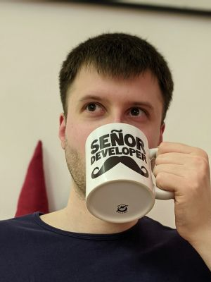

# Vítejte na kurzu programovacího jazyka C
Vítám všechny, kteří zabloudili až do mého kurzu jazyka C. Kurz je udržován jako open source [zde](https://github.com/tomasbruckner/c_lectures). Pokud byste se chtěli ke kurzu vyjádřit (například dát zpětnou vazbu, napsat nápad na vylepšení nebo vyjasnit nějaký koncept), tak můžete použít například Github diskuze [zde](https://github.com/tomasbruckner/c_lectures/discussions).

## O mně

Mé jméno je Tomáš Bruckner ([tomasbruckner.dev](https://www.tomasbruckner.dev/)) a rád trávím čas programováním. Vystudoval jsem bakalářský a magisterský program na Vysokém učení technickém (VUT) v Brně na Fakultě informatiky (FIT). Zde jsem také strávil jeden rok doktorského programu, kde jsem byl cvičící předmětu [Základy programování](https://www.fit.vut.cz/study/course/244899/.cs), což je právě z mého pohledu jeden z nejdůležitějších předmětů prvního semestru, kde se studenti mají naučit programovat právě v jazyku C.

## Proč jsem tento kurz vytvořil
Když se podívám zpětně na to, jakým způsobem je učen jazyk C na univerzitě (VUT FIT), tak jsem viděl spoustu prostoru na zlepšení. Různí přednášející mají různé styly a zaměřují se více na teorii. To na univerzitě dává smysl, ale taky to nesedne každému. Já jsem se chtěl zaměřit více na praktický přístup.

Cvičící v laboratořích se také můžou výrazně lišit. Jsou tam lidé, kteří mají pro učení vášeň a dávají do toho maximum. Bohužel studentů v prvním ročníku je přes 600 a na takové obří množství je potřeba i velká lidská síla ze strany akademického personálu. Pro velkou část cvíčících je to první předmět, který mají na starost. Nemají zkušenosti s vedením cvičení. Nemají zkušenosti s komunikací se studenty. Nejsmutnější je, že často ani nemají zkušenosti s jazykem C. Naposledy ho viděli ve stejném předmětu, který zrovna učí a od té doby dělají v něčem úplně jiném. Nechcou se na cvičení připravovat, protože to pro ně nemá žádnou hodnotu. Chcou to mít co nejrychleji za sebou a věnovat tomu minimální čas a energii.

Pro studenty to je loterie, jestli si vytáhnout skvělého cvičícího, který jim všechno skvěle vysvětlí. Nebo budou mít smůlu a odnesou si ze cvičení 30% toho, co by mohli u někoho lepšího. Nebo to často není ani o tom, že by byl cvičící špatný, ale jenom danému studentovi nesedne styl učení daného cvičícího.

Proč tedy nevytvořit alternativu, co by student mohl použít. Buď jako doplněk nebo jako hlavní materiál k učení. Proč ale znovu objevovat kolo a dělat nový kurz. Neexistuje náhodou už dost jiných alternativ? Nedalo by se použít již existujícího? Pojďme se tedy podívat, jaké má student možnosti.

Nejvíce doporučovaná knížka je `Učebnice jazyka C` od Pavla Herouta, která má dva díly. Když jsem se učil jazyk C, tak jsem obě četl, ale mě osobně tyto knihy nevyhovaly. Tempo knihy mi přišlo velmi pomalé. Na celkem 717 stranách (první díl 280, druhý 437) jsem se vlastně dozvěděl zhruba 1/3 obsahu tohoto kurzu. Navíc je to placená varianta, což může hodně lidí odradit. U knížky je také problém, že nemůžu udělat jednoduše copy paste nebo vyhledávat tak, jak je tomu u digitální varianty.

Další velmi populární zdroj je knížka `The C Programming Language` přímo od autorů jazyka C. Ta vyšla v roce 1978 a je psána i stylem sedmdesátých let. Někomu to může vyhovovat, ale pro spoustu lidí to opět není ideální varianta.

Dále jsou na internetu různé tutoriály, ale ty z mého pohledu trpí několika problémy. Některé nejsou zdarma. Většina z nich jsou jenom v angličtině (chtěl jsem mít kurz v češtině) a z těch co jsem viděl já, tak všechny jsou jenom hodně povrchové. Navíc je problém kontaktovat autora kurzu a zeptat se, když něčemu nerozumím.

Všechny tyto problémy jsem chtěl vyřešit právě tímto kurzem. Chtěl jsem něco, co bude nahrazovat kurz na vysoké škole obsahem znalostí, které si odsud odnesete. Chtěl jsem něco v češtině. Chtěl jsem něco, kde se mě jako autora můžete zeptat, když něčemu nerozumíte (viz link na začátku příspěvku). A případně i něco, kde může přispět i kdokoliv další a udělat tenhle kurz ještě mnohem lepší.

## Pro koho je kurz určen
Určen je pro začatečníky, kteří se chtějí naučit programovat v jazyce C. Ať už s programováním teprve začínají nebo již mají nějaké zkušenosti z jiného programovacího jazyka.

Nejčastější čtenář bude pravděpodobně student střední/vysoké školy, který má na škole předmět programování v jazyce C a trošku v tom plave a spoustu věcí mu nejsou jasné. Proto může využít tento kurz k dovysvětlení problematiky nebo k procvičení programování.

S optimismem doufám, že tento kurz využijí i lidé, kteří mají o programování zájem a chtěli proniknout do tajů programování. Kurz je psán tak, že není potřeba předchozí znalost programování.

V neposlední řadě můžou kurz využít lidé, kteří už mají nějaké znalosti s programováním a chtějí pochopit, jak některé věci fungují na nižší úrovni. Díky tomu lépe pochopí, jak věci fungují pod pokličkou.

## Proč právě jazyk C
Jazyk C je nízkoúrovňový jazyk s nízkou úrovní abstrakce. Co to znamená? Že jazyk za vás toho moc neudělá a všechno si musíte udělat sami. Proč je to výhoda? Díky tomu pochopíte principy paměti a co se děje pod povrchem programovacích jazyků s vyšší úrovní abstrakce (JavaScript, PHP, Python a další). Tím dokážete pracovat efektivněji v libovolném jazyce a budete mít mnohem hlubší porozumění programování.

