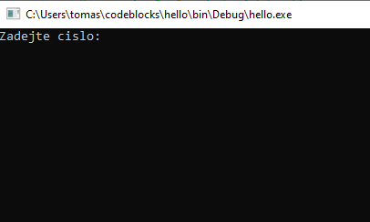
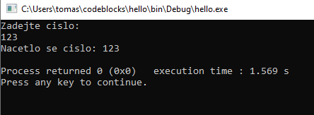

# Práce s uživatelskám vstupem
Ke čtení uživatelského vstupu lze použít další funkci z knihovny stdio nazvanou *scanf*. Ta funguje tak, že ji jako prvni argument předáme modifikátor (obdobně jako ve funkci printf). Pokud použijeme modifikátor %i, tak jako druhý argument musíme předat **ukazatel** na proměnnou typu int.

Ukazateli se budeme zabývat více v kapitole XXX. Zatím nám může stačit, že před proměnnou musíme dát znak & (ampersand).

Mějme program

```c
#include <stdio.h>

int main()
{
    int vstup = 0;
    printf("Zadejte cislo:\n");
    scanf("%i", &vstup);

    printf("Nacetlo se cislo: %i\n", vstup);

    return 0;
}
```

Když program pustíme, tak se nám zobrazí




Nyní můžeme napsat číslo například `123` a zmáčknout Enter tlačítko. Pak se zobrazí



Co se v programu děje?

1. Vytvoří se proměnná vstup a nastaví se na nulu
1. Vytiskne se Zadejte cislo
1. Funkce scanf zastaví program a čeká, než uživatel zadá nějaký vstup a dá enter ()
1. Vytiskne se Nacetlo se cislo s načteným číslem
1. Provede se return 0 a program se ukončí

