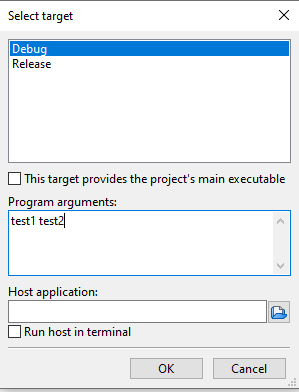

Našim programům můžeme předávat data několika způsoby. Jeden z nich je uživatelský vstup (viz kapitola XXX). Dalším je čtení ze souborů (viz kapitola XXX). Nyní si ukážeme další způsob předání dat a to pomocí `argumentů programu`.

O co se jedná? Stejně jako funkcím předáváme při volání argumenty, tak i můžeme předat argumenty i samotnému programu jako celku. V podstatě se jedná o předání argumentů funkci `main`.

K čemu je to dobré? Někdy chceme udělat program, který umí dělat několik věcí. Například program, který umí šifrovat a dešifrovat hesla. Mohli bychom samozřejmě udělat dva programy, ale je to méně praktické, než mít jeden (museli bychom všude kopírovat dva `.exe` soubory místo jednoho). Jak ale program pozná, jestli zrovna chceme šifrovat nebo dešifrovat? K tomu se krásně hodí právě argumenty programu. Díky nim se můžeme rozhodnout, že teď chceme program spustit v režimu šifrování a podruhé v režimu dešifrování.

## Funkce main
Do této doby jsme definovali funkci main jenom bez parametrů
```c
int main()
```

Můžeme ji však zadefinovat i s dvěma parametry
```c
int main(int argc, char* argv[])
```

Existuje i zápis pomocí dvojitého ukazatele
```c
int main(int argc, char** argv)
```

Co jednotlivé parametry znamenají?

* **argc** (argc = argument count) - počet argumentů programu (celé číslo)
* **argv** (argv = argument vector) - samotné argumenty programu (pole řetězců)


## Práce s argumenty
Mějme program, který vytiskne všechny argumenty našeho programu
```c
#include <stdio.h>

int main(int argc, char* argv[])
{
    printf("Pocet argumentu: %i\n", argc);

    for(int i = 0; i < argc; i = i + s1) {
        printf("%s\n", argv[i]);
    }

    return 0;
}
```

Když program spustíme, tak dostáváme

```
Pocet argumentu: 1
C:\Users\tomas\codeblocks\hello\bin\Debug\hello.exe
```

Vidíme, že první argument je cesta k binárnímu souboru našeho programu (tzv. program, který jsme spustili). Každý program má vždy aspoň jeden argument a to je právě tato cesta k danému programu.

Jak předáme další argumenty? Jeden ze způsobů je, že si otevřeme aplikaci PowerShell terminál (ve Windows je automaticky nainstalovaná) a půjdeme do složky, kde máme binární soubor.

To uděláme tak, že napíšeme v PowerShell terminálu `cd` a cestu do složky, kde máme náš binární soubor. V mém případě to je `"C:\Users\tomas\codeblocks\hello\bin\Debug\"` a zmáčkneme enter.

Nyní program můžeme spustit tak, že napíšeme `.\` a název binárního souboru. V mém případě se binární soubor jmenuje `hello.exe` (můžeme to zkopírovat z toho, co nám vytisknul předchozí program). Nyní můžeme napsat libovolné argumenty programu. Jednotlivé argumenty se oddělují mezerou. Já jsem si vybral 3 argumenty, které jsou `prvni`, `druhy` a `treti`. Vy si můžete zvolit svoje vlastní. Po zmáčknutí klávesy enter dostáváme výpis.
```
C:\Users\tomas\codeblocks\hello\bin\Debug\hello.exe
prvni
druhy
treti
```

Lze také udělat argument s mezerou. To se dělá tak, že všechny slova jednoho argumentu dáme do dvojitých uvozovek. Například `"argument s mezerou"`.


Celý výpis v PowerShell by vypadal následovně.

```ps1
PS C:\Users\tomas> cd "C:\Users\tomas\codeblocks\hello\bin\Debug\"
PS C:\Users\tomas\codeblocks\hello\bin\Debug> .\hello.exe prvni druhy treti
Pocet argumentu: 4
C:\Users\tomas\codeblocks\hello\bin\Debug\hello.exe
prvni
druhy
treti
PS C:\Users\tomas\codeblocks\hello\bin\Debug> .\hello.exe "argument s mezerou"
Pocet argumentu: 2
C:\Users\tomas\codeblocks\hello\bin\Debug\hello.exe
argument s mezerou
```

Pokud bychom chtěli zadávat argumenty programu v CodeBlocks a ne přes PowerShell terminál, tak můžeme.

V CodeBlocks klikneme v horní liště `Project -> Set program's arguments`


A následně nastavíme argumenty do `Program arguments`. Například nastavíme dva argumenty `test1` a `test2`.




Potvrdíme tlačítkem OK. Pokud program nyní spustíme, tak dostáváme

```
Pocet argumentu: 3
C:\Users\tomas\codeblocks\hello\bin\Debug\hello.exe
test1
test2
```

## Šifrovací program
Jak bychom udělali náš šifrovací/dešifrovací progam? Jako šifrovací mechanismus můžeme použít například Caesarovu šifru [více zde](https://cs.wikipedia.org/wiki/Caesarova_%C5%A1ifra). Ta funguje tak, že každé písmeno posune v abecedě o x znaků. Mějme jednoduchou variantu, která posune vždy každý znak o 1 pozici. Tzv. z A se stane B, z B se stane C, z C se stane D atd. Na konci se Z stane zase A.

Program pro šifrování
```c
#include <stdio.h>
#include <string.h>

void sifruj(char * text) {
    for (int i = 0; text[i] != '\0'; i = i + 1) {
        char c = text[i];
        if (c < 'z' && c >= 'a') {
            printf("%c", c + 1);
        } else if (c == 'z') {
            printf("%c", 'a');
        }
    }

    printf("\n");
}

void desifruj(char * text) {
    for (int i = 0; text[i] != '\0'; i = i + 1) {
        char c = text[i];
        if (c <= 'z' && c > 'a') {
            printf("%c", c - 1);
        } else if (c == 'a') {
            printf("%c", 'z');
        }
    }

    printf("\n");
}

int main(int argc, char* argv[])
{
    if (argc != 3) {
        printf("Spatny pocet argument.\n");
        printf("Prvni argument je rezim: sifruj/desifruj.\n");
        printf("Druhy argument je text k zasifrovani. Pouze male pismenka anglicke abecedy.\n");
        return 1;
    }

    if (strcmp(argv[1], "sifruj") == 0) {
        sifruj(argv[2]);
        return 0;
    }

    if (strcmp(argv[1], "desifruj") == 0) {
        desifruj(argv[2]);
        return 0;
    }

    printf("Neznamy rezim. Pouzijte sifruj nebo desifruj\n");
    return 1;
}
```


## Úkoly na procvičení
### Úkol 1
XXXXXXXXXXXXXXXXXXX


<details>
  <summary>Klikni pro zobrazení možného řešení</summary>

```c
#include <stdio.h>

void tiskni_nejvetsi(int cisla_k_tisku[], int velikost_pole) {
    // Zde predpokladame, ze pole ma aspon jeden prvek
    // Lepsi by bylo to osetrit na zacatku pro situace, kdy pole bude mit 0 prvku
    int max = cisla_k_tisku[0];  
    for (int i = 0; i < velikost_pole; i = i + 1) {
        if (cisla_k_tisku[i] > max) {
            max = cisla_k_tisku[i];
        }
    }
    
    printf("Maximum je %i\n", max);
}

int main()
{
    int pole[5];

    for (int i = 0; i < 5; i = i + 1) {
        int vstup = 0;
        printf("Zadejte cislo:\n");
        scanf("%i", &vstup);
        pole[i] = vstup;
    }

    tiskni_nejvetsi(pole, 5);

    return 0;
}
```
</details>

## Fun fact
Pokud máme v programu chybu, tak se běžně používá označení, že máme v programu "bug" (anglicky brouk). Tohle označení vzniklo ve 40. letech při vytváření sálového počítače Harvard Mark II.
Tento počítač začal selhávat. Operátoři počítače zjistili, že chyba byla způsobena skutečným broukem (molem), který byl uvězněn uvnitř počítače.


## Odkazy
[Následující kapitola: Funkce - prototypy](./pokrocile-prototypy.md)

[GitHub diskuze k této kapitole](https://github.com/tomasbruckner/c_lectures/discussions/19)

[Zpátky na přehled](./index.md)

[Předchozí kapitola: Práce se soubory](./zaklady-soubory.md)
