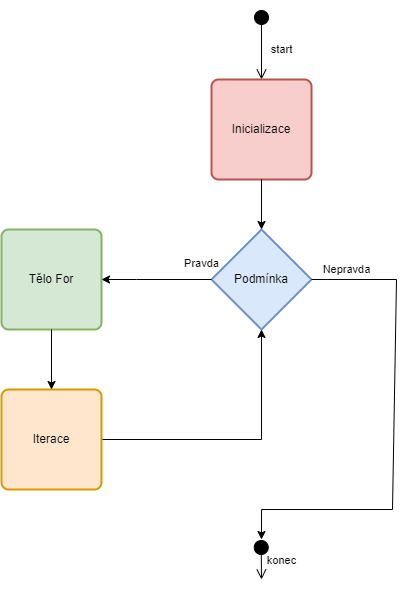
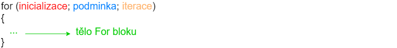
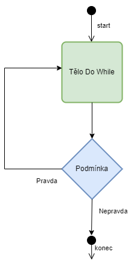
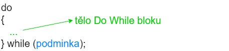

Cykly nám pomáhají opakovat určitou část kódu do té doby, dokud je splněna stanovená podmínka. Cyklů máme více typů. Nelze říct, že jeden je lepší nebo horší. Pokud máme kód napsaný pomocí nějakého cyklu, tak tento kód lze vždy převést na jiný typ cyklu se zachováním funkčnosti (pořád bude fungovat stejně).

## Cyklus While
První cyklus, který si ukážeme, je cyklus `while`. Jeho diagram je následující


Nejdříve se zkontroluje podmínka. Pokud je pravdivá, tak se provedé blok kódu while a podmínka se zkontroluje znovu. Pokud je opět pravdivá, tak se blok kódu provede znovu. Jakmile podmínka není pravdivá, tak se cyklus ukončí.


Mějme kód


```c
#include <stdio.h>

int main()
{
    int x = 0;
    while (x < 3) {
        printf("%i\n", x);
        x = x + 1;
    }

    return 0;
}
```

Co daný kód vytiskne?

```
0
1
2
```

Co program vykoná krok za krokem
1. Definuje se proměnná `x` a nastaví se na hodnotu 0
1. Zkontroluje se podmínka zda `x` (0) je menší než 3 - ano je, podmínka je pravdivá
1. Vytiskne se 0 a nový řádek
1. do `x` se uloží hodnota `0 + 1`, tzv. hodnota 1
1. Zkontroluje se podmínka zda `x` (1) je menší než 3 - ano je, podmínka je pravdivá
1. Vytiskne se 1 a nový řádek
1. do x se uloží hodnota `1 + 1`, tzv. hodnota 2
1. Zkontroluje se podmínka zda `x` (2) je menší než 3 - ano je, podmínka je pravdivá
1. Vytiskne se 2 a nový řádek
1. do x se uloží hodnota `2 + 1`, tzv. hodnota 3
1. Zkontroluje se podmínka zda `x` (3) je menší než 3 - není, podmínka je nepravdivá
1. Provede se `return 0` a program se ukončí


## Cyklus For

Další typ cyklu je `for`. Ten se skládá z několika částí.

První je **inicializace**. Zde můžeme dát jeden příkaz. Tento příkaz se provede pouze jednou.

Druhá část je **podmínka**. Pokud je pravdivá, tak se provede tělo cyklu for a *iterace* (viz níže). Pokud není podmínka pravdivá, tak se cyklus ukončí a pokračuje se dál.

Třetí část je **tělo cyklu for**. Ten obsahuje 0 až N příkazů.

Poslední část je **iterace**. Zde máme jeden příkaz, který se provede po provedení *těla for*.

Diagram vypadá následovně




Na úrovni kódu to vypadá následovně




Mějme minimální program, který vytiskne čísla od 0 do 2.

```c
#include <stdio.h>

int main()
{
    for (int x = 0; x < 3; x = x + 1) {
        printf("%i\n", x);
    }

    return 0;
}
```

Jednotlivé části *cyklu for* jsou v tomto programu

* **inicializace** - `int x = 0`
* **podmínka** - `x < 3`
* **iterace** - `x = x + 1`
* **tělo cyklu** - `printf("%i\n", x);`

Dejme si pozor hlavně na středníky v definici for cyklu. Ty jsou povinné a nesmíme na ně zapomenout. Oddělují jednotlivé části - inicializaci, podmínku a iteraci.


Co program vykoná krok za krokem
1. Definuje se proměnná `x` a nastaví se na hodnotu 0 (**inicializace**)
1. Zkontroluje se podmínka zda `x` (0) je menší než 3 - ano je, podmínka je pravdivá (**podmínka**)
1. Vytiskne se 0 a nový řádek (**tělo cyklu**)
1. do `x` se uloží hodnota `0 + 1`, tzv. hodnota 1 (**iterace**)
1. Zkontroluje se podmínka zda `x` (1) je menší než 3 - ano je, podmínka je pravdivá (**podmínka**)
1. Vytiskne se 1 a nový řádek (**tělo cyklu**)
1. do `x` se uloží hodnota `1 + 1`, tzv. hodnota 2 (**iterace**)
1. Zkontroluje se podmínka zda `x` (2) je menší než 3 - ano je, podmínka je pravdivá (**podmínka**)
1. Vytiskne se 2 a nový řádek (**tělo cyklu**)
1. do `x` se uloží hodnota `2 + 1`, tzv. hodnota 3 (**iterace**)
1. Zkontroluje se podmínka zda `x` (3) je menší než 3 - není, podmínka je nepravdivá (**podmínka**)
1. Provede se `return 0` a program končí (kód mimo cyklus)

> Můžete si všimnout, že program vykonává stejnou funkci jako cyklus `While`. Obecně platí, že cokoliv co napíšete pomocí `while` cyklu lze předělat na `for` cyklus. Stejně tak každý cyklus `for` lze předělat na cyklus `while`. Můžete používat ten typ cyklu, který se vám líbí více.

## Cyklus Do While

Poslední cyklus, který si dnes probereme, je cyklus `do while`. Je velmi podobný cyklu `while`



Hlavní (a jediný) rozdíl je v tom, že tělo cyklu proběhne vždy aspoň jedenkrát. Podmínka se vyhodnocuje až na konci cyklu.



Mějme program, který má vždy podmínku nepravdivou.
```c
#include <stdio.h>

int main()
{
    do {
        printf("Ahoj\n");
    } while (0);

    return 0;
}
```
Co program vykoná krok za krokem
1. Vytiskne se `Ahoj`
1. Zkontroluje se podmínka - reprezentuje v jazyku C hodnota 0 pravdu? Ne, podmínka je nepravdivá.
1. Provede se `return 0` a program končí

Pokud potřebujete, aby cyklus proběhnul aspoň jednou (také říkáme "cyklus udělal jednu iteraci"), tak cyklus `do while` je skvělá volba.

Tento cyklus je obecně nejméně používaný (ze všech, které jsme si zatím probrali) a většinou si vystačíme pouze s while/for cyklem.

## Zanoření cyklů
Cykly můžeme libovolně zanořovat (stejně jako IF struktura). Můžeme mít cyklus v cyklu

```c
#include <stdio.h>

int main()
{
    int x = 0;
    while (x < 2) {
        int y = 0;
        while (y < 2) {
            printf("X je %i, Y je %i\n", x, y);
            y = y + 1;
        }
        x = x + 1;
    }

    return 0;
}

```
Nám dává výsledek

```
X je 0, Y je 0
X je 0, Y je 1
X je 1, Y je 0
X je 1, Y je 1
```

Co program vykoná krok za krokem
1. Vytvoří se proměnná `x` a nastaví se na 0
1. Zkontroluje se podmínka zda `x` (0) je menší než 2 - ano je, podmínka je pravdivá
1. Vytvoří se proměnná `y` a nastaví se na 0.
1. Zkontroluje se podmínka zda `y` (0) je menší než 2 - ano je, podmínka je pravdivá
1. Vytiskne se `X je 0, Y je 0`
1. Zvýší se hodnota `y` o 1 (na 1)
1. Zkontroluje se podmínka zda `y` (1) je menší než 2 - ano je, podmínka je pravdivá
1. Vytiskne se `X je 0, Y je 1`
1. Zvýší se hodnota `y` o 1 (na 2)
1. Zkontroluje se podmínka zda `y` (2) je menší než 2 - není, podmínka je **nepravdivá**
1. Zvýší se `x` o 1 (na 1)
1. Zkontroluje se podmínka zda `x` (1) je menší než 2 - ano je, podmínka je pravdivá
1. Vytvoří se proměnná `y` a nastaví se na 0.
1. Zkontroluje se podmínka zda `y` (0) je menší než 2 - ano je, podmínka je pravdivá
1. Vytiskne se `X je 1, Y je 0`
1. Zvýší se hodnota `y` o 1 (na 1)
1. Zkontroluje se podmínka zda `y` (1) je menší než 2 - ano je, podmínka je pravdivá
1. Vytiskne se `X je 1, Y je 1`
1. Zvýší se hodnota `y` o 1 (na 2)
1. Zkontroluje se podmínka zda `y` (2) je menší než 2 - není, podmínka je **nepravdivá**
1. Zvýší se `x` o 1 (na 2)
1. Zkontroluje se podmínka zda `x` (2) je menší než 2 - není, podmínka je **nepravdivá**
1. Provede se `return 0` a program končí

Všimněme si bodu 13. Deklarovat proměnnou uvnitř cyklu není problém. Je to kvůli tomu, že proměnné mají tzv. blokový `scope`. Více si o tom povíme v kapitole XXX. Zatím nám stačí vědět, že je něco takového možné.


Cykly také můžeme kombinovat s `IF` strukturou (cyklus uvnitř `IF` nebo `IF` uvnitř cyklu). Např.
```c
#include <stdio.h>

int main()
{
    int x = 0;
    while (x < 2) {
        if (x == 1) {
            printf("Ahoj\n");
        }

        x = x + 1;
    }

    return 0;
}
```

## Break a continue
S cykly se vážou dvě klíčová slova `break` a `continue`. Obě upravují chování cyklu. Pokud zavoláme `break`, tak se cyklus ukončí. Použití může vypadat následovně
```c
#include <stdio.h>

int main()
{
    int x = 0;
    while (x < 2) {
        printf("Ahoj\n");
        break;
        printf("Ahoj\n");

        x = x + 1;
    }

    return 0;
}
```

Zde se vytiskne pouze
```
Ahoj
```
Pak se cyklus ukončí. Velmi častá je kombinace s `IF` strukturou. Např. chceme tisknout čísla dokud nenarazíme na trojku.

```c
#include <stdio.h>

int main()
{
    for (int x = 0; x < 5; x = x + 1) {
        if (x == 3) {
            break;
        }

        printf("Cislo je %i\n", x);
    }

    return 0;
}
```
Nám vytiskne

```
Cislo je 0
Cislo je 1
Cislo je 2
```


Dále máme klíčové slovo `continue`. To slouží k ukončení aktuální iterace cyklu a přeskočení na další iteraci. Můžeme si to představit, že `continue` ukončí aktuální tělo cyklu, ale neukončí celý `for` cyklus (tak jak to dělá klíčové slovo `break`).

```c
#include <stdio.h>

int main()
{
    for (int x = 0; x < 5; x = x + 1) {
        if (x == 3) {
            continue;
        }

        printf("Cislo je %i\n", x);
    }

    return 0;
}
```

Nám vytiskne všechny čísla kromě trojky.

```
Cislo je 0
Cislo je 1
Cislo je 2
Cislo je 4
```


## Zacyklení
Při psaní cyklů je potřeba si dát pozor na to, aby neběžel cyklus do nekonečna. Pokud se tak stane, tak říkáme, že došlo k zacyklení programu. Ukázka může být např.

```c
#include <stdio.h>

int main()
{
    while (1) {
        printf("Ahoj\n");
    }

    return 0;
}
```

Pokud tento program spustíme, tak bude psát do nekonečna `Ahoj`. Jediný způsob jak tuto situaci vyřešit je program násilně ukončit (také se používá fráze *zabít program*).

Jaké jsou nejčastější případy, kdy se program zacyklí? Např. zapomeneme měnit proměnnou v podmínce

```c
#include <stdio.h>

int main()
{
    int x = 0;
    while (x < 2) {
        printf("Ahoj\n");
    }

    return 0;
}
```


Co program vykoná krok za krokem
1. Vytvoří se proměnná `x` a nastaví se na 0
1. Zkontroluje se podmínka zda `x` (0) je menší než 2 - ano je, podmínka je pravdivá
1. Vytiskne se `Ahoj`.
1. Zkontroluje se podmínka zda `x` (0) je menší než 2 - ano je, podmínka je pravdivá
1. Vytiskne se `Ahoj`.
1. Zkontroluje se podmínka zda `x` (0) je menší než 2 - ano je, podmínka je pravdivá
1. Vytiskne se `Ahoj`.
1. Zkontroluje se podmínka zda `x` (0) je menší než 2 - ano je, podmínka je pravdivá
1. Vytiskne se `Ahoj`.
1. Zkontroluje se podmínka zda `x` (0) je menší než 2 - ano je, podmínka je pravdivá
1. Vytiskne se `Ahoj`.
1. Zkontroluje se podmínka zda `x` (0) je menší než 2 - ano je, podmínka je pravdivá
1. Vytiskne se `Ahoj`.
1. ...

Jak vidíme, tak `x` se nikdy nezmění, podmínka bude vždy pravdivá.

Další častý případ je, že měníme proměnnou jinak, než bychom měli

```c
#include <stdio.h>

int main()
{
    int x = 0;
    while (x < 2) {
        printf("Ahoj\n");
        x = x - 1;
    }

    return 0;
}
```


Co program vykoná krok za krokem
1. Vytvoří se proměnná `x` a nastaví se na 0
1. Zkontroluje se podmínka zda `x` (0) je menší než 2 - ano je, podmínka je pravdivá
1. Vytiskne se `Ahoj`.
1. Hodnota `x` se sníží o 1 (na -1)
1. Zkontroluje se podmínka zda `x` (-1) je menší než 2 - ano je, podmínka je pravdivá
1. Vytiskne se `Ahoj`.
1. Hodnota `x` se sníží o 1 (na -2)
1. Zkontroluje se podmínka zda `x` (-2) je menší než 2 - ano je, podmínka je pravdivá
1. Vytiskne se `Ahoj`.
1. Hodnota `x` se sníží o 1 (na -3)
1. Zkontroluje se podmínka zda `x` (-3) je menší než 2 - ano je, podmínka je pravdivá
1. ...

Teoreticky by tento program bežel donekonečna. Kvůli limitům datových typů však jednou takový program doběhne, i když to bude za hodně dlouho. Více v kapitole XXX.


Na zacyklení je potřeba si dávát pozor. Nic si z toho ale nedělejte, pokud se vám to stane. Dříve nebo později to určitě přijde.


## Úkoly na procvičení
### Úkol 1
Přepište následující kód tak, aby použil cyklus `While` místo `For`

```c
#include <stdio.h>

int main()
{
    for (int i = 0; i < 10; i = i + 2) {
        printf("Cislo je %i\n", i);
    }
    
    return 0;
}
```


<details>
  <summary>Klikni pro zobrazení možného řešení</summary>

```c
#include <stdio.h>

int main()
{
    int i = 0;
    while(i < 10) {
        printf("Cislo je %i\n", i);
        i = i + 2;
    }
    
    return 0;
}
```
</details>


### Úkol 2
Napište funkci, která dostane 1 parametr X datového typu `int`. Pokud je číslo větší nebo rovno 0, tak se udělá součet všech čísel od 0 do X. Pokud je parametr X menší než 0, tak se vytiskne 0.

Ukázka:

Pro vstup 3 se vytisknou čísla 6 (1 + 2 + 3)
Pro vstup 4 se vytisknou čísla 10 (1 + 2 + 3 + 4)
Pro vstup 0 se vytiskne číslo 0
Pro vstup -5 se vytisknou čísla 0


<details>
  <summary>Klikni pro zobrazení možného řešení</summary>

```c
#include <stdio.h>

void tisk(int x) {
    if (x <= 0) {
        printf("0\n");
        return;
    }

    int soucet = 0;

    for (int i = 1; i <= x; i = i + 1) {
        soucet = soucet + i;
    }

    printf("%i\n", soucet);
}

int main()
{
    printf("Tisk 3\n");
    tisk(3);
    printf("Tisk 4\n");
    tisk(4);
    printf("Tisk 0\n");
    tisk(0);
    printf("Tisk -5\n");
    tisk(-5);
    
    return 0;
}
```
</details>


### Úkol 3
Napište funkci, která dostane 1 parametr X datového typu `int`. Pokud je číslo větší nebo rovno 0, tak se vytisknou všechny sudá čísla od 0 do tohoto čísla včetně nuly. Pokud je parametr X menší než 0, tak se vytisknou všechny lichá čísla od X do 0.

Ukázka:

Pro vstup 7 se vytisknou čísla 0, 2, 4, 6
Pro vstup 0 se vytiskne číslo 0
Pro vstup -5 se vytisknou čísla -5, -3, -1


<details>
  <summary>Klikni pro zobrazení možného řešení</summary>

```c
#include <stdio.h>

void tisk(int x) {
    if (x >= 0) {
        for (int i = 0; i <= x; i = i + 2) {
            printf("%i\n", i);
        }
    } else {
        for (int i = x; i < 0; i = i + 1) {
            if (i % 2 != 0) {
                printf("%i\n", i);
            }
        }
    }
}

int main()
{
    printf("Tisk 7\n");
    tisk(7);
    printf("Tisk 0\n");
    tisk(0);
    printf("Tisk -5\n");
    tisk(-5);
    
    return 0;
}
```
</details>


### Úkol 4
Napište funkci, která dostane 1 parametr X datového typu `int`. Funkce vytiskne čtvercovou matici X krát X, která bude mít každé další číslo větší.

Ukázka:

Pro vstup 2 se vytiskne
1 2
3 4

Pro vstup 4 se vytiskne
1 2 3 4
5 6 7 8
9 10 11 12
13 14 15 16


<details>
  <summary>Klikni pro zobrazení možného řešení</summary>

```c
#include <stdio.h>

void tisk(int x) {
    int cislo_matice = 1;

    for (int i = 0; i < x; i = i + 1) {
        for (int j = 0; j < x; j = j + 1) {
            printf("%i ", cislo_matice);
            cislo_matice = cislo_matice + 1;
        }

        printf("\n");
    }
}

int main()
{
    printf("Tisk 2\n");
    tisk(2);
    printf("Tisk 4\n");
    tisk(4);
    
    return 0;
}
```
</details>


## Fun fact
V IT existuje `Moorův zákon`, který definoval v roce 1965 spoluzakladatel společnosti Intel, Goron Moore. Podle tohoto zákona se každých 18 měsíců zdvojnásobí výpočetní výkon/efektivity procesorů.

Více [zde](https://cs.wikipedia.org/wiki/Moor%C5%AFv_z%C3%A1kon).
