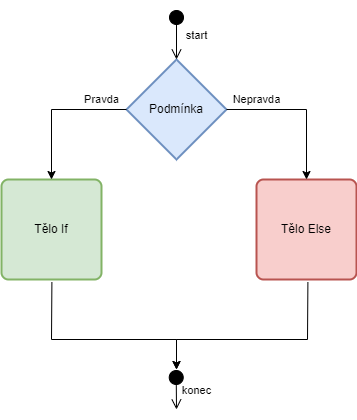
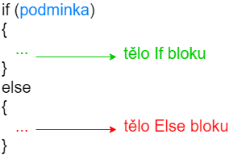
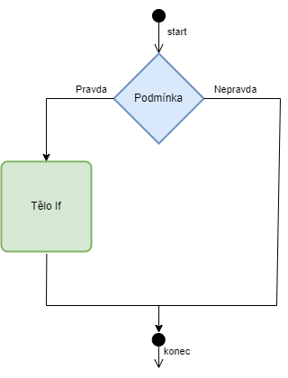
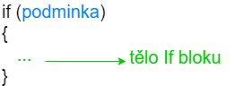
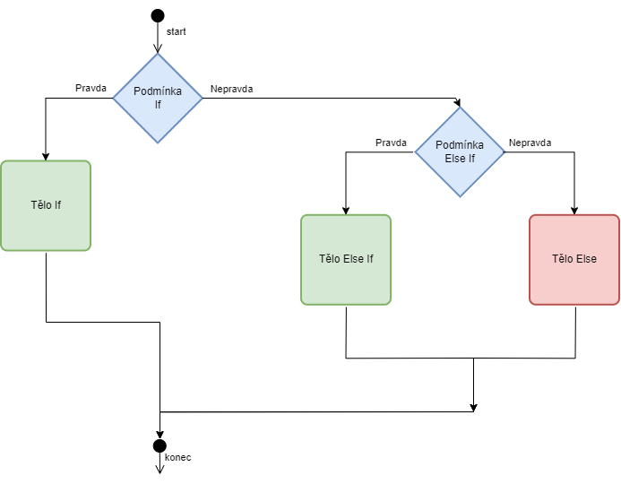
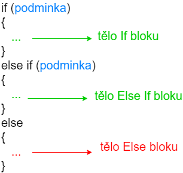

V našem programu se nám může hodit, když se některé příkazy vykonají jenom v některých situacích. Od toho nám slouží řídící struktura IF. Ta funguje následovně



Nejdříve se zkontroluje podmínka. Ta se vyhodnotí buď jako pravdivá nebo nepravdivá. Pokud je pravdivá, tak se vykoná tělo **IF** bloku. Pokud je nepravdivá, tak se vykoná tělo **Else** bloku. V kódu to pak vypadá následovně





Minimalistický program

```c
#include <stdio.h>

int main()
{
    int x = 10;
    if (x == 10) {
        printf("Pravda\n");
        printf("X se rovna 10\n");
    } else {
        printf("Nepravda\n");
        printf("X je: %i\n", x);
    }

    return 0;
}
```

Když program spustíme, tak se vytiskne

```
Pravda
X se rovna 10
```

Tisk bychom mohli naprogramovat jako jeden řádek 

```c
printf("Pravda\nX se rovna 10\n");
```
a program by fungoval stejně. Dvěma `printf` příkazy jsme si demonstrovali, že blok může obsahovat více příkazů.

Všimněme si operátoru `==`. Jedná se o porovnání dvou hodnot. Pokud se hodnota nalevo (x) rovná hodnotě napravo (10), tak se podmínka vyhodnotí jako pravdivá. V opačném případě jako nepravdivá. Více o operátorech níže.

> Zde je potřeba si dávat pozor na velmi častou chybu mezi programátory začátečníky. Je rozdíl mezi jedním `=` a dvěma `==`. V prvním případě se jedná o přiřazení hodnoty do proměnné (viz předchozí kapitola) a v druhém o porovnání dvou hodnot.

Pokud bychom `x` změnili na jiné číslo (nebo změnili podmínku, aby kontrolovala jiné číslo než 10). Např.

```c
#include <stdio.h>

int main()
{
    int x = -8;
    if (x == 10) {
        printf("Pravda\n");
        printf("X se rovna 10\n");
    } else {
        printf("Nepravda\n");
        printf("X je: %i\n", x);
    }

    return 0;
}
```

Tak se nám po spuštění objeví
```
Nepravda
X je: -8
```


V příkladu jsme si ukázali operátor `==`. Jaké další operátory můžeme použít?
| Operátor  |  Ukázka  | Význam  | 
|:---:|:---:|:---:|
| == | x == y  | **x** se rovná **y**  | 
| != | x != y  | **x** je různý od **y**  | 
| > | x > y  | **x** je větší než **y**  | 
| >= | x >= y  | **x** je větší nebo se rovná **y**  | 
| < | x < y  | **x** je menší než **y**  | 
| <= | x <= y  | **x** je menší nebo se rovná **y**  | 


Více informací [zde](https://devdocs.io/c/language/operator_comparison)

Důležité je také pochopit, že příkazy mimo IF strukturu se vykonají vždy
```c
#include <stdio.h>

int main()
{
    int x = -8;
    printf("Vytiskne se vzdy\n");

    if (x == 10) {
        printf("Pravda\n");
        printf("X se rovna 10\n");
    } else {
        printf("Nepravda\n");
        printf("X je: %i\n", x);
    }
    
    printf("Take se vytiskne vzdy\n");

    return 0;
}
```

Jak bychom udělali, kdybychom chtěli v případě `x == 10` vytisknout `X se rovna 10` a jinak nic? Mohli bychom použít prázdný blok těla `else`
```c
#include <stdio.h>

int main()
{
    int x = 10;
    if (x == 10) {
        printf("X se rovna 10\n");
    } else {
    }
    
    return 0;
}
```


Můžeme použít ale trošku lepší zápis. U řídící struktury IF existuje zápis i bez Else bloku (říkáme také bez Else větve). Ta má diagram




A pro kód platí.




Krátký program pro ukázku

```c
#include <stdio.h>

int main()
{
    int x = 10;
    if (x == 10) {
        printf("X se rovna 10\n");
    }

    return 0;
}
```

IF strukturu můžeme libovolně zanořovat. Mějme program, který se bude chovat podle následujících pravidel
* vytiskne `Cislo je 10` pokud je číslo 10
* `Cislo je 5` pokud je číslo 5 
* ve všech ostatních případech vytiskne `Nezname cislo`

Jedno z možných řešení je

```c
#include <stdio.h>

int main()
{
    int x = -8;
    if (x == 10) {
        printf("Cislo je 10\n");
    } else {
        if (x == 5) {
            printf("Cislo je 10\n");
        } else {
            printf("Nezname cislo\n");
        }
    }

    return 0;
}
```
IF struktura ale podporuje i zkrácenější zápis pomocí `Else if`.




A pro kód platí.




Předchozí program bychom mohli přepsat s použitím `Else if`
```c
#include <stdio.h>

int main()
{
    int x = -8;
    if (x == 10) {
        printf("Cislo je 10\n");
    } else if (x == 5) {
        printf("Cislo je 5\n");
    } else {
        printf("Nezname cislo\n");
    }

    return 0;
}
```

Tím jsme se v našem případě vyhnuli zanoření a udělali jsme náš kód o trošku přehlednější. Větví else if můžeme mít libovolný počet. Např. pokud bychom chtěli přidat ještě kontrolu na číslo 3.

```c
#include <stdio.h>

int main()
{
    int x = -8;
    if (x == 10) {
        printf("Cislo je 10\n");
    } else if (x == 5) {
        printf("Cislo je 5\n");
    }  else if (x == 3) {
        printf("Cislo je 3\n");
    } else {
        printf("Nezname cislo\n");
    }

    return 0;
}
```

Je potřeba si uvědomit, že jakmile je jedna z podmínek pravdivá, tak se další podmínky ignorují. To je častý omyl programátorů začátečníků, že si myslí, že se provedou všechny bloky, kde je podmínka pravdivá.

```c
#include <stdio.h>

int main()
{
    int x = 10;
    if (x == 10) {
        printf("Cislo je 10\n");
    } else if (x == 10) {
        printf("Cislo je opet 10\n");
    } else {
        printf("Nezname cislo\n");
    }

    return 0;
}
```

Zde platí první i druhá podmínka. Nicméně se vytiskne jenom
```
Cislo je 10
```

Vysvětlení můžeme najít v diagramu pro else if strutkturu. Jak bylo řečeno výše. Jakmile je jedna z podmínek pravdivá, ostatní se ignorují.

Jinak by tomu bylo, pokud bychom měli IF struktur v našem programu více. V následujícím programu máme dvě nezávislé struktury IF.

```c
#include <stdio.h>

int main()
{
    int x = 10;
    if (x == 10) {
        printf("Cislo je 10\n");
    } else {
        printf("Nezname cislo\n");
    }
    
    if (x == 10) {
        printf("Cislo je 10\n");
    } else {
        printf("Nezname cislo\n");
    }

    return 0;
}
```

Vzhledem k tomu, že jsou to dvě nezávislé struktury IF, tak se `Cislo je 10` vytiskne dvakrát.

```
Cislo je 10
Cislo je 10
```

Podle čeho se určí, zda je hodnota v podmínce pravdivá či nepravdivá? Pro jazyk C platí jednoduché pravidlo. 0 znamená nepravda a všechny ostatní čísla znamenají pravdu.

```c
#include <stdio.h>

int main()
{
    if (1) {
        printf("Pravda\n");
    }

    if (-1) {
        printf("Pravda\n");
    }

    if (10) {
        printf("Pravda\n");
    }

    if (-101) {
        printf("Pravda\n");
    }

    if (0) {
        printf("Nepravda :(\n");
    }

    return 0;
}
```

Vytiskne se
```
Pravda
Pravda
Pravda
Pravda
```

Hodnota může být i v proměnné. Nic se tím nemění.

```c
#include <stdio.h>

int main()
{
    int pravda1 = 1;
    int pravda2 = -1;
    int pravda3 = 10;
    int pravda4 = -101;
    int nepravda = 0;

    if (pravda1) {
        printf("Pravda\n");
    }

    if (pravda2) {
        printf("Pravda\n");
    }

    if (pravda3) {
        printf("Pravda\n");
    }

    if (pravda4) {
        printf("Pravda\n");
    }

    if (nepravda) {
        printf("Nepravda :(\n");
    }

    return 0;
}
```

Jak tedy fungují porovnávací operátory (např. `==`)? Můžeme si to demonstrovat na příkladě

```c
#include <stdio.h>

int main()
{
    int pravda = 3 == 3;
    int nepravda = 3 == 5;
    
    printf("3 == 3 je %i\n", pravda);
    printf("3 == 5 je %i\n", nepravda);

    return 0;
}
```
Nám vypíše
```
3 == 3 je 1
3 == 5 je 0
```

Porovnávací operátory fungují tak, že pokud je výsledek pravdivý, tak vrátí číslo 1. Pokud je nepravdivý, tak vrátí číslo 0.

## Komplexní výrazy
Pokud chceme používat v našich programech komplexnější výrazy, tak můžeme použít logické operátory. V jazyce C jsou následující

| Operátor  |  Ukázka  | Význam  | 
|:---:|:---:|:---:|
| ! | !x  | logická negace **x**  | 
| && | x && y  | logický AND **x** a **y**  | 
| \|\| | x \|\| y  | logický OR **x** a **y**  |


Více informací [zde](https://devdocs.io/c/language/operator_logical)


Pokud bychom chtěli vytisknout text jenom pokud je číslo 5 nebo 10, tak můžeme použít jenom jeden IF a OR operátor.


```c
#include <stdio.h>

int main()
{
    int x = 10;

    if (x == 5 || x == 10) {
        printf("Pravda\n");
    }

    return 0;
}
```

Jako v matematice, tak můžeme přidat do výrazů závorky, aby nám bylo jasnější, v jakém pořadí se výrazy vyhodnocují.

```c
#include <stdio.h>

int main()
{
    int x = 10;

    if ((x == 5) || (x == 10)) {
        printf("Pravda\n");
    }

    return 0;
}
```


Pozor na to, že někteří začátečníci dělají chybu v tom, že napíšou
```c
if (x == 5 || 10)
```
To je z pohledu C validní kód, ale způsobí to, že se IF vykoná vždy. Pokud bychom měli x s hodnotou 7, tak se nejdříve vykoná porovnání `x == 5`, to je nepravdivé a vyhodnotí se jako 0. Vznikne nám tím v podstatě

```c
if (0 || 10)
```

Nula se zahodí, protože je nepravdivá a pokračuje se dál. Vykoná se
```c
if (10)
```

A jelikož 10 je různé od 0, tak se jedná o pravdivé tvrzení. Následující program tedy vytiskne `Pravda`.

```c
#include <stdio.h>

int main()
{
    int x = 7;

    if (x == 5 || 10) {
        printf("Pravda\n");
    }

    return 0;
}
```

Správně je tedy pro náš případ varianta 
```c
if (x == 5 || x == 10)
```


## Pravdivostní tabulky
Většina lidí se pravděpodobně setkala s výrokovou logikou (nejčastěji na střední škole). Pro zopakování zde uvádím pravdivostní tabulky základních operátorů (výrokových spojek).

Pokud jste úplně ztraceni a netušíte, o čem se tady bavíme, tak doporučuji samostudium např. [zde](https://www.matweb.cz/vyroky/).


**Negace** obrací význam. Pokud něco platilo, tak po negaci neplatí a naopak.

| Hodnota X  | !X (negace X)  | 
|:---:|:---:|
| 1 | 0  | 
| 0 | 1  |

**OR (NEBO)** platí, pokud je aspoň jedna z hodnot pravdivá.

| Hodnota X  |  Hodnota Y  | X \|\| Y (X nebo Y)  | 
|:---:|:---:|:---:|
| 1 | 1 | 1 | 
| 0 | 1 | 1 | 
| 1 | 0 | 1 | 
| 0 | 0 | 0 |

**AND (A)** platí, pokud jsou obě hodnoty pravdivé.

| Hodnota X  |  Hodnota Y  | X && Y (X a Y)  | 
|:---:|:---:|:---:|
| 1 | 1 | 1 | 
| 0 | 1 | 0 | 
| 1 | 0 | 0 | 
| 0 | 0 | 0 |


## Úkoly na procvičení
### Úkol 1
Upravte/přidejte/změňte operátory v IF podmínkách tak, aby všechny podmínky byly pravdivé. Hodnoty v proměnných neměňte.

```c
#include <stdio.h>

int main()
{
    int x = 10;
    int y = -4;
    int z = 0;

    if (z) {
        printf("Pravda\n");
    }

    if (x && z) {
        printf("Pravda\n");
    }

    if (x < y) {
        printf("Pravda\n");
    }

    if (z == y || z >= x) {
        printf("Pravda\n");
    }

    return 0;
}
```


<details>
  <summary>Klikni pro zobrazení možného řešení</summary>

```c
#include <stdio.h>

int main()
{
    int x = 10;
    int y = -4;
    int z = 0;

    if (!z) {
        printf("Pravda\n");
    }

    if (x || z) {
        printf("Pravda\n");
    }

    if (x > y) {
        printf("Pravda\n");
    }

    if (z != y || z >= x) {
        printf("Pravda\n");
    }

    return 0;
}
```
</details>


### Úkol 2
Napište funkci, která dostane parametrem číslo. Pokud je hodnota čísla 3 nebo menší, tak se vytiskne `Cislo je male`. Pokud je vetší než 10, tak se vytiskne `Cislo je velke`. V ostatních případech se vytiskne `Cislo je ok`.

<details>
  <summary>Klikni pro zobrazení možného řešení</summary>

```c
#include <stdio.h>

void zkontroluj_cislo(int x) {
    if (x <= 3) {
        printf("Cislo je male\n");
    } else if (x > 10) {
        printf("Cislo je velke\n");
    } else {
        printf("Cislo je ok\n");
    }
}

int main()
{
    zkontroluj_cislo(3);
    zkontroluj_cislo(7);
    zkontroluj_cislo(11);

    return 0;
}
```
</details>


### Úkol 3
Zjednodušte program, aby bylo pouze jedno zanoření IF struktury.

```c
#include <stdio.h>

void zkontroluj_cislo(int x) {
    if (x < 12) {
        printf("Cislo je male\n");
        if (x < 3) {
            printf("Cislo je velmi male\n");
        } else {
        }
    } else {
        printf("Cislo je ok\n");
        if (x == 12) {
            printf("Cislo je 12\n");
        } else {
            if (x > 35) {
                printf("Cislo je hodne velke\n");
            } else if (x < 3) {
                printf("Nikdy se neprovede\n");
            }
        }
    }
}

int main()
{
    zkontroluj_cislo(-5);
    zkontroluj_cislo(7);
    zkontroluj_cislo(12);
    zkontroluj_cislo(30);
    zkontroluj_cislo(35);
    return 0;
}
```


<details>
  <summary>Klikni pro zobrazení možného řešení</summary>

Větev s tiskem `Nikdy se neprovede`, tak můžeme vynechat. Jedná se o mrtvý kód, který se nikdy neprovede. Pokud by x bylo menší než 3, tak ho odchytil již první if.

```c
#include <stdio.h>

void zkontroluj_cislo(int x) {
    if (x < 3) {
        printf("Cislo je male\n");
        printf("Cislo je velmi male\n");
    } else if (x < 12) {
        printf("Cislo je male\n");
    } else if (x == 12) {
        printf("Cislo je ok\n");
        printf("Cislo je 12\n");
    } else if (x > 35) {
        printf("Cislo je ok\n");
        printf("Cislo je hodne velke\n");
    }
}

int main()
{
    zkontroluj_cislo(-5);
    zkontroluj_cislo(7);
    zkontroluj_cislo(12);
    zkontroluj_cislo(30);
    zkontroluj_cislo(35);
    return 0;
}
```
</details>

## Fun fact
Programovacích jazyků máme stovky. Některé jsou více populární a některé méně. Kromě jazyku **C** existuje i programovací jazyky **B**, **D**, **E**, **F**. Nebo z rodiny **C++**, **C#**, **C--**, **C\***.

Přehled například [zde](https://en.wikipedia.org/wiki/List_of_programming_languages). Ale nejsou zde určitě všechny programovací jazyky na světě, protože každý programátor si může udělat svůj vlastní jazyk. V budoucnu bych chtěl připravit i kurz, jak si udělat vlastní jazyk.

