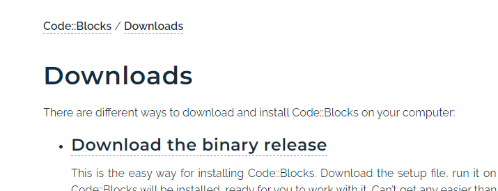
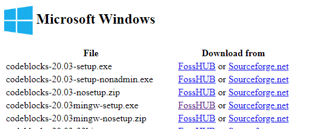
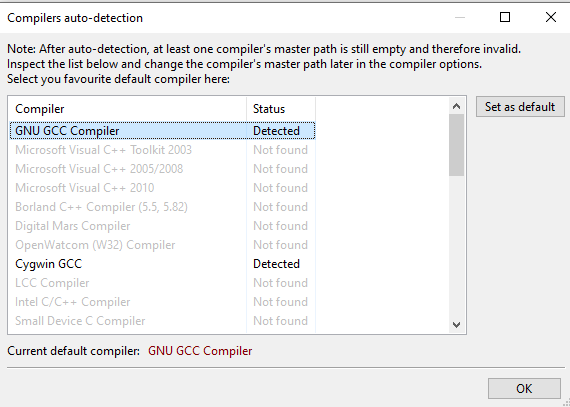
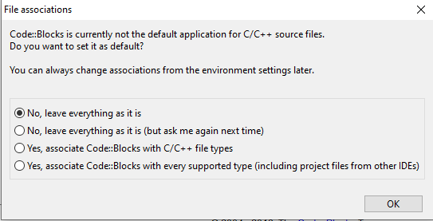

Abychom mohli efektivně programovat (tzv. psát zdrojový kód), tak potřebujeme nějaký editor. Šlo by použít i poznámkový blok ve Windows, ale ten není ideální. Existují mnohem lepší programy, které mají spoustu užitečné funkcionality, která nám dokáže ušetřit hodně práce.

Jeden z takových programů je CodeBlocks (je plně zdarma). Pokud jste již zkušenější programátor a máte zkušenost s jinými editory, tak samozřejmě můžete použít váš oblíbený editor a tuto kapitolu přeskočit.

Pokud jste se rozhodli použít CodeBlocks, tak začnete tak, že půjdete na stránky programu a stáhnete si instalační soubor [zde](https://www.codeblocks.org/downloads/). Zde klikněte na `Download the binary release`

Zde vyberte verzi, která bude mít v názvu `mingw-setup.exe` a stáhněte ji například z FossHUB (můžete použít i Sourceforge.net, je to jedno).

Instalační soubor spusťte dvojklikem. Jakmile se spustí instalace, tak klikněte na

1. Next
1. I Agree
1. Next
1. Install
1. Next
1. Finish

CodeBlocks můžete spustit z místa, kam jste ho nainstalovali.

Pokud se po otevření objeví okno Compilers auto-detection, tak vyberte GNU GCC Compiler

Na další obrazovce můžete kliknout na `No, leave everything as it is`

Nyní máme nainstalováno. Upravíme si ještě nastavení editoru, aby nám více pomáhalo při učení. V horní liště klikneme na Settings -> Compiler

Tady je uprostřed záložka Compiler Flags, zde zaklikneme

* Have gcc follow the 2017 ISO C language standard [-std=c17]
* Produce debugging symbols [-g]
* Enable all common compiler warnings (overrides many other settings) [-Wall]
* Enable extra compiler warnings [-Wextra]
* Treat as errors the warnings demanded by strict ISO C and ISO C++ [-pedantic-errors]

A klikneme na tlačítko `OK`

Pak jdeme do Settings -> Editor

Zde uprostřed vybereme záložku `Encoding settings` a zde vybereme

* Use encoding when opening files: UTF-8

Opět potvrdíme kliknutím na `OK`.

Nyní jsme připraveni začít programovat!