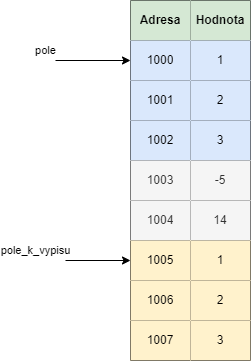

V předchozích kapitolách jsme si ukázali práci s polem a ukazateli. Ve skutečnosti pole a ukazatele mají k sobě velmi blízko.

Mějme pole

```c
int pole[] = { 1, 2, 3 };
```

My můžeme toto pole vzít a uložit ho do ukazatele. Vše bude fungovat normálně.

```c
int pole[] = { 1, 2, 3 };
int * ukazatel = pole;
```

Ukažme si toto chování v následujícím programu

```c
#include <stdio.h>

int main() {
    int pole[] = { 1, 2, 3 };
    int * ukazatel = pole;

    printf("Ukazatel je %i\n", *ukazatel);

    return 0;
}
```
Vytiskne se nám

```
Ukazatel je 1
```

Jak to vypadá v paměti?


Co však my můžeme dělat s ukazateli je i posunovat se na další adresu. Stačí nám k ukazateli přičíst jedničku

```c
#include <stdio.h>

int main() {
    int pole[] = { 1, 2, 3 };
    int * ukazatel = pole;

    printf("Prvni prvek je %i\n", *ukazatel);
    printf("Druhy prvek je %i\n", *(ukazatel + 1));
    printf("Treti prvek je %i\n", *(ukazatel + 2));

    return 0;
}
```
Program tiskne

```
Prvni prvek je 1
Druhy prvek je 2
Treti prvek je 3
```

Musíme si ale už ohlídat, že nesaháme někam, kam bychom neměli. Když uděláme `*(ukazatel + 3)`, tak už saháme mimo naše zadefinované pole. To je **nedefinované chování** a může způsobit různé problémy. Proto bychom to neměli dělat.


Pokud jsme měli pole, co jsme předávali do funkce a zavolali nad ním `sizeof` (viz kapitola XXX).


```c
#include <stdio.h>

void tiskni_pole(int pole_k_vypisu[]) {
    int velikost = sizeof(pole_k_vypisu);
    printf("Prvni prvek je %i\n", velikost);
}

int main() {
    int pole[] = { 1, 2, 3 };
    tiskni_pole(pole);

    return 0;
}
```

A v Build messages vidíme upozornění, že sice voláme sizeof nad polem, ale vrátí se nám hodnota ukazatele na int.
```
'sizeof' on array function parameter 'pole' will return size of 'int *'
```

Je to proto, že když předáváme pole do funkce, tak toto pole se degraduje na ukazatel na toto pole. Mohli bychom čekat, že se na úrovni paměti stane následující



Tzv. že se celé pole překopíruje na nové místo v paměti.

K tomu ale `nedochází`. Z pohledu paměti je velmi neefektivní kopírovat potenciálně obrovská pole. Ve skutečnosti se stane následující


Do funkce se pošle ukazatel na existující adresu, kde se dané pole nachází.

Proto tedy platí, že pokud modifikuji pole ve funkci, tak se změná projeví všude. Tzv. i v místě, odkud funkci voláme (viz kapitola XXX)

```c
#include <stdio.h>

void modifikuj_pole(int pole[]) {
    pole[0] = 10;
}

int main() {
    int pole[] = { 1, 2, 3 };
    modifikuj_pole(pole);
    printf("Prvni prvek je %i\n", pole[0]);

    return 0;
}
```

Nám vytiskne `Prvni prvek je 10`.


## Přístupy do pole a ukazatele
Tak jak přistupujeme do pole pomocí hranatých závorek, a nebo jak přistupujeme na ukazatel pomocí hvězdičky (dereference), tak to můžeme použít i naopak v poli i v ukazateli.

```c
#include <stdio.h>

int main() {
    int pole[] = { 1, 2, 3 };
    int * ukazatel = pole;

    printf("Ukazatel[1] je %i\n", ukazatel[1]);
    printf("*(pole + 1) je %i\n", *(pole + 1));

    return 0;
}
```

Dostáváme

```
Ukazatel[1] je 2
*(pole + 1) je 2
```

## Parametr předaný odkazem a hodnotou
V této kapitole jsme si objasnil důležitý koncept a to rozdíl mezi tím, když pošleme do funkce hodnotu celého čísla a pole.

U celého čísla se hodnota nakopíruje, tzv. pro následující program


```c
#include <stdio.h>

void modifikuj_cislo(int cislo_ve_funkci) {
    cislo_ve_funkci = 15;
}

int main() {
    int cislo = 10;
    modifikuj_cislo(cislo);
    printf("Cislo je %i\n", cislo);

    return 0;
}
```

Před provedením řádku `cislo_ve_funkci = 15;` vidíme v paměti, že obě proměnné mají svou vlastní adresu a hodnota proměnné `cislo` se nakopírovala na adresu proměnné `cislo_ve_funkci`.


Tomuto konceptu se říká `parametr předaný hodnotou`.

V případě pole máme program
```c
#include <stdio.h>

void modifikuj_pole(int pole[]) {
    pole[0] = 10;
}

int main() {
    int pole[] = { 1, 2, 3 };
    modifikuj_pole(pole);
    printf("Prvni prvek je %i\n", pole[0]);

    return 0;
}
```

A v paměti to vypadá před řádkem `pole[0] = 10;` následovně


Pokud se hodnota argumentu funkce nekopíruje, ale předá se jenom ukazatel, tak hovoříme o `parametr předaný odkazem`.

Všechny pole a ukazatele jsou předány odkazem. Datový typy jako `int` nebo `char` jsou vždy předány hodnotou.

## Úkoly na procvičení
### Úkol 1
XXXXXXXXXX

<details>
  <summary>Klikni pro zobrazení možného řešení</summary>

```c
#include <stdio.h>

int main()
{
    char vstup;
    printf("Zadejte znak:\n");
    scanf("%c", &vstup);
    
    printf("Zadali jste znak %c\n", vstup);

    return 0;
}
```
</details>


## Fun fact
Pro programátory je spousta webový stránek. Jedna z nich je [https://thecodinglove.com](https://thecodinglove.com), kde najdete různé GIF, které se týkají života programátora.


## Odkazy
[Zpátky na přehled](./index.md)

[Předchozí kapitola: Ukazatele](./zaklady-ukazatele.md)

[Následující kapitola: Řetězce](./zaklady-retezce.md)

[GitHub diskuze k této kapitole](https://github.com/tomasbruckner/c_lectures/discussions/15)
