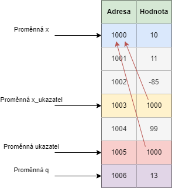

V této kapitole se podíváme na speciální datový typ `ukazatel`. Pochopení ukazatelů je velmi důležité k efektivní práci v jazyku C. Je to taky část, se kterou lidé často zápasí. Zkusme si to v této kapitole osvětlit.

Nejdříve je potřeba pochopit, že každou proměnnou, kterou vytvoříme, tak je uložená někde v paměti počítače. Paměť v počítači je rozdělená na spoustu malých kousků a každý kousek má svoji unikátní adresu.

Název proměnné není nic jiného, než námi pojmenované místo někde v paměti počítače.

Mějme program

```c
#include <stdio.h>

int main() {
    int x = 256;

    printf("Adresa je %p, hodnota je %i\n", &x, x);

    return 0;
}
```

Pro tisk adresy se používá `%p`. Pokud chceme získat adresu proměnné, použijeme operátor reference `&` (říkáme `reference na proměnnou x`). Program nám vytiskne

```
Adresa je 000000000061FE1C, hodnota je 256
```

Hodnota adresy se může lišit na vašem počítači. Tady vidíme, že místo v paměti `61FE1C` jsme si pojmenovali jako proměnnou `x`. Každé místo v paměti má svoji hodnotu. V našem případě je hodnota místa v paměti `256`.


V paměti to pak vypadá následovně


## Datový typ ukazatel
V našich programech můžeme vytvářet datový typ `ukazatel`. Datový typ `ukazatel` má vždy **doprovodný datový typ**. K tomuto základnímu datovému typu přidáme hvězdičku. Například

* `int *` - ukazatel na datový typ int
* `char *` - ukazatel na datový typ char

Tak jak proměnná datového typu `int` má hodnotu celé číslo a proměnná datového typu `char` má hodnotu jeden znak, tak proměnná datového typu `ukazatel` má hodnotu **adresu v paměti**.

A doprovodný datový typ nám říká, jakou **hodnotu na dané adrese najdeme**. Tzv. pokud máme datový typ `int *`, tak je to ukazatel na místo v paměti a na této adrese najdeme hodnotu typu `int`.

Pokud máme například
```c
int * x_ukazatel;
```

Tak proměnná `x_ukazatel` slouží k uložení hodnoty adresy proměnné datového typu `int`. Jak do `x_ukazatel` uložit hodnotu? Když zkusíme

```c
int x = 256;
int * x_ukazatel = x;
```
Dostáváme chybu
```
initialization of 'int *' from 'int' makes pointer from integer without a cast
```
Tzv. snažíme se uložit hodnotu `int` do datového typu `int *`. Jak to opravit? Řekli jsme si, že adresu proměnné nám vrátí operátor `&`. Program tedy opravíme následovně

```c
int x = 256;
int * x_ukazatel = &x;
```

Mějme program, ve kterém si toto chování demonstrujeme. Všimněme si, že pro adresu používáme `%p`. Pro hodnotu `x` používáme `%i` a pro hodnotu `x_ukazatel` používáme `%p`. Proč? Protože hodnota `x_ukazatel` je adresa a adresu vytiskneme pomocí `%p`.

```c
#include <stdio.h>

int main() {
    int x = 256;
    int * x_ukazatel = &x;

    printf("Adresa x je %p, hodnota x_ukazatel je %i\n", &x, x);
    printf("Adresa x_ukazatel je %p, hodnota x_ukazatel je %p\n", &x_ukazatel, x_ukazatel);

    return 0;
}
```
Nám vytiskne
```
Adresa x je 000000000061FE1C, hodnota x_ukazatel je 256
Adresa x_ukazatel je 000000000061FE10, hodnota x_ukazatel je 000000000061FE1C
```
Nyní už nemáme žádnou chybu. Adresa `x` a hodnota `x_ukazatel` jsou stejné.

| Proměnná | Hodnota | Adresa v paměti | Co vrátí reference (&) |
|---|---|---|---|
| x | 256 | 61FE1C | 61FE1C |
| x_ukazatel | 61FE1C | 61FE10 | 61FE10 |


Z tabulky si můžeme potvrdit, že adresa v paměti je to stejné, co se vrátí pomocí reference (operátor `&`).

Tady vidíme, že i proměnná `x_ukazatel` má svoji adresu v paměti (jako i všechny jiné proměnné). Taky jsme si ukázali, že proměnná datového typu `ukazatel` nemá tradiční hodnotu (jak třeba datový typ `int` má hodnotu celé číslo), ale jeho hodnota je adresa v paměti.

## Dereference
Ukázali jsme si operátor `reference` (`&`). Existuje i opačný operátor nazvaný `dereference` (`*`). Pokud operátor reference vrátí adresu proměnné, co dělá operátor dereference? Vrátí hodnotu na dané adrese.
Mějme program, kde v `printf` tiskneme  `*x_ukazatel`. Všimněme si, že už nepoužíváme `%p`, ale dvakrát `%i`. Je to proto, že nás u `x_ukazatel` nezájímá adresa, ale hodnota na adrese. A hodnota na adrese je `int` (protože se jedná o `ukazatel na int`).

```c
#include <stdio.h>

int main() {
    int x = 256;
    int * x_ukazatel = &x;

    printf("Hodnota x je %i, hodnota *x_ukazatel je %i\n", x, *x_ukazatel);

    return 0;
}
```
Dostáváme
```
Hodnota x je 256, hodnota *x_ukazatel je 256
```

> Zde je potřeba si uvědomit rozdíl v použití hvězdičky `*`. Pokud hvězdičku napíšeme k datovému typu při definici proměnné (např. `int * x_ukazatel`), tak je význam **datový typ ukazatel na int**. Pokud hvězdičku napíšeme k proměnné (např. `*x_ukazatel`), tak je význam **dereference proměnné** (získání hodnoty na adrese).

Pokud bychom měli následující kód.

```c
int x = 10;
int * x_ukazatel = &x;
```
Tak se můžeme podívat, jak to vypadá v paměti a co by se nám vrátilo při referenci/dereferenci. Hodnoty adres v paměti jsou jenom ilustrační pro jednodušší pochopení principu.

| Proměnná | Hodnota | Adresa v paměti | Co vrátí reference (&) | Co vrátí dereference (*)
|---|---|---|---|---|
| x | 10 | 1000 | 1000 | nelze, hodnota v x není adresa (proto nejde dereferencovat) |
| x_ukazatel | 1000 | 1004 | 1004 | 10 (hodnotu na adrese 1000, tzv. hodnotu x) |


Kdybychom si měli situaci znázornit na diagramu, tak by vypadala následovně.


Co by se stalo, kdybychom změnili hodnotu x?

```c
int x = 10;
int * x_ukazatel = &x;
x = 11;
```

V paměti bychom pak měli


Proto nás ani nepřekvapí, když si vytiskneme hodnoty

```c
#include <stdio.h>

int main() {
    int x = 10;
    int * x_ukazatel = &x;
    x = 11;

    printf("Hodnota x je %i, hodnota *x_ukazatel je %i\n", x, *x_ukazatel);

    return 0;
}
```

A dostáváme

```
Hodnota x je 11, hodnota *x_ukazatel je 11
```

Stejná situace nastává, pokud bychom měnili hodnotu přes ukazatel

```c
#include <stdio.h>

int main() {
    int x = 10;
    int * x_ukazatel = &x;
    *x_ukazatel = 11;

    printf("Hodnota x je %i, hodnota *x_ukazatel je %i\n", x, *x_ukazatel);

    return 0;
}
```
Nám dává
```
Hodnota x je 11, hodnota *x_ukazatel je 11
```

Jak vidíme, tak dereferenci můžeme použít i pro přiřazení hodnoty.

Z tohoto chování bývají lidé překvapení. Můžeme si to představit tak, že když uděláme

```c
x = 11;
```

Tak počítač to vidí jako na adresu v paměti ulož hodnotu 11. Tzv. pokud bychom brali, že adresa `x` je například `1000`, tak se vykoná něco jako

```
na adresu 1000 ulož 11
```

Pokud uděláme 
```c
*x_ukazatel = 11;
```

A hodnota x_ukazatel je `1000` a adresa proměnné x_ukazatel je `1004`, tak to počítač vyhodnotí
1. nahradí proměnnou x_ukazatel za jeji adresu, tzv. vznikne `*(1004) = 11;`
1. Pak udělá dereferenci, tzv. vznikne něco jako `1000 = 11;`
1. Pak proběhne stejné uložení jako v případě `x = 11;`

## Hodnota NULL
Pokud definujeme ukazatel, tak mu můžeme nastavit hodnotu `NULL` (nezávisle, zda jde o int ukazatel nebo libovolný jiný ukazatel). Tato hodnota reprezentuje, že daný ukazatel na nic neukazuje (na žádné místo v paměti).

S ukazatelem na `NULL` nemůžeme pracovat normálním způsobem. Pokud bychom se pokusili vytisknout hodnotu, na kterou ukazuje, tak dostáváme chybu 
```c
#include <stdio.h>

int main() {
    int * x_ukazatel = NULL;
    *x = 10;

    printf("Hodnota x_ukazatel je %i\n", *x_ukazatel);

    return 0;
}
```

Stejně tak se nám nepodaří uložit na tuto adresu nějakou hodnotu. Opět dostáváme chybu

```c
#include <stdio.h>

int main() {
    int * x_ukazatel = NULL;
    *x_ukazatel = 10;

    printf("Hodnota x_ukazatel je %i\n", *x_ukazatel);

    return 0;
}
```

Správně tedy můžeme definovat hodnotu ukazatele jako `NULL`, ale následně musíme hodnotu nastavit.


```c
#include <stdio.h>

int main() {
    int x = 10;
    int * x_ukazatel = NULL;
    x_ukazatel = &x;

    printf("Hodnota x_ukazatel je %i\n", *x_ukazatel);

    return 0;
}
```

## Důležité body
V ukazatelích začátečníci dělají často chybu. Jedná se o nejsložitější část základů, které si v tomto kurzu probereme.

Důležité je si dát pozor na rozdíl v `x_ukazatel = &x` a `*x_ukazatel = x`.

První případ `x_ukazatel = &x` provede následující akce. Vezme se adresa proměnné x (`&x`) a ta se uloží do proměnné typu ukazatel (`x_ukazatel = &x`).

V druhém případě `*x_ukazatel = x` se nejdříve provede dereference (`*x_ukazatel`) a na výslednou adresu se uloží hodnota x. Tzv. pokud x_ukazatel má v sobě hodnotu 1000, tak se na adresu 1000 uloží hodnota x.


## Práce s více ukazateli
V programu můžeme mít libovolný počet ukazatelů
```c
#include <stdio.h>

int main() {
    int x = 10;
    int * x_ukazatel = &x;
    int * y_ukazatel = &x;

    printf("Hodnota x_ukazatel je %i, hodnota y_ukazatel je %i\n", *x_ukazatel, *y_ukazatel);

    return 0;
}
```

Nám vytiskne dvakrát hodnotu 10. V paměti by to vypadalo následovně.


Stejná situace nástává i v případě, že uložíme ukazatel do ukazatele. V obou případech bude uložená hodnota adresy proměnné x jak do ukazatele `x_ukazatel` tak do ukazatele `y_ukazatel`.

```c
#include <stdio.h>

int main() {
    int x = 10;
    int * x_ukazatel = &x;
    int * y_ukazatel = x_ukazatel;

    printf("Hodnota x_ukazatel je %i, hodnota y_ukazatel je %i\n", *x_ukazatel, *y_ukazatel);

    return 0;
}
```

Všimněme si, že při nastavení `y_ukazatel = x_ukazatel` již nepoužíváme operátor reference (&). Kdybychom to udělali 

```c
int x = 10;
int * x_ukazatel = &x;
int * y_ukazatel = &x_ukazatel;
```

Tak do `y_ukazatel` ukládáme adresu `x_ukazatel`. To by se nám nepodařilo spustit. V paměti by to vypadalo následovně (pokud by program nevyhodil chybu)


Vidíme, že `y_ukazatel` teď směřuje na adresu `x_ukazatel` místo na adresu `x`. Tím jsme vytvořili tzv. **ukazatel na ukazatel**.

Kde je problém? Pokud definujeme ukazatel na int (`int *`), tak do taokové proměnné můžeme uložit jako hodnotu adresu. To je v pořádku. Protože i `y_ukazatel` má svoji adresu a adresy se od sebe neliší (neexistují různé typy adres). Takže není problém, že ukládáme adresu `x_ukazatel` do `y_ukazatel`.

Problém ale nastává v tom, že kdybychom udělali dereferenci (`*y_ukazatel`), tak pro proměnnou typu `int *` bychom správně měli dostat po dereferenci hodnotu typu `int`. Ale v našem případě nedostáváme hodnotu typu `int`, ale dostáváme adresu (`int *`, tzv. ukazatel na `int`). A to je důvod, proč náš program nefunguje.

V této situaci bychom měli

| Proměnná | Hodnota | Adresa v paměti (co vrátí reference &) | Co vrátí dereference (*)
|---|---|---|---|
| x | 10 | 1000 | nelze, hodnota v x není adresa (proto nejde dereferencovat) |
| x_ukazatel | 1000 | 1003 | 10 (hodnotu x) |
| y_ukazatel | 1003 | 1004 | 1000 (adresu x_ukazatel) |

Program nám nefunguje proto, že abychom mohli uložit ukazatel na ukazatel, tak potřebujeme mít proměnnou definovanou jako `int **` (dvě hvězdičky).

```c
int x = 10;
int * x_ukazatel = &x;
int ** y_ukazatel = &x_ukazatel;
```


Pokud bychom se chtěli dostat přes `y_ukazatel` k hodnotě 10, tak můžeme.

Nejdříve uděláme `*y_ukazatel` (dereferenci `y_ukazatel`), tím dostaneme hodnotu `x_ukazatele`, tzv. 1000. Když nad tím zavoláme dereferenci ještě jednou `*(*y_ukazatel)`, tak dostáváme hodnotu 10.


Funguje to následovně
* `*y_ukazatel` - vrať mi hodnotu na adrese 1003 -> Na adrese 1003 je hodnota 1000.
* `*(*y_ukazatel)` - si můžeme představit jako `*(1000)` (protože víme, že `*y_ukazatel` je 1000), což není nic jiného, než vrať mi hodnotu na adrese 1000 -> Na adrese 1000 je hodnota 10.

Závorky v tomto případě jsou volitelné (operátor dereference má stejnou prioritu viz kapitola [Priorita operátorů](./volitelne-priorita-operatoru.md)). `*(*y_ukazatel)` je tedy stejné jako napsat `**y_ukazatel`. Dostáváme následující program

```c
#include <stdio.h>

int main() {
    int x = 10;
    int * x_ukazatel = &x;
    int ** y_ukazatel = &x_ukazatel;

    printf("Hodnota **y_ukazatel je %i\n", **y_ukazatel);

    return 0;
}
```

Tímto způsobem můžeme udělat i ukazatel na ukazatel na ukazatel (tři hvězdičky). A na podobném principu udělat i více úrovní.

Pro připomenutí rozdílu mezi hvězdičkou při definování datového typu ukazatel a hvězdičky při dereferenci si ukážeme, že následující program funguje stejně jako předchozí (akorát je na více řádků).

```c
#include <stdio.h>

int main() {
    int x = 10;
    int * x_ukazatel = NULL;
    x_ukazatel = &x;
    int ** y_ukazatel = NULL;
    y_ukazatel = &x_ukazatel;

    int vysledek = **y_ukazatel;

    printf("Hodnota **y_ukazatel je %i\n", vysledek);

    return 0;
}
```

Stejně tak můžeme použít při práci s ukazatelem na ukazatel pouze jednu dereferenci.

```c
#include <stdio.h>

int main() {
    int x = 10;
    int * x_ukazatel = &x;;
    int ** y_ukazatel = &x_ukazatel;
    int * z_ukazatel = *y_ukazatel;


    printf("Hodnota *z_ukazatel je %i\n", *z_ukazatel);

    return 0;
}
```

A dostáváme
```
Hodnota *z_ukazatel je 10
```

* `y_ukazatel` - vrací datový typ `int **`
* `*y_ukazate`l - vrací datový typ `int *`
* `**y_ukazatel` - vrací datový typ `int`


## Ukazatelé ve funkcích
Nyní si ukážeme, jak můžeme použít ukazatele ve funkcích.

```c
#include <stdio.h>

void uprav_ukazatel(int * ukazatel) {
    *ukazatel = 13;
}

int main() {
    int x = 10;
    int * x_ukazatel = &x;
    uprav_ukazatel(x_ukazatel);

    printf("Hodnota x je %i\n", x);

    return 0;
}
```

Následně se nám vytiskne

```
Hodnota x je 13
```

My pošleme do funkce proměnnou typu ukazatel na datový typ `int`. Ten má v sobě hodnotu adresy `x`. Pak pomocí `*ukazatel = 13` řekneme, že se na adrese `x` (kde je aktuálně hodnota 10) se má uložit hodnota 13. Ta se uloží do paměti a pak i po skončení funkce je uložená nová hodnota. Jakmile se změní hodnota v paměti, tak už se sama od sebe nikdy nevrátí zpátky.

V okamžiku, kdy se nacházíme na začátku funkce `uprav_ukazatel`, to vypadá v paměti následovně (hodnoty na adresách 1001, 1002 a 1004 nemají žádný význam a jenom demonstrují, že na těchto adresách je náhodná hodnota)


Připomeňme si, že proměnná `ukazatel` (jako každá jiná proměnná) má svoje vlastní místo v paměti (adresa 1005) a to je různé od adresy proměnné `x_ukazatel` (adresa 1004).

Proto kdybychom změnili hodnotu v proměnné `ukazatel`, tak situace vypadá následovně

```c
#include <stdio.h>

void uprav_ukazatel(int * ukazatel) {
    int q = 13;
    ukazatel = &q;
}

int main() {
    int x = 10;
    int * x_ukazatel = &x;
    uprav_ukazatel(x_ukazatel);

    printf("Hodnota x_ukazatel je %i\n", *x_ukazatel);

    return 0;
}
```
Vytiskne se nám
```
Hodnota x_ukazatel je 10
```

Co se tady stane a proč se nevytiskne 13? Po definici proměnné `q` (tzv. za řádkem `int q = 13;`) máme v paměti následující



Následně provedeme uložení adresy `q` do ukazatele `ukazatel = &q`. V paměti máme následující


Když pak jdeme ale tisknout proměnnou `x` (adresa 1000), tak vidíme, že zde máme uloženou pořád hodnotu 10.


Pokud bychom chtěli změnit hodnotu, tak to uděláme následovně

```c
#include <stdio.h>

void uprav_ukazatel(int * ukazatel) {
    *ukazatel = 13;
}

int main() {
    int x = 10;
    uprav_ukazatel(&x);

    printf("Hodnota x je %i\n", x);

    return 0;
}
```
A dostáváme

```
Hodnota x je 13
```

Pro zkrácený zápis jsme využili referenční operátor (`&`). Obešli jsme se tak bez proměnné `x_ukazatel`.


## Úkoly na procvičení
### Úkol 1
XXX

<details>
  <summary>Klikni pro zobrazení možného řešení</summary>

```c
#include <stdio.h>

int main()
{
    char vstup;
    printf("Zadejte znak:\n");
    scanf("%c", &vstup);
    
    printf("Zadali jste znak %c\n", vstup);

    return 0;
}
```
</details>


## Fun fact
Nejběžnější hesla za rok 2022 dle společnosti NordPass jsou

1. **password** 
1. **123456**
1. **123456789**
1. **guest** 
1. **qwerty** 
1. **12345678**
1. **111111**
1. **12345**
1. **col123456**
1. **123123**
1. **1234567**
1. **1234**
1. **1234567890**
1. **000000**
1. **555555**
1. **666666**
1. **123321**
1. **654321**
1. **7777777**
1. **123**

Používejte bezpečnější hesla!


## Odkazy
[Následující kapitola: Pole vs ukazatel](./zaklady-pole-vs-ukazatel.md)

[GitHub diskuze k této kapitole](https://github.com/tomasbruckner/c_lectures/discussions/14)

[Zpátky na přehled](./index.md)

[Předchozí kapitola: Datový typ char](./zaklady-char.md)

