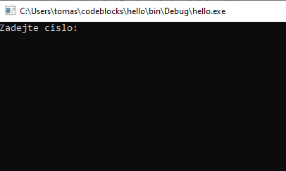
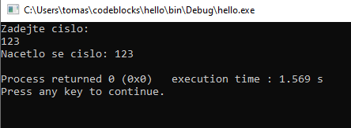

V našich programech bychom chtěli pracovat s nějakým vstupem od uživatele. Co to je ten vstup od uživatele? Například text, který uživatel napíše na klávesnici. Také to může být pohyb/klikání myši. V této kapitole si ukážeme, jak nechat uživatele něco napsat na klávesnici a následně tento text použít v našem programu.

Ke čtení uživatelského vstupu (z klávesnice) lze použít další funkci z knihovny `stdio` nazvanou `scanf`. Ta funguje tak, že ji jako prvni argument předáme modifikátor (obdobně jako ve funkci `printf`). Pokud použijeme modifikátor `%i`, tak jako druhý argument musíme předat `ukazatel` na proměnnou typu `int`.

Ukazateli se budeme zabývat více v kapitole [Ukazatele](./zaklady-ukazatele.md). Zatím nám stačí vědět, že před proměnnou musíme dát znak `&` (čte se jako ampersand).

Mějme program

```c
#include <stdio.h>

int main()
{
    int vstup = 0;
    printf("Zadejte cislo:\n");
    scanf("%i", &vstup);

    printf("Nacetlo se cislo: %i\n", vstup);

    return 0;
}
```

Když program pustíme, tak se nám zobrazí




Nyní můžeme napsat číslo například `123` a zmáčknout Enter tlačítko. Pak se zobrazí



Co se v programu děje?

1. Vytvoří se proměnná `vstup` datového typu `int` a nastaví se na nulu
1. Vytiskne se `Zadejte cislo`
1. Funkce `scanf` zastaví program a čeká, než uživatel zadá nějaký vstup (něco napíše na klávesnici) a dá enter
1. Vytiskne se `Nacetlo se cislo` s načteným číslem
1. Provede se `return 0` a program se ukončí

Tímto způsobem jsme dokázali získat vstup od uživatele. Díky tomu dokážeme dělat mnohem více interaktivnější programy. Mějme jednoduchou kalkulačku, která požádá uživatele o 2 čísla a následně je sečte.

```c
#include <stdio.h>

int main()
{
    int prvniCislo = 0;
    int druheCislo = 0;
    printf("Zadejte prvni cislo:\n");
    scanf("%i", &prvniCislo);

    printf("Zadejte druhe cislo:\n");
    scanf("%i", &druheCislo);

    int soucet = prvniCislo + druheCislo;
    printf("Soucet je: %i\n", soucet);

    return 0;
}
```

Můžeme načítat vstup i v cyklu. Řekněme, že chceme program, který bude načítat čísla do té doby, než uživatel zadá číslo 7.

```c
#include <stdio.h>

int main()
{
    while(1) {
        int vstup = 0;
        printf("Zadejte cislo:\n");
        scanf("%i", &vstup);
        printf("Zadali jste cislo: %i\n", vstup);

        if (vstup == 7) {
            break;
        }
    }

    return 0;
}
```

Pokud bychom chtěli pracovat s desetinnými čísly, tak použijeme modifikátor `%lf`.
```c
#include <stdio.h>

int main()
{
    double vstup = 0;
    printf("Zadejte cislo:\n");
    scanf("%lf", &vstup);

    printf("Nacetlo se cislo: %lf\n", vstup);

    return 0;
}
```

Zde pozor, že zadáváme desetinné číslo s tečkou a ne čárkou. Tzv. správně zadáme desetinné číslo jako `3.12` (špatně by bylo `3,12`).

Pokud bychom chtěli pracovat s libovolným řetězcem (ne pouze s číslama), tak by to bylo trošku náročnější. Vysvětlíme si v kapitole [Práce s uživatelským vstupem pro pokročilé](./pokrocile-vstup.md).


## Úkoly na procvičení
### Úkol 1
Napište program, který bude načítat čísla do té doby, než uživatel zadá liché číslo (pak se ukončí).


<details>
  <summary>Klikni pro zobrazení možného řešení</summary>

```c
#include <stdio.h>

int main()
{
    while(1) {
        int vstup = 0;
        printf("Zadejte cislo:\n");
        scanf("%i", &vstup);

        if (vstup % 2 == 1) {
            break;
        }

        printf("Zadali jste sude cislo. Zkuste to znovu\n");
    }

    return 0;
}
```
</details>


### Úkol 2
Napište program, který načte 3 čísla.
* Pokud je první číslo větší než ostatní, tak se vytiskne `Prvni je nejvetsi`
* Pokud je druhé číslo větší než ostatní, tak se vytiskne `Druhe je nejvetsi`
* Pokud je třetí číslo větší než ostatní, tak se vytiskne `Treti je nejvetsi`
* Pokud jsou všechny čísla stejná, tak se vytiskne `Vsechny stejne`
* Jinak se vytiskne `Dve cisla jsou stejne`


<details>
  <summary>Klikni pro zobrazení možného řešení</summary>

```c
#include <stdio.h>

int main()
{
    int prvniCislo = 0;
    int druheCislo = 0;
    int tretiCislo = 0;
    printf("Zadejte cislo:\n");
    scanf("%i", &prvniCislo);
    printf("Zadejte cislo:\n");
    scanf("%i", &druheCislo);
    printf("Zadejte cislo:\n");
    scanf("%i", &tretiCislo);

    if (prvniCislo > druheCislo && prvniCislo > tretiCislo) {
        printf("Prvni je nejvetsi\n");
    } else if (druheCislo > prvniCislo && druheCislo > tretiCislo) {
        printf("Druhe je nejvetsi\n");
    } else if (tretiCislo > druheCislo && tretiCislo > prvniCislo) {
        printf("Treti je nejvetsi\n");
    } else if (prvniCislo == druheCislo && prvniCislo == tretiCislo) {
        printf("Vsechny stejne\n");
    } else {
        printf("Dve cisla jsou stejne\n");
    }

    return 0;
}
```
</details>

### Úkol 3
Napište program, který načte 2 čísla. První číslu říkejme X, druhému číslu říkejme Y. Program pak vytiskne X krát `Cislo je Y`.

Tzv. pokud uživatel zadá nejdříve číslo 3 a pak číslo 6, tak se vytiskne

```
Cislo je 6
Cislo je 6
Cislo je 6
```


<details>
  <summary>Klikni pro zobrazení možného řešení</summary>

```c
#include <stdio.h>

int main()
{
    int prvniCislo = 0;
    int druheCislo = 0;
    printf("Zadejte cislo:\n");
    scanf("%i", &prvniCislo);
    printf("Zadejte cislo:\n");
    scanf("%i", &druheCislo);
    
    for (int i = 0; i < prvniCislo; i = i + 1) {
        printf("Cislo je %i\n", druheCislo);
    }

    return 0;
}
```
</details>


### Úkol 4
Napište program, který funguje následovně.
1. Načte od uživatele vstup
    * Pokud je vstup číslo 1, v další fázi se bude sčítat
    * Pokud je vstup číslo 2, v další fázi se bude odečítat
    * Pokud je vstup cokoliv jiného, program se ukončí
1. Načtou se dvě čísla
1. Pokud uživatel v prvním bodě zvolil sčítání, tak se vytiskne součet, jinak se vytiskne odečet


<details>
  <summary>Klikni pro zobrazení možného řešení</summary>

```c
#include <stdio.h>

int main()
{
    int rezim = 0;
    printf("Zadejte rezim\n");
    printf("    1: scitani\n");
    printf("    2: odecitani\n");
    printf("    ostatni: konec\n");
    scanf("%i", &rezim);

    if (rezim != 1 && rezim != 2) {
        return 0;
    }

    int prvniCislo = 0;
    int druheCislo = 0;
    printf("Zadejte prvni cislo:\n");
    scanf("%i", &prvniCislo);
    printf("Zadejte druhe cislo:\n");
    scanf("%i", &druheCislo);

    int vysledek = 0;
    if (rezim == 1) {
        vysledek = prvniCislo + druheCislo;
        printf("Soucet je: %i\n", vysledek);
    } else {
        vysledek = prvniCislo - druheCislo;
        printf("Odecet je: %i\n", vysledek);
    }

    return 0;
}
```
</details>


## Fun fact
V programování a obecně technologiích není věk příliš důležitý. Například Aaron Swartz se účastnil na definici [RSS](https://cs.wikipedia.org/wiki/RSS) formátu již ve 13 letech. Měl velkých vliv na spoustu věcí, které dnes na internetu bereme jako samozřejmost. 

O jeho životě byl natočen film [Zázračné dítě internetu: příběh Aarona Swartze](https://www.csfd.cz/film/361964-zazracne-dite-internetu-pribeh-aarona-swartze/prehled/).

## Odkazy
[Následující kapitola: Pole](./zaklady-pole.md)

[GitHub diskuze k této kapitole](https://github.com/tomasbruckner/c_lectures/discussions/11)

[Zpátky na přehled](./index.md)

[Předchozí kapitola: Cykly](./zaklady-cykly.md)


